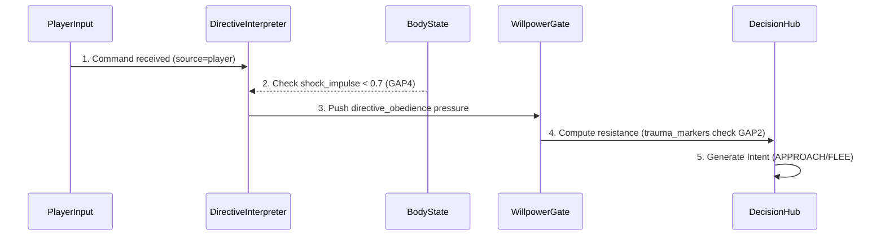
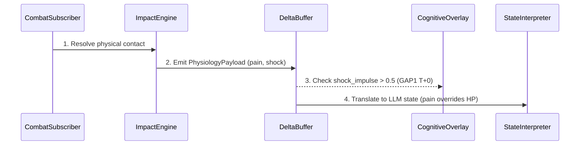
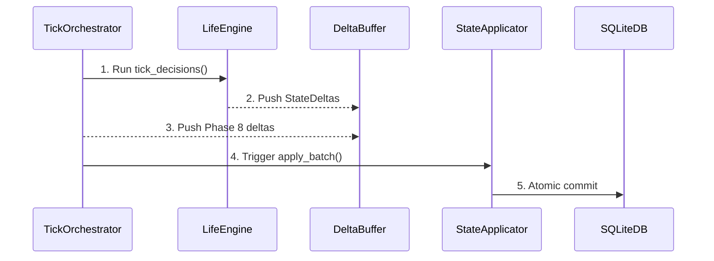
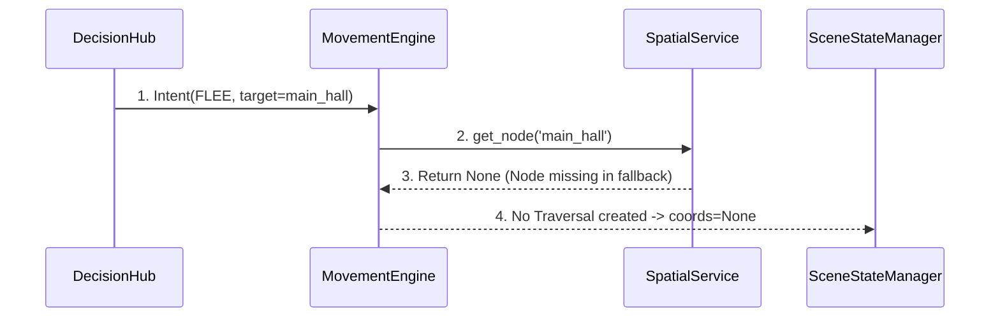

# ARCHITECTURE FLOW (Auto-generated)

> Внимание: Этот файл сгенерирован автоматически из `architecture/*.yaml`.
> Не редактируйте его вручную. Изменяйте YAML файлы и запускайте `python build_graph.py`.

## 🔗 Топология системы (Flowchart)

```mermaid
flowchart TD

    %% === БАЗОВЫЕ СТИЛИ ===
    classDef ui fill:#e0f7fa,stroke:#006064,stroke-width:2px;
    classDef application fill:#e8f5e9,stroke:#1b5e20,stroke-width:2px;
    classDef domain fill:#fff3e0,stroke:#e65100,stroke-width:2px;
    classDef infrastructure fill:#ffebee,stroke:#b71c1c,stroke-width:2px;
    classDef forbidden fill:#f66,stroke:#333,stroke-width:2px,stroke-dasharray: 5 5;

    subgraph UI[UI Layer]
    direction TB
        GameScreen("Pygame GameScreen"):::ui
        TextInput("TextInput (Resistance Medium)"):::ui
        PresentationFirewall("Presentation Firewall"):::ui
        PerceptualMomentum("Perceptual Momentum (S-curve)"):::ui
    end

    subgraph APPLICATION[Application Layer]
    direction TB
        WillpowerGate("WillpowerGate (Cumulative Strain)"):::application
        DecisionHub("Decision Hub v2 (Utility Deformation)"):::application
        IntentEventAdapter("Intent Event Adapter"):::application
        CausalObserver("Causal Observer (CDS)"):::application
        CombatSubscriber("Combat Subscriber"):::application
        StateInterpreter("State Interpreter (LLM Bridge)"):::application
        TickOrchestrator("Tick Orchestrator"):::application
        LifeEngine("Life Engine (De-godified)"):::application
        StateApplicator("State Applicator"):::application
        CognitiveOverlay("Cognitive Overlay (T+0)"):::application
        MovementEngine("Movement Engine"):::application
        SceneStateManager("Scene State Manager"):::application
    end

    subgraph DOMAIN[Domain Layer]
    direction TB
        DirectiveInterpreter("Directive Interpretation Subscriber"):::domain
        CFRMSolver("Local Causal Solver (CFRM P2)"):::domain
        BodyState["Body State (Physiology)"]:::domain
        SourceID["Source ID (Social Authority)"]:::domain
        EventDTO["Event DTO (NPC_SPOKE)"]:::domain
        DeterministicClock("Deterministic Clock"):::domain
        CausalTrace("Causal Trace"):::domain
        ImpactEngine("Impact Engine (Pure Function)"):::domain
        PhysiologyPayload["PhysiologyPayload (pain, blood_loss, shock_impulse)"]:::domain
        DecayHandler("Leaky Integrator (Decay)"):::domain
        DeltaBuffer(("Delta Buffer (Event Bus)")):::domain
        SpatialService("Spatial Query Service v1.2"):::domain
        TraversalState("Traversal State (LOD1)"):::domain
        SceneChange["SceneChange (Projection)"]:::domain
    end

    subgraph INFRASTRUCTURE[Infrastructure Layer]
    direction TB
        GameStdout(("Game Process stdout/logs")):::infrastructure
        GitHistory[("Git Log & File System")]:::infrastructure
        APIRoutes[["FastAPI Routes"]]:::infrastructure
        SQLiteDB[("Runtime SQLite")]:::infrastructure
        LlamaServer[["LLM API (llama-server :8080)"]]:::infrastructure
        GraphCompiler("Graph Compiler"):::infrastructure
        EditorJSON[("location_templates.json")]:::infrastructure
        BuiltinFallback["Builtin Fallback Graph"]:::infrastructure
    end

    %% === КАСТОМНЫЕ СТИЛИ УЗЛОВ ===
    style DecisionHub fill:#e8f5e9,stroke:#1b5e20,stroke-width:4px;
    style TickOrchestrator fill:#e1f5fe,stroke:#0277bd,stroke-width:4px;

    %% === ПОТОКИ ДАННЫХ ===
    WillpowerGate ==>|"provides resistance & identity_rigidity"| DecisionHub
    BodyState -.->|"inhibits obedience"| DirectiveInterpreter
    BodyState -.->|"Somatic Veto"| DecisionHub
    SourceID -->|"NPC-to-NPC legitimacy"| DirectiveInterpreter
    DirectiveInterpreter -->|"generates obedience/irritation"| DeltaBuffer
    IntentEventAdapter -->|"preserves semantic_action & target_id"| EventDTO
    CFRMSolver -->|"parses avatar psyche"| PlayerObserver
    GameStdout -->|"reads logs"| CausalObserver
    GitHistory -->|"reads git log & TODOs"| CausalObserver
    DeterministicClock -->|"provides tick context"| CausalTrace
    CausalObserver -->|"writes traces"| CausalTrace
    GameScreen ==>|"POST /action (IntentDTO)"| APIRoutes
    APIRoutes -->|"resolve_player_intent()"| TickOrchestrator
    StateApplicator -->|"WorldSnapshotDTO + will_conflict"| APIRoutes
    APIRoutes -->|"JSON Response"| GameScreen
    GameScreen -.->|"infect() - motor resistance"| TextInput
    GameScreen -->|"sanitize_perceptual_input()"| PresentationFirewall
    PresentationFirewall -->|"SanitizedPerceptualVectors"| PerceptualMomentum
    CombatSubscriber -->|"resolves contact"| ImpactEngine
    ImpactEngine ==>|"computes"| PhysiologyPayload
    PhysiologyPayload -->|"flushed to"| DeltaBuffer
    DecayHandler -->|"time-driven decay (Phase 0.5)"| DeltaBuffer
    PhysiologyPayload -.->|"provides pain & shock"| StateInterpreter
    LifeEngine ==>|"emits intents & deltas"| DeltaBuffer
    TickOrchestrator -->|"aggregates Phase 8 results"| DeltaBuffer
    DeltaBuffer ==>|"apply_batch()"| StateApplicator
    CognitiveOverlay -.->|"injects shock_impulse > 0.5"| StateApplicator
    StateApplicator -->|"commits state"| SQLiteDB
    TickOrchestrator -.->|"query LLM"| LlamaServer
    GameScreen ==>|"POST /action (IntentDTO)"| APIRoutes
    EditorJSON -->|"load_editor_json"| GraphCompiler
    BuiltinFallback -.->|"fallback graph"| GraphCompiler
    GraphCompiler -->|"compiles graph"| SpatialService
    SpatialService -->|"reads graph & positions"| MovementEngine
    MovementEngine -.->|"get_node(target_id)"| SpatialService
    MovementEngine -->|"produces"| SceneChange
    SceneChange -->|"applied by"| SceneStateManager
    SceneStateManager -->|"enriches & interpolates"| TraversalState

    %% === АРХИТЕКТУРНЫЕ ЗАПРЕТЫ ===
    DecisionHub -.->|"🚫 FORBIDDEN: Use T+0 pressure (Only T-1)"| Raw_Delta:::forbidden
    DirectiveInterpreter -.->|"🚫 FORBIDDEN: Direct movement generation"| MovementIntent:::forbidden
    CausalObserver -.->|"🚫 FORBIDDEN: Feedback loop into simulation"| Runtime_State:::forbidden
    CDS -.->|"🚫 FORBIDDEN: Interrupt causal flow on crash"| Pipeline:::forbidden
    Frontend -.->|"🚫 FORBIDDEN: Import backend.app (Устав §1.1)"| BackendInternals:::forbidden
    APIRoutes -.->|"🚫 FORBIDDEN: Pass internal state to UI"| NPCState:::forbidden
    CombatSubscriber -.->|"🚫 FORBIDDEN: Domain Leakage (ADR-021)"| Emotion:::forbidden
    StateInterpreter -.->|"🚫 FORBIDDEN: Ignore pain/shock"| HP_Ratio:::forbidden
    LifeEngine -.->|"🚫 FORBIDDEN: Direct mutation (ADR-051)"| NPC_Position:::forbidden
    Any -.->|"🚫 FORBIDDEN: Bypass DeltaBuffer"| State:::forbidden
    TickOrchestrator -.->|"🚫 FORBIDDEN: TICK_CATCHUP loops (ADR-047)"| Time:::forbidden
    MovementEngine -.->|"🚫 FORBIDDEN: Direct mutation (ADR-066)"| SceneState:::forbidden
    SceneStateManager -.->|"🚫 FORBIDDEN: Mutate graph"| SpatialService:::forbidden
    Enrichment -.->|"🚫 FORBIDDEN: Overwrite pipeline position (ADR-072)"| LOD0_Position:::forbidden
```

## ⏱ Временные Диаграммы (Sequence Diagrams)

### Player Command Execution Flow

### Combat Impact Cascade

### Pipeline Tick Execution Flow

### Broken Traversal Flow (Node Not Found - BREAK-N)

## 📊 Каузальная Карта (Micro-details)

> Детальная логика работы системы: условия срабатывания, привязка к коду и ADR.

### Потоки данных (Edges)

| Откуда | Куда | Описание | Условие / Логика | Код | ADR/GAP |
|--------|------|----------|------------------|-----|---------|
| WillpowerGate | DecisionHub | provides resistance & identity_rigidity | trauma_markers > 0 -> +0.1 identity_rigidity | `will.py:122-125` | GAP2 FIX |
| BodyState | DirectiveInterpreter | inhibits obedience | shock_impulse > 0.7 -> return [] | `directive_interpretation_subscriber.py:58` | GAP4 FIX |
| BodyState | DecisionHub | Somatic Veto | pain > 0.8 blocks FLEE; shock > 0.7 blocks ATTACK | `pressure_translator.py:52` | GAP3 FIX |
| SourceID | DirectiveInterpreter | NPC-to-NPC legitimacy | fear_{source_id} > 0.3 | `directive_interpretation_subscriber.py:77-92` | GAP13 FIX |
| DirectiveInterpreter | DeltaBuffer | generates obedience/irritation | legitimacy > 0.3 -> obedience; else -> irritation | `directive_interpretation_subscriber.py:93-97` | ADR-057 |
| IntentEventAdapter | EventDTO | preserves semantic_action & target_id | Always if present in CommunicationIntent | `intent_event_adapter.py:46-47` | GAP8 FIX |
| CFRMSolver | PlayerObserver | parses avatar psyche | Player is observer candidate | `local_causal_solver.py:320-324` | GAP7 FIX |
| GameStdout | CausalObserver | reads logs | Regex patterns, pipe/file read | `causal_observer.py` | - |
| GitHistory | CausalObserver | reads git log & TODOs | Every session start | `causal_observer.py` | - |
| DeterministicClock | CausalTrace | provides tick context | - | `-` | - |
| CausalObserver | CausalTrace | writes traces | Passive, try/except isolated | `causal_observer.py` | - |
| GameScreen | APIRoutes | POST /action (IntentDTO) | On Enter key | `api_client.py` | - |
| APIRoutes | TickOrchestrator | resolve_player_intent() | Validate DTO | `routes.py` | - |
| StateApplicator | APIRoutes | WorldSnapshotDTO + will_conflict | End of action tick | `routes.py` | ADR-068 |
| APIRoutes | GameScreen | JSON Response | ActionQueue poll | `api_client.py` | - |
| GameScreen | TextInput | infect() - motor resistance | will_conflict_data not None | `game_screen.py:808` | ADR-039 |
| GameScreen | PresentationFirewall | sanitize_perceptual_input() | On avatar_state update | `game_screen.py:890` | - |
| PresentationFirewall | PerceptualMomentum | SanitizedPerceptualVectors | S-curve inertia | `game_screen.py:893` | - |
| CombatSubscriber | ImpactEngine | resolves contact | Fuzzy target resolve | `combat_subscriber.py` | ADR-021 |
| ImpactEngine | PhysiologyPayload | computes | Physics composite (DRSL) | `impact_engine.py` | ADR-015 |
| PhysiologyPayload | DeltaBuffer | flushed to | Only PhysiologyPayload | `physiology.py` | ADR-020 |
| DecayHandler | DeltaBuffer | time-driven decay (Phase 0.5) | Leaky integrator exp(-lambda*dt) | `physiology.py` | ADR-022 |
| PhysiologyPayload | StateInterpreter | provides pain & shock | Overrides HP for LLM prompt (GAP5) | `state_interpreter.py:273-291` | GAP5 FIX |
| LifeEngine | DeltaBuffer | emits intents & deltas | tick_decisions() produces StateDeltas | `life_engine.py` | ADR-051 |
| TickOrchestrator | DeltaBuffer | aggregates Phase 8 results | Always on tick | `tick_orchestrator.py` | ADR-066 |
| DeltaBuffer | StateApplicator | apply_batch() | Aggregated at end of tick | `state_applicator.py` | ADR-001 |
| CognitiveOverlay | StateApplicator | injects shock_impulse > 0.5 | shock_impulse > 0.5 (T+0 injection) | `tick_orchestrator.py:634` | GAP1 FIX |
| StateApplicator | SQLiteDB | commits state | Atomic commit | `state_applicator.py` | - |
| TickOrchestrator | LlamaServer | query LLM | Action tick | `game_loop_bridge.py` | - |
| GameScreen | APIRoutes | POST /action (IntentDTO) | On Enter key. 'сюда'/'мне' -> target_ref='player' (GAP11 FIX) | `intent_compressor.py:93-98` | - |
| EditorJSON | GraphCompiler | load_editor_json | If file exists and valid | `graph_compiler.py` | - |
| BuiltinFallback | GraphCompiler | fallback graph | BREAK-2: JSON NOT FOUND -> Builtin | `graph_compiler.py` | - |
| GraphCompiler | SpatialService | compiles graph | Strict match or valid inferred | `spatial_service.py` | - |
| SpatialService | MovementEngine | reads graph & positions | O(1) spatial index | `spatial_service.py` | ADR-048 |
| MovementEngine | SpatialService | get_node(target_id) | BREAK-N: Node 'main_hall' missing in fallback -> returns None | `spatial_service.py` | BREAK-N |
| MovementEngine | SceneChange | produces | Only if get_node() != None | `movement_engine.py` | ADR-052 |
| SceneChange | SceneStateManager | applied by | - | `-` | - |
| SceneStateManager | TraversalState | enriches & interpolates | in_transit flag, interpolation by progress | `scene_state_manager.py:1145,1585` | GAP12 FIX |

### Архитектурные запреты (Constraints)

| Источник | Цель | Правило | Код/Документ |
|----------|------|---------|--------------|
| DecisionHub | Raw_Delta | FORBIDDEN: Use T+0 pressure (Only T-1) | `ADR-050` |
| DirectiveInterpreter | MovementIntent | FORBIDDEN: Direct movement generation | `ADR-043` |
| CausalObserver | Runtime_State | FORBIDDEN: Feedback loop into simulation | `Устав §11.1` |
| CDS | Pipeline | FORBIDDEN: Interrupt causal flow on crash | `Устав §11.2` |
| Frontend | BackendInternals | FORBIDDEN: Import backend.app (Устав §1.1) | `Устав §1.1` |
| APIRoutes | NPCState | FORBIDDEN: Pass internal state to UI | `Устав §6.1` |
| CombatSubscriber | Emotion | FORBIDDEN: Domain Leakage (ADR-021) | `ADR-021` |
| StateInterpreter | HP_Ratio | FORBIDDEN: Ignore pain/shock | `state_interpreter.py:273` |
| LifeEngine | NPC_Position | FORBIDDEN: Direct mutation (ADR-051) | `ADR-051` |
| Any | State | FORBIDDEN: Bypass DeltaBuffer | `ADR-001` |
| TickOrchestrator | Time | FORBIDDEN: TICK_CATCHUP loops (ADR-047) | `ADR-047` |
| MovementEngine | SceneState | FORBIDDEN: Direct mutation (ADR-066) | `ADR-066` |
| SceneStateManager | SpatialService | FORBIDDEN: Mutate graph | `ADR-008` |
| Enrichment | LOD0_Position | FORBIDDEN: Overwrite pipeline position (ADR-072) | `ADR-072` |
