# ARCHITECTURE FLOW (Auto-generated)

> Внимание: Этот файл сгенерирован автоматически из `architecture/*.yaml`.
> Не редактируйте его вручную. Изменяйте YAML файлы и запускайте `python build_graph.py`.

## 🔗 Топология системы (Flowchart)

```mermaid
flowchart TD

    %% === БАЗОВЫЕ СТИЛИ ===
    classDef ui fill:#e0f7fa,stroke:#006064,stroke-width:2px;
    classDef application fill:#e8f5e9,stroke:#1b5e20,stroke-width:2px;
    classDef domain fill:#fff3e0,stroke:#e65100,stroke-width:2px;
    classDef infrastructure fill:#ffebee,stroke:#b71c1c,stroke-width:2px;
    classDef forbidden fill:#f66,stroke:#333,stroke-width:2px,stroke-dasharray: 5 5;

    subgraph UI[UI Layer]
    direction TB
        GameScreen("Pygame GameScreen"):::ui
        TextInput("TextInput (Resistance Medium)"):::ui
        PresentationFirewall("Presentation Firewall"):::ui
        PerceptualMomentum("Perceptual Momentum (S-curve)"):::ui
        I18n("Localization Module (i18n)"):::ui
        SceneRenderer("Scene Renderer (Map & HUD)"):::ui
        SpriteRegistry("Sprite Registry (Tile Provider)"):::ui
    end

    subgraph APPLICATION[Application Layer]
    direction TB
        WillpowerGate("WillpowerGate (Cumulative Strain)"):::application
        IntentEventAdapter("Intent Event Adapter"):::application
        SocialMemoryUpdater("Social Memory Updater"):::application
        ConfigOverlay("Config Overlay (identity-патч констант)"):::application
        PresetMaterializer("Preset Materializer (temp campaign copy)"):::application
        ScenarioPlayer("Scenario Player (InterventionEvent timeline)"):::application
        ExperimentRunner("Experiment Runner (headless session)"):::application
        ObservabilityTap("Observability Tap (пассивный наблюдатель)"):::application
        ProbeAdapter("Probe Adapter"):::application
        SuperboxAdapter("Superbox Adapter"):::application
        CausalObserver("Causal Observer (CDS)"):::application
        TickHealthChecker("Tick Health Checker"):::application
        PatternRegistry("Pattern Registry (Compiled Regex)"):::application
        DNAComputer("DNA Metrics Computer"):::application
        Router("DM Router (Execution Gate)"):::application
        DriftLaboratory("Drift Laboratory (SUPERBOX)"):::application
        InvariantHealthChecker("Invariant Health Checker"):::application
        IPT("Invariant Probe Tests (IPT)"):::application
        EconomyTracker("Economy Tracker"):::application
        TradeResolver("Trade Resolver"):::application
        FactExtractor("FactExtractor"):::application
        DecisionHub("Decision Hub (Projection-Native Scoring)"):::application
        LifeProjectResolver("Life Project Resolver"):::application
        IntentCompressor("Intent Compressor"):::application
        LayeredMemory("Layered Memory (STM/L2/Campaign)"):::application
        TopicExtractor("Topic Extractor"):::application
        CombatSubscriber("Combat Subscriber"):::application
        WillService("Will (IntentPressureResolver + WillpowerGate + Affect)"):::application
        ReactionSubscriber("Reaction Subscriber (Cognitive Layer)"):::application
        AffectivePipeline("Affective Pipeline (_run_affective_pipeline)"):::application
        GameLoop("Game Loop (Pipeline Controller)"):::application
        PressureTranslator("Pressure Translator (Somatic Veto)"):::application
        AvatarPresentationAssembler("Avatar Presentation Assembler"):::application
        DRFBus(("DRF Bus (Causal Field Bus)")):::application
        DRFExecutionContext["DRF Execution Context (Scoped Causal Ledger)"]:::application
        NPCStateAdapter("NPCState Adapter (Serialization Bridge)"):::application
        CrystallizedBeliefModifierResolver("Crystallized Belief Modifier Resolver (L2.5 -> Drive Modifiers)"):::application
        BreakProgressEngine("Break Progress Engine"):::application
        BehaviorMaskEvaluator("Behavior Mask Evaluator"):::application
        CalibrationEngine("Calibration Engine (Pass-through / Deprecated)"):::application
        PatternDetector("Pattern Detector (L1.5 Source Grouping & Noise Filter)"):::application
        BeliefCrystallizationEngine("Belief Crystallization Engine (L2.5)"):::application
        CrystallizedBeliefStore("Crystallized Belief Store (L2.5 Storage)"):::application
        MemoryManager("Memory Manager"):::application
        TickOrchestrator("Tick Orchestrator"):::application
        StateApplicator("State Applicator"):::application
        CognitiveOverlay("Cognitive Overlay (T+0)"):::application
        TickContext["Tick Context"]:::application
        KernelRNG("Kernel RNG (Deterministic)"):::application
        NpcTickPipeline("Npc Tick Pipeline (Pure Reducer)"):::application
        BehaviorManifestationService("Behavior Manifestation Service"):::application
        PhenomenologyProjectionService("Phenomenology Projection Service"):::application
        WorldSnapshotBuilder("World Snapshot Builder"):::application
        DMAgent("DM Agent (Narrative)"):::application
        PipelineContext["Pipeline Context"]:::application
        AffectiveDecayHandler("Affective Decay Handler (Phase 0.5)"):::application
        ProjectionEngine("Projection Engine (Pure State Writer)"):::application
        TimeSkipExecutor("Time Skip (Observation Layer)"):::application
        WorldProjectionBuffer("World Projection Buffer (Shadow Causality)"):::application
        PlayerCognitionPipeline("Player Cognition Pipeline"):::application
        RelationshipEvents("Реестр событий §5.5 — 20 типов"):::application
        RelationshipStateStore("Relationship State Store — SSOT"):::application
        RelationshipEventSemantics("Relationship Event Semantics"):::application
        RelationshipModifierResolver("Relationship Modifier Resolver"):::application
        NeedProviderRelationship("Need Provider — интимная сфера"):::application
        LifeEngine("Life Engine"):::application
        EventCompiler("Event Compiler (Physics Generator)"):::application
        EquivalenceValidator("Equivalence Validator"):::application
        SceneStateManager("Scene State Manager (Projection Engine)"):::application
        SpatialFactory("Spatial Factory (Single Entry Point)"):::application
        MovementEngine("Movement Engine"):::application
        WorldTopologyProvider("World Topology Provider (ETKE-IK Gateway)"):::application
        DynamicAffordanceField("Dynamic Affordance Field (Dual-Layer Stigmergy)"):::application
        CollisionAvoidance("Collision Avoidance (Reactive Layer)"):::application
        SteeringResolver("Steering Resolver (ETKE-IK)"):::application
        MotionIntegrator("Motion Integrator (ETKE-IK)"):::application
        BoundaryRouter("Boundary Router"):::application
        ContextBuilder("Context Builder"):::application
        TemporalEngine("Temporal Engine"):::application
        StateInterpreter("State Interpreter (LLM Bridge)"):::application
        DMContractBuilder("DM Contract Builder"):::application
        SceneOutcomeBuilder("Scene Outcome Builder"):::application
        WorldObjectStore("World Object Store (Topology Facade)"):::application
        AffordanceResolver("AffordanceResolver (W2 Pure Affordance Projection)"):::application
    end

    subgraph DOMAIN[Domain Layer]
    direction TB
        DirectiveInterpreter("Directive Interpretation Subscriber"):::domain
        CFRMSolver("Local Causal Solver (CFRM P2)"):::domain
        SourceID["Source ID (Social Authority)"]:::domain
        EventDTO["Event DTO (NPC_SPOKE)"]:::domain
        EmotionalVector["Emotional Vector (Aggression/Fear)"]:::domain
        ProfileMath("Profile Math (Causal Geometry of Character)"):::domain
        SocialDeltaEngine("Social Delta Engine"):::domain
        VillageMemoryField("Village Memory Field"):::domain
        InstitutionalInertia("Institutional Inertia"):::domain
        InstitutionLayer("Village Institution Layer"):::domain
        RiskPerceptionProfile("Risk Perception Profile"):::domain
        CoreConstants("core.constants (SSOT калибруемых констант)"):::domain
        CalibrationPreset["Calibration Preset (constants + npc_overrides + scenario + seed)"]:::domain
        CalibrationMetrics("Calibration Metrics (M0: CharacterChange, DecisionDiversity, LoopRate, EventResponsiveness, CausalDepth)"):::domain
        DeterministicClock("Deterministic Clock"):::domain
        CausalTrace("Causal Trace"):::domain
        TickHealthReport["Tick Health Report"]:::domain
        DNASnapshot["DNA Snapshot"]:::domain
        DNADelta["DNA Delta"]:::domain
        SimulationIntegrityError("Simulation Integrity Error"):::domain
        InvariantViolation["Invariant Violation"]:::domain
        NeedEngine("Need Engine"):::domain
        PsychoEconomy("Psycho Economy"):::domain
        TransactionEngine("Transaction Engine"):::domain
        MarketState["Market State"]:::domain
        OpportunityEngine("Opportunity Engine"):::domain
        EconomicModifier("Economic Modifier"):::domain
        StressCalculator("Stress Calculator"):::domain
        TravellerGenerator("Traveller Generator"):::domain
        ProfileFactory("Profile Factory"):::domain
        ManifestationState("ManifestationState (Immutable)"):::domain
        Reality("Reality (Internal State)"):::domain
        ObservationRelation["ObservationRelation (Observer x Target)"]:::domain
        PerceivedSignal("PerceivedSignal"):::domain
        ObservedFact("ObservedFact (Atomic)"):::domain
        Inference("Inference / Hypothesis"):::domain
        Memory("Memory / Belief"):::domain
        TraitDriftEvent["Trait Drift Event (L1 Record)"]:::domain
        CoreOrientation("Core Orientation (L0 Immutable)"):::domain
        LifeProject["Life Project (L2.7 Dynamic)"]:::domain
        RelationshipStore("Relationship Store"):::domain
        DialogueSession["Dialogue Session (STM)"]:::domain
        PromotionEngine("Memory Promotion Engine"):::domain
        ImportanceEngine("Importance Engine"):::domain
        WorkingMemory["Working Memory"]:::domain
        ResonanceEngine("Resonance Engine"):::domain
        ContradictionResolver("Contradiction Resolver"):::domain
        BeliefAggregator("Belief Aggregator"):::domain
        EvidenceMapper("Evidence Mapper"):::domain
        BeliefTransitionEngine("Belief Transition Engine"):::domain
        BeliefModifierResolver("Belief Modifier Resolver"):::domain
        NarrativeCache["Narrative Cache (L2)"]:::domain
        EventSemanticTagger("Event Semantic Tagger"):::domain
        BodyState("Body State (Physiology Container)"):::domain
        ImpactEngine("Impact Engine (Pure Function)"):::domain
        PhysiologyPayload["PhysiologyPayload (pain, blood_loss, shock_impulse)"]:::domain
        BODY_STATE_DISABLED("BODY_STATE_DISABLED (Sentinel)"):::domain
        DecayHandler("Leaky Integrator (Decay)"):::domain
        InjuryProcessor("Injury Processor (Injury → Physiology Bridge)"):::domain
        VitalStateEvaluator("Vital State Evaluator (BodyState → LifeStatus)"):::domain
        LifeStatus["LifeStatus (ALIVE/DEAD)"]:::domain
        PerceptualKernel["Perceptual Kernel (threat/uncertainty/anomaly/somatic_urgency)"]:::domain
        PressureDerivation("Pressure Derivation (Primary Signals)"):::domain
        EmotionResolution("Emotion Resolution (Pressure → Emotion)"):::domain
        AffectiveIntegrator("Affective Integrator (Time Integral)"):::domain
        EmotionTransition("Emotion Transition (Phase Collapse)"):::domain
        EmotionTag["Emotion Tag (fearful/angry/panic)"]:::domain
        Psyche["Psyche (fear_drive, willpower — personality traits)"]:::domain
        AvatarStateDTO["Avatar State DTO (Phenomenological Projection)"]:::domain
        IntentDomain("Intent Domain (SURVIVAL/SOCIAL/ROUTINE/EXPLORATION)"):::domain
        L1Chronicle("L1 Chronicle (Append-Only History)"):::domain
        DriveResolver("Drive Resolver (Pure Function L0+L1→L3)"):::domain
        EffectiveDrives["Effective Drives (Ephemeral L3 Projection)"]:::domain
        OntologyViolationError("Ontology Violation Error (L5 Post-Commit Guard)"):::domain
        EvidenceOfPersistence["Evidence Of Persistence (L1.5 Aggregate)"]:::domain
        CrystallizedBelief["Crystallized Belief (L2.5 Projection)"]:::domain
        DeltaBuffer(("Delta Buffer (Event Bus)")):::domain
        EmbodiedTraceDTO["Embodied Trace DTO"]:::domain
        PlayerPerceptionDTO["Player Perception DTO"]:::domain
        SnapshotKernel["WorldSnapshot (Immutable Reality Slice)"]:::domain
        ThickSceneChange["Thick Scene Change (Full Physical Contract)"]:::domain
        WorldProjectionEvent["World Projection Event (Derived Narrative)"]:::domain
        PerceptionLayer("Perception Layer"):::domain
        SpatialLayer("Spatial Layer"):::domain
        RecognitionLayer("Recognition Layer"):::domain
        AttentionLayer("Attention Layer"):::domain
        MemoryLayer("Memory Layer"):::domain
        UncertaintyLayer("Uncertainty Layer"):::domain
        CognitiveDistortion("Cognitive Distortion"):::domain
        InterpretationLayer("Interpretation Layer"):::domain
        PerceivedScene["Perceived Scene"]:::domain
        MicroEvent["Micro Event"]:::domain
        ReactionResolver("Reaction Resolver"):::domain
        ReactionRules("Reaction Rules"):::domain
        NeedSystem("Потребности — NeedSlot + NeedLevel"):::domain
        PreferenceModel("Предпочтения"):::domain
        HardConstraint("Жёсткие ограничения"):::domain
        ExclusivityRequirement("Эксклюзивность-требование A→B"):::domain
        AttractionVector("Влечение-вектор — 6 каналов"):::domain
        TrustFearScalars("trust, fear — быстрые каналы"):::domain
        DebtRespectScalars("debt, respect"):::domain
        TrustDeep("TrustDeep — медленное доверие"):::domain
        Received("Received — УДАЛЁН"):::domain
        Satiation("Сатурация — NeedLevel.satiation"):::domain
        CurrentArousal("Текущее возбуждение — эфемер L3"):::domain
        Frustration("Фрустрация — NeedLevel.frustration"):::domain
        FrustrationByNeedProjection("frustration_by_need — read-only проекция"):::domain
        AdaptationCost("Цена адаптации + стратегия"):::domain
        ReciprocityBalance("Баланс взаимности A→B"):::domain
        Infatuation("Влюблённость — УНИЧТОЖЕНА как состояние"):::domain
        Attachment("Привязанность A→B"):::domain
        Intimacy("Интимность A→B"):::domain
        Bond("Bond — УДАЛЁН окончательно"):::domain
        SharedHistory("Общая история — парные факты"):::domain
        NegotiatedAgreements("Договорённости — факты"):::domain
        Investment("Инвестиции — парный факт"):::domain
        ObservedRelationshipState("Наблюдаемое состояние отношений"):::domain
        BeliefPredicates("Предикаты о партнёре — LOVES, DESIRES, TRUSTS_ME, FAITHFUL, COMMITTED, SATISFIED_WITH_ME"):::domain
        Satisfaction("Удовлетворённость per need"):::domain
        PartnerDesire("PartnerDesire — адресный readout"):::domain
        ContextualFactors("Новизна, депривация, аффект-фактор"):::domain
        Compatibility("Совместимость"):::domain
        Jealousy("Ревность — условная фаза L"):::domain
        RelationshipUtility("RU — derived DECISION readout"):::domain
        ExclusivityCompatibility("Совместимость эксклюзивности"):::domain
        LoveAggregates("LOVE/DESIRE-агрегаты — ЗАПРЕЩЕНЫ"):::domain
        RelationshipValue("RelationshipValue — ЗАПРЕЩЕНА"):::domain
        ScenarioEvaluations("Сценарные оценки Stay/Exit"):::domain
        AlternativeValue("AlternativeValue — операция fold"):::domain
        ScenarioLocalTerms("ExpectDelta, candidate_score, uncertainty_penalty, LossInvest"):::domain
        IdealizationReadout("Идеализация — read-only диагностика"):::domain
        RelationshipDynamics("Relationship Dynamics — чистые функции"):::domain
        RelationshipBeliefs("Relationship Beliefs — предикаты"):::domain
        ExitStayIntents("Интенты DISTANCE/BREAK_BOND/NEGOTIATE"):::domain
        SpatialService("Spatial Query Service v1.2"):::domain
        SpatialQueryService("Spatial Query Service (Read Authority)"):::domain
        TraversalDict("Traversal Dict (LOD1)"):::domain
        SceneChange["SceneChange (Projection)"]:::domain
        MacroMovementGoal["Macro Movement Goal (LOD1)"]:::domain
        LocalSteeringGoal["Local Steering Goal (LOD0)"]:::domain
        MovementRequest["Movement Request (Actor-Agnostic Contract)"]:::domain
        AffordanceVector("Affordance Vector (Field Capabilities)"):::domain
        BodySchema("Body Schema (Kinematic Profile)"):::domain
        DriveVector["Drive Vector (Continuous Movement Intent)"]:::domain
        KinematicProfile["Kinematic Profile (Frontend Output)"]:::domain
        DeformationRecord["Deformation Record (Hard Stigmergy DTO)"]:::domain
        TracePayload["Trace Payload (Soft Stigmergy DTO)"]:::domain
        MotionPrimitive("Motion Primitive (Enum)"):::domain
        RoomsGeometry["Rooms Geometry (Polygons)"]:::domain
        AdjacencyInference("Adjacency Inference"):::domain
        SpatialRuntime("Spatial Runtime (LOS, Sound, Scene Extraction)"):::domain
        LocationGraph["LocationGraph (DEPRECATED — ADR-102)"]:::domain
        BoundaryNode("Boundary Node (exit_{direction})"):::domain
        BoundaryMap["boundary_map (Dict[str, dict])"]:::domain
        SemanticIndex("Semantic Index Layer"):::domain
        PersistencePort("Persistence Port (ABC)"):::domain
        GameTimeConstants("Game Time Constants (ADR-O-302)"):::domain
        VerbalizationContext["Verbalization Context"]:::domain
        ContentProfile["Content Profile"]:::domain
        NarrativeContractProtocol("Narrative Contract Protocol"):::domain
        DMContract["DM Contract"]:::domain
        ResponseValidator("Response Validator"):::domain
        NPCResponseValidator("NPC Response Validator"):::domain
        SceneContinuity("Scene Continuity"):::domain
        VerbalStance["Verbal Stance"]:::domain
        WorldObject("WorldObject (Semantic World Entity)"):::domain
        ObjectRelation["ObjectRelation (Query Projection DTO)"]:::domain
    end

    subgraph INFRASTRUCTURE[Infrastructure Layer]
    direction TB
        GameStdout(("Game Process stdout/logs")):::infrastructure
        GitHistory[("Git Log & File System")]:::infrastructure
        APIRoutes[["FastAPI Routes"]]:::infrastructure
        ArchetypeConfig[("Archetype Config JSON (Profession)")]:::infrastructure
        IndividualConfig[("Individual Config JSON (Position)")]:::infrastructure
        LLMCompressorClient("LLM Compressor Client (Protocol)"):::infrastructure
        LlamaCppCompressorClient("LlamaCpp Compressor Client"):::infrastructure
        SQLiteMemoryStore[("SQLite Memory Store")]:::infrastructure
        YAMLMemoryExport("YAML Memory Export"):::infrastructure
        SQLiteDB[("Runtime SQLite")]:::infrastructure
        LlamaServer[["LLM API (llama-server :8080)"]]:::infrastructure
        GraphCompiler("Graph Compiler (v2 - List format + Adjacency + Boundary + Geometry)"):::infrastructure
        EditorJSON[("Map Editor JSON (rooms as list)")]:::infrastructure
        BuiltinFallback["Builtin Fallback Graph"]:::infrastructure
        SqlitePersistenceAdapter("SQLite Persistence Adapter"):::infrastructure
        JsonPersistenceAdapter("JSON Persistence Adapter (Legacy)"):::infrastructure
        PromptLoader("Prompt Loader"):::infrastructure
    end

    %% === КАСТОМНЫЕ СТИЛИ УЗЛОВ ===
    style TickOrchestrator fill:#e1f5fe,stroke:#0277bd,stroke-width:4px;

    %% === ПОТОКИ ДАННЫХ ===
    WillpowerGate ==>|"provides resistance & identity_rigidity"| DecisionHub
    BodyState -.->|"Somatic Gate: shock > 0.7 blocks interpretation (ADR-O-139)"| DirectiveInterpreter
    BodyState -.->|"Somatic Veto"| DecisionHub
    SourceID -->|"NPC-to-NPC legitimacy"| DirectiveInterpreter
    DirectiveInterpreter -->|"generates obedience/irritation"| DeltaBuffer
    IntentEventAdapter -->|"preserves semantic_action & target_id"| EventDTO
    CFRMSolver -->|"parses avatar psyche"| PlayerObserver
    IntentCompressor -->|"injects emotions in Fast Path"| EmotionalVector
    EmotionalVector -->|"provides emotional charge"| WillpowerGate
    AffectivePipeline ==>|"EmotionTag → _emotion_modifier() → utility deformation"| DecisionHub
    AffectivePipeline -->|"EmotionPayload"| DeltaBuffer
    ReactionSubscriber -.->|"sets emotion directly (bypasses accumulator)"| AffectivePipeline
    VitalStateEvaluator -->|"body_state['life_status'] → AvatarStateDTO.life_status"| AvatarPresentationAssembler
    AvatarPresentationAssembler -->|"assemble_avatar_presentation → normalized phenomenological projection"| AvatarStateDTO
    BodyState -->|"pain (normalized /100.0) + shock + blood_loss → Somatic Veto constraints"| PressureTranslator
    PressureTranslator -->|"DecisionContext with feasibility constraints"| DecisionContext
    TickOrchestrator -->|"owns self._drf_bus (instance-level)"| DRFBus
    DRFBus -->|"drf_ctx = DRFExecutionContext(tick_id, npc_id, bus) — scoped per NPC"| DRFExecutionContext
    ProfileMath -->|"computes RelationshipResponseProfile multipliers"| SocialDeltaEngine
    ProfileMath -->|"computes threat_sensitivity and sense_of_control"| RiskPerceptionProfile
    SocialDeltaEngine -->|"process(state, personality, event, intent) → List[StateDeltas]"| DecisionHub
    EventBus -->|"EventDTO (COMBAT/DEATH/SOCIAL)"| SocialMemoryUpdater
    SocialMemoryUpdater -->|"ingest(event) / decay()"| VillageMemoryField
    VillageMemoryField -->|"consensus_risk, myth_level"| InstitutionLayer
    InstitutionalInertia -->|"adaptation_rate filter"| InstitutionLayer
    InstitutionLayer -->|"Decision Bias (effective_risk modifier)"| DecisionHub
    RiskPerceptionProfile -->|"perceive_risk() replaces _compute_risk()"| DecisionHub
    RelationshipStore -->|"provides read-only relationship_cache (0-100 scale)"| DecisionHub
    PerceptualKernel -->|"Viability mask projection"| IntentDomain
    CrystallizedBeliefStore -->|"get_beliefs() → List[CrystallizedBelief]"| CrystallizedBeliefModifierResolver
    CrystallizedBeliefModifierResolver ==>|"resolve() → drive_modifiers (Dict[str, float])"| DecisionHub
    TickOrchestrator -->|"calculates will_state breaks"| BreakProgressEngine
    BreakProgressEngine -->|"commits TraitDriftEvent (target_id, effect_value)"| L1Chronicle
    TickOrchestrator -->|"evaluates mask before DecisionHub"| BehaviorMaskEvaluator
    BehaviorMaskEvaluator -->|"applies social mask to utility scoring"| DecisionHub
    ConfigOverlay ==>|"identity-патч значений + from-import биндингов sys.modules"| CoreConstants
    CoreConstants -->|"from-import биндинги констант (27-43)"| DecisionHub
    ExperimentRunner -->|"вводит overlay на время прогона (require_loaded)"| ConfigOverlay
    PresetMaterializer -->|"load + materialize"| CalibrationPreset
    ExperimentRunner -->|"материализует temp-кампанию"| PresetMaterializer
    ScenarioPlayer -->|"execute(interventions=[InterventionEvent])"| TickOrchestrator
    ExperimentRunner -->|"headless-сборка и тики на temp-копии (шаблон DriftLaboratory)"| GameLoop
    EventBus -->|"sync-подписка на реальный реестр EventType"| ObservabilityTap
    ObservabilityTap -->|"события + post-commit диффы сторов"| CalibrationMetrics
    GameStdout -->|"reads logs"| CausalObserver
    GitHistory -->|"reads git log & TODOs"| CausalObserver
    DeterministicClock -->|"provides tick context"| CausalTrace
    CausalObserver -->|"writes traces"| CausalTrace
    CausalObserver -->|"dispatches parsed events"| TickHealthChecker
    PatternRegistry -->|"provides compiled patterns"| CausalObserver
    TickHealthChecker -->|"provides TickHealthReport"| DNAComputer
    DNAComputer -->|"writes DNA snapshot + PFI"| CausalTrace
    Router -->|"notify_stream_start/end — LLM execution gate (ADR-147)"| CausalObserver
    TickHealthChecker -->|"produces health report"| TickHealthReport
    DNAComputer -->|"computes snapshot with PFI"| DNASnapshot
    DNAComputer -->|"computes delta between sessions"| DNADelta
    DriftLaboratory -->|"records drift snapshots"| CausalTrace
    BeliefCrystallizationEngine -->|"logs crystallization & decay events"| CausalObserver
    TickOrchestrator -->|"emits [TICK_ORCH] summary"| GameStdout
    PostDecision -->|"raises on INV-DIALOGUE-PIPELINE"| SimulationIntegrityError
    TickOrchestrator -->|"raises on INV-TIME-FREEZE"| SimulationIntegrityError
    WorldSnapshotBuilder -->|"raises on INV-TRAV-DICT or INV-NPC-NAME"| SimulationIntegrityError
    CausalObserver -->|"feeds [TICK_ORCH] and [SIM_INTEGRITY] lines"| InvariantHealthChecker
    InvariantHealthChecker -->|"produces violations"| InvariantViolation
    InvariantHealthChecker -->|"provides invariant_violations"| DNAComputer
    IPT -->|"runs idle_tick in isolated world"| GameLoop
    NeedEngine -->|"need stress → economic_stress"| StressCalculator
    StressCalculator -->|"economic_stress → utility modifier"| DecisionHub
    TradeResolver -->|"resolve_tick → execute_sale/employment"| TransactionEngine
    MarketState -->|"market phase → price modifier"| TradeResolver
    PsychoEconomy -->|"decay_modifier + consumption_frequency"| NeedEngine
    ProfileFactory -->|"EconomicProfile → need calculation"| NeedEngine
    EconomyTracker -->|"ticks_since_talk + daily_income → context"| DecisionHub
    OpportunityEngine -->|"opportunity result → action option"| DecisionHub
    TravellerGenerator -->|"traveller visit → trade opportunity"| TradeResolver
    EconomicModifier -->|"wealth modifier → price adjustment"| TradeResolver
    TransactionEngine -->|"transaction result → state delta"| DeltaBuffer
    GameScreen ==>|"POST /action (IntentDTO)"| APIRoutes
    APIRoutes -->|"resolve_player_intent()"| TickOrchestrator
    StateApplicator -->|"WorldSnapshotDTO + will_conflict"| APIRoutes
    APIRoutes -->|"JSON Response"| GameScreen
    GameScreen -->|"GET /api/world_state (polling)"| APIRoutes
    GameScreen -->|"POST /api/game/action/stream (SSE)"| APIRoutes
    GameScreen -.->|"infect() - motor resistance"| TextInput
    GameScreen -->|"sanitize_perceptual_input()"| PresentationFirewall
    PresentationFirewall -->|"SanitizedPerceptualVectors"| PerceptualMomentum
    GameScreen -->|"t(), activity_ru(), manifest_color()"| I18n
    SceneRenderer -->|"get_entity_sprite(type)"| SpriteRegistry
    APIRoutes -->|"manifestations (List[ManifestationDTO])"| GameScreen
    TraitDriftEvent -->|"appends drift record"| L1Chronicle
    BreakProgressEngine -->|"commits TraitDriftEvent (target_id, effect_value)"| L1Chronicle
    CrystallizedBeliefStore -->|"provides L2.5 beliefs for projection"| DriveResolver
    DriveResolver --> EffectiveDrives
    CoreOrientation -->|"initializes at spawn"| LifeProject
    BreakProgressEngine -->|"triggers with identity_crisis=True"| LifeProjectResolver
    LifeProjectResolver -->|"computes new direction"| LifeProject
    LifeProject -->|"provides boosts for proactive intents"| DecisionHub
    EffectiveDrives -->|"pass-through (no scalar mutation)"| CalibrationEngine
    CalibrationEngine -->|"delivers L3_stable"| DecisionHub
    L1Chronicle -->|"query_raw() → List[TraitDriftEvent]"| PatternDetector
    PatternDetector -->|"detect() → List[EvidenceOfPersistence]"| EvidenceOfPersistence
    EvidenceOfPersistence -->|"aggregated statistics"| BeliefCrystallizationEngine
    BeliefCrystallizationEngine -->|"crystallize() → update_beliefs()"| CrystallizedBeliefStore
    CrystallizedBeliefStore -->|"get_beliefs() → List[CrystallizedBelief]"| CrystallizedBeliefModifierResolver
    CrystallizedBeliefModifierResolver -->|"resolve() → drive_modifiers (Dict[str, float])"| DecisionHub
    ArchetypeConfig -->|"provides L0 archetype"| DriveResolver
    IndividualConfig -->|"merges individual overrides"| DriveResolver
    GameLoop -->|"raw text input (async LLM compression)"| IntentCompressor
    IntentCompressor -->|"Slow Path: complex intent → LLM"| LLMCompressorClient
    IntentCompressor -->|"IntentSemanticField → pressure source"| DecisionHub
    Reality -->|"manifests"| ManifestationState
    MemoryManager -->|"apply(event, npc_state)"| LayeredMemory
    LayeredMemory -->|"STM write/read"| DialogueSession
    DialogueSession -->|"promote on dialogue end"| PromotionEngine
    PromotionEngine -->|"campaign write"| SQLiteMemoryStore
    PromotionEngine -->|"snapshot for human"| YAMLMemoryExport
    ResonanceEngine -->|"scan_affective_resonance → distort_pressure"| WillpowerGate
    ImportanceEngine -->|"importance score"| PromotionEngine
    EventSemanticTagger -->|"semantic tags for retrieval"| LayeredMemory
    TopicExtractor -->|"topic for decision"| DecisionHub
    BeliefAggregator -->|"aggregated evidence → belief update"| BeliefTransitionEngine
    ContradictionResolver -->|"contradiction detected → belief revision"| BeliefTransitionEngine
    RelationshipStore -->|"relationship_cache updates"| StateApplicator
    TickOrchestrator -->|"_phase_3_memory: compress_narrative_cache"| MemoryManager
    TickOrchestrator -->|"_phase_3_memory: check_identity_promotion"| MemoryManager
    PerceivedSignal -->|"reads"| FactExtractor
    FactExtractor -->|"produces"| ObservedFact
    Reality -->|"manifests"| ManifestationState
    ManifestationState -->|"observed via"| ObservationRelation
    ObservationRelation -->|"filtered by physics"| PerceivedSignal
    PerceivedSignal -->|"extracted"| ObservedFact
    ObservedFact -->|"hypothesized"| Inference
    ObservedFact -->|"stored"| Memory
    Inference -->|"stored"| Memory
    CombatSubscriber -->|"resolves contact"| ImpactEngine
    ImpactEngine ==>|"computes"| PhysiologyPayload
    PhysiologyPayload -->|"flushed to"| DeltaBuffer
    DecayHandler -->|"time-driven decay (Phase 0.5) — pain/fatigue/blood_loss/shock_impulse"| DeltaBuffer
    InjuryProcessor -->|"injury-driven bleeding + chronic pain (Phase 0.5)"| DeltaBuffer
    StateApplicator -->|"writes damage to body_state['current_hp'] (ADR-HP-UNIFICATION)"| BodyState
    StateApplicator -->|"evaluates body_state after PHYSIOLOGY domain"| VitalStateEvaluator
    VitalStateEvaluator -->|"DEAD/UNCONSCIOUS → IDLE guard"| DecisionHub
    PhysiologyPayload -.->|"provides pain & shock"| StateInterpreter
    PhysiologyPayload -->|"body_state (pain/blood_loss/shock_impulse) read via all_npcs_raw"| BehaviorManifestationService
    BehaviorManifestationService -->|"EmbodiedTraceDTO (instability, micro_pause, action_interruption)"| PhenomenologyProjectionService
    PhenomenologyProjectionService -->|"cue_keys (WINCING, BLEEDING, HOLDING_SIDE, STAGGERED) + atmosphere from motor traces"| PlayerPerceptionDTO
    StateInterpreter -->|"physical_state (pain/shock/blood_loss → words)"| VerbalizationContext
    VitalStateEvaluator -->|"body_state['life_status'] → AvatarStateDTO.life_status"| AvatarPresentationAssembler
    AvatarPresentationAssembler -->|"assemble_avatar_presentation → normalized phenomenological projection"| AvatarStateDTO
    PerceptualKernel -->|"kernel + body_state → DecisionContext (Somatic Veto)"| PressureTranslator
    PressureTranslator -->|"DecisionContext with feasibility constraints"| DecisionContext
    PerceptualKernel -->|"threat_gradient + uncertainty + anomaly + somatic_urgency"| PressureDerivation
    BodyState -->|"somatic_urgency = (pain_norm + shock_norm) / 2.0"| PerceptualKernel
    BodyState -->|"pain modulates threat; fatigue → sensory overload"| PressureDerivation
    PressureDerivation -->|"AffectivePressureDTO (threat_load, uncertainty_load, aggression_charge)"| EmotionResolution
    Psyche -->|"personality modulates panic threshold"| EmotionResolution
    EmotionResolution -->|"threat+personality → fear/panic/rage/confusion"| EmotionTag
    EmotionResolution -->|"stress_delta (aggregated load)"| NPCState_stress
    PerceptualKernel -->|"threat_gradient * 0.6 + uncertainty * 0.3 + anomaly * 0.1 + somatic_urgency * (1.0 - will*0.5)"| AffectiveIntegrator
    AffectiveIntegrator -->|"new_load vs prev_load → threshold crossing?"| EmotionTransition
    EmotionTransition -->|"EmotionPayload (stress_delta, emotion_tag, affective_load)"| DeltaBuffer
    ReactionSubscriber -->|"EmotionPayload (stress_delta, emotion_tag, affective_load=None)"| DeltaBuffer
    NPCStateAdapter -->|"from_legacy / write_to_legacy round-trip"| NPCStateAdapter
    TickOrchestrator -.->|"injects sentinel for NPC without body_state (Normalization Gate)"| BODY_STATE_DISABLED
    LifeEngine ==>|"emits intents & deltas"| DeltaBuffer
    TickOrchestrator -->|"aggregates Phase 8 results"| DeltaBuffer
    DeltaBuffer ==>|"apply_batch()"| StateApplicator
    CognitiveOverlay -.->|"injects shock_impulse > 0.5"| StateApplicator
    StateApplicator -->|"commits state"| SQLiteDB
    StateApplicator -->|"reads npc_positions (body_state only)"| BehaviorManifestationService
    BehaviorManifestationService -->|"EmbodiedTraceDTO"| PhenomenologyProjectionService
    PhenomenologyProjectionService -->|"Domain PlayerPerceptionDTO"| WorldSnapshotBuilder
    WorldSnapshotBuilder -->|"Canonical PlayerPerceptionDTO"| APIRoutes
    TickOrchestrator -.->|"query LLM (3 retries)"| LlamaServer
    GameScreen ==>|"POST /action (IntentDTO)"| APIRoutes
    DeltaBuffer -->|"dict → NPCState → _apply_deltas → write_to_legacy → dict"| NPCStateAdapter
    TickOrchestrator -->|"calls _run_affective_pipeline(ctx)"| AffectivePipeline
    StateApplicator -->|"update_cache(campaign_id, npc_dicts)"| LifeEngine
    LifeEngine -->|"load_npc_runtime — SQLite read-back"| SqlitePersistenceAdapter
    StateApplicator -->|"player_dict.body_state → AvatarStateDTO"| AvatarPresentationAssembler
    TickOrchestrator -->|"owns self._drf_bus (instance-level)"| DRFBus
    TickOrchestrator -->|"assembles preloaded data & frozen snapshot"| TickState
    TickState -->|"passes immutable state"| NpcTickPipeline
    NpcTickPipeline -->|"returns pure result (deltas, intents, pending_io)"| TickMutation
    TickOrchestrator -->|"commits deferred IO (l1_events, memory_events) & deltas"| TickMutation
    TickOrchestrator -->|"creates rng_factory (lambda npc_id: KernelRNG(tick, npc_id))"| TickContext
    TickContext -->|"passes rng_factory"| NpcTickPipeline
    NpcTickPipeline -->|"calls rng_factory(npc_id) to get deterministic RNG"| KernelRNG
    KernelRNG -->|"provides deterministic rng (salt='decision_hub')"| DecisionHub
    TickOrchestrator -->|"_phase_3_memory (compress idle, promote on event)"| MemoryManager
    TickOrchestrator -->|"_phase_5_decision (evaluates mask before DecisionHub)"| BehaviorMaskEvaluator
    TickOrchestrator -->|"calculates will_state breaks"| BreakProgressEngine
    BreakProgressEngine -->|"commits TraitDriftEvent (target_id, effect_value)"| L1Chronicle
    L1Chronicle -->|"persists events to l1_chronicle_events"| SQLiteDB
    DeltaBuffer -->|"appends TraitDriftEvent from IdentityPayload"| L1Chronicle
    L1Chronicle -->|"provides weighted history (L1)"| DriveResolver
    DriveResolver -->|"computes ephemeral projection (L3)"| EffectiveDrives
    L1Chronicle -->|"query_raw() → List[TraitDriftEvent]"| PatternDetector
    PatternDetector -->|"detect() → List[EvidenceOfPersistence]"| EvidenceOfPersistence
    EvidenceOfPersistence -->|"aggregated statistics"| BeliefCrystallizationEngine
    BeliefCrystallizationEngine -->|"crystallize() → update_beliefs()"| CrystallizedBeliefStore
    CrystallizedBeliefStore -->|"get_beliefs() → List[CrystallizedBelief]"| CrystallizedBeliefModifierResolver
    CrystallizedBeliefModifierResolver -->|"resolve() → drive_modifiers (Dict[str, float])"| DecisionHub
    SceneStateManager -.->|"calls project(state_t, state_t-1) inside commit()"| WorldProjectionBuffer
    WorldProjectionBuffer -->|"generates derived events"| WorldProjectionEvent
    TimeSkipExecutor -->|"kernel.execute() loop"| TickOrchestrator
    GameLoop -->|"get_npcs_callback"| TimeSkipExecutor
    PerceptionLayer -->|"visible/audible entities → distance + LOS"| SpatialLayer
    SpatialLayer -->|"spatial data → recognition confidence"| RecognitionLayer
    RecognitionLayer -->|"recognized entities → attention filter"| AttentionLayer
    AttentionLayer -->|"attended entities → memory update"| MemoryLayer
    MemoryLayer -->|"memory tier → uncertainty bonus"| UncertaintyLayer
    UncertaintyLayer -->|"uncertain entities → distortion input"| CognitiveDistortion
    CognitiveDistortion -->|"biased perception → inference"| InterpretationLayer
    InterpretationLayer -->|"inferences → final scene"| PerceivedScene
    PlayerCognitionPipeline -->|"PerceivedScene → snapshot enrichment"| WorldSnapshotBuilder
    EventBus -->|"EventDTO → micro events classification"| ReactionRules
    ReactionRules -->|"List[MicroEvent] → resolve"| ReactionResolver
    ReactionResolver -->|"immediate reaction → EmotionPayload"| DeltaBuffer
    RelationshipEvents -->|"события сферы через EventBus"| RelationshipEventSemantics
    RelationshipEventSemantics -->|"дельты через delta_buffer и StateApplicator"| RelationshipStateStore
    RelationshipDynamics -->|"медленный контур дня, писатель StateApplicator"| RelationshipStateStore
    RelationshipStateStore -->|"read-only проекция состояния"| RelationshipModifierResolver
    RelationshipModifierResolver -->|"apply_modifiers — Modifier Contract v1"| DecisionHub
    NeedSystem -->|"срочность дефицита"| NeedProviderRelationship
    NeedProviderRelationship -->|"общий контур мотивации"| DecisionHub
    RelationshipStateStore -->|"ленивое вычисление по требованию"| RelationshipUtility
    Attachment -->|"компонент внутри RU — Т1"| RelationshipUtility
    RelationshipUtility -->|"вход ContinueValue"| ScenarioEvaluations
    AlternativeValue -->|"вход ExitValue"| ScenarioEvaluations
    Investment -->|"только LossInvest в ExitCost — СВ4"| ScenarioEvaluations
    ScenarioEvaluations -->|"сравнение — intent выбирает DecisionHub"| DecisionHub
    BeliefPredicates -->|"модификаторы из confidence предикатов"| RelationshipModifierResolver
    RelationshipStateStore -->|"read-only диагностика — mutation-нуль"| IdealizationReadout
    DriveVector -->|"resolve(drive, body, affordance)"| SteeringResolver
    SteeringResolver -->|"produces velocity"| KinematicProfile
    KinematicProfile -->|"integrate(position, velocity)"| MotionIntegrator
    MotionIntegrator -->|"updates position & exertion"| KinematicProfile
    SpatialService -->|"get_zone_id(x, y) & geometry"| WorldTopologyProvider
    WorldTopologyProvider -->|"query_affordance_field(region, pos)"| AffordanceVector
    TickOrchestrator -.->|"owns instance (S91)"| DynamicAffordanceField
    DynamicAffordanceField -.->|"injected via constructor"| WorldTopologyProvider
    TickOrchestrator -->|"purge_hard_overrides(current_tick)"| DynamicAffordanceField
    TickOrchestrator -->|"step_decay()"| DynamicAffordanceField
    Phase1Input -->|"resolve_actor_reference() -> builds MovementRequest"| MovementRequest
    MovementRequest -->|"consumes movement_request from IntentResolution"| TickOrchestrator
    TickOrchestrator -->|"creates LocalSteeringGoal(actor_id)"| LocalSteeringGoal
    LocalSteeringGoal -->|"process_intents([LocalSteeringGoal])"| MovementEngine
    DynamicAffordanceField -->|"stores & queries (Hard Layer)"| DeformationRecord
    DynamicAffordanceField -->|"accumulates (Soft Layer)"| TracePayload
    TickOrchestrator -->|"apply_trace(TracePayload)"| DynamicAffordanceField
    EditorJSON -->|"load_editor_json"| GraphCompiler
    BuiltinFallback -->|"fallback graph"| GraphCompiler
    SpatialRuntime -->|"resolve_distance + extract_scene (ADR-102)"| SpatialService
    SceneStateManager -.->|"enriches scene_state with campaign_id (ADR-102)"| SpatialRuntime
    GraphCompiler -->|"triggers if passages empty"| AdjacencyInference
    AdjacencyInference -->|"returns inferred passages"| GraphCompiler
    GraphCompiler -->|"compiles graph + boundary_map + rooms_geometry"| SpatialService
    SpatialService -->|"get_zone_id(x, y) & is_point_in_bounds(x, y)"| WorldTopologyProvider
    TickOrchestrator -.->|"owns instance (S91)"| DynamicAffordanceField
    DynamicAffordanceField -.->|"injected via constructor"| WorldTopologyProvider
    WorldTopologyProvider -->|"apply_deformation(region, zone_id, record)"| DynamicAffordanceField
    TickOrchestrator -->|"purge_expired(current_tick)"| DynamicAffordanceField
    DynamicAffordanceField -->|"stores & queries"| DeformationRecord
    LifeEngine -->|"generates with MotionPrimitive"| DriveVector
    DriveVector -->|"apply(drive, pos, topology)"| CollisionAvoidance
    SpatialService -->|"provides read-only spatial API"| SpatialQueryService
    SpatialQueryService -->|"reads graph & positions"| MovementEngine
    SpatialService -->|"get_node(target_id)"| MovementEngine
    LifeEngine -->|"resolve_node(role=NodeRole) (S85.1)"| SpatialService
    SemanticIndex -->|"resolves semantic targets to canonical IDs"| SpatialService
    DecisionHub -->|"produces domain-typed movement goal"| MacroMovementGoal
    MovementEngine -->|"produces"| SceneChange
    SceneChange -->|"applied by"| SceneStateManager
    SceneStateManager -->|"enriches, interpolates & transitions"| TraversalDict
    EventCompiler -->|"resolves boundary transitions at compile time"| BoundaryNode
    PersistencePort -->|"primary implementation"| SqlitePersistenceAdapter
    PersistencePort -->|"fallback implementation"| JsonPersistenceAdapter
    StateApplicator -->|"atomic_commit(campaign_id, scene_state, npc_dicts)"| PersistencePort
    ContextBuilder -->|"build_context → TickContext"| TickOrchestrator
    TemporalEngine -->|"temporal context + tick counter"| TickOrchestrator
    TemporalEngine -->|"mark_decay_executed → skip double decay"| DecayHandler
    GameTimeConstants -->|"GAME_TICK_INTERVAL_SECONDS, ETKE_IK_SUBSTEP_DT"| TickOrchestrator
    GameTimeConstants -->|"GAME_TICK_INTERVAL_SECONDS (REAL_TIME_BRIDGE), AFFECT_DECAY_BASE_RATE"| LifeEngine
    StateInterpreter -->|"physical_state (pain/shock/blood_loss → words)"| VerbalizationContext
    VerbalizationContext -->|"context → contract assembly"| DMContractBuilder
    DMContractBuilder -->|"build() → contract"| DMContract
    DMContract -->|"system_prompt + user_prompt → LLM"| LlamaServer
    LlamaServer -->|"raw LLM response → validate"| ResponseValidator
    LlamaServer -->|"raw NPC response → validate"| NPCResponseValidator
    SceneContinuity -->|"continuity prompt block"| DMContractBuilder
    SceneOutcomeBuilder -->|"scene outcome → context enrichment"| VerbalizationContext
    DecisionHub -->|"decision → verbal stance"| VerbalStance
    VerbalStance -->|"stance → prompt_line in context"| VerbalizationContext
    PromptLoader -->|"load system prompts"| DMContractBuilder
    MemoryManager -->|"memory entries → context"| VerbalizationContext
    WorldObjectStore -->|"typed operations: spawn / establish / release / relocate"| WorldObject
    WorldObjectStore -->|"scene_state['world_objects'] subtree (lazy on write only)"| SceneState
    WorldObjectStore -->|"read-only composition (query_objects_at -> resolve)"| AffordanceResolver

    %% === АРХИТЕКТУРНЫЕ ЗАПРЕТЫ ===
    DecisionHub -.->|"🚫 FORBIDDEN: Use T+0 pressure (Only T-1)"| Raw_Delta:::forbidden
    DirectiveInterpreter -.->|"🚫 FORBIDDEN: Direct movement generation"| MovementIntent:::forbidden
    IntentCompressor -.->|"🚫 FORBIDDEN: Return default 0.0 vector for ATTACK (ADR-088)"| EmotionalVector:::forbidden
    StateInterpreter -.->|"🚫 FORBIDDEN: Derive psychological state from stress (ADR-104)"| EmotionTag:::forbidden
    AffectivePipeline -.->|"🚫 REQUIRED: Affective pipeline must run in player turn (ADR-117)"| DecisionHub:::forbidden
    ReactionSubscriber -.->|"🚫 REQUIRED: Anti-DOUBLE TRUTH bootstrap when emotion != NEUTRAL but affective_load < threshold (ADR-117)"| AffectivePipeline:::forbidden
    NPCStateAdapter -.->|"🚫 FORBIDDEN: from_legacy/write_to_legacy without emotion and emotion_delta (ADR-116)"| EmotionTag:::forbidden
    DecisionHub -.->|"🚫 REQUIRED: relationship_cache = nested {target_id: {trust: 0-100, fear: 0-100}}. SSOT = RelationshipStore. NOT persisted in NPCState (ADR-121). Consumers normalize 0-100 → 0-1."| relationship_cache:::forbidden
    DecisionHub -.->|"🚫 REQUIRED: PHYSICS_OF_POWER boost directly to scores[APPROACH], not via _context_relevance (ADR-036 FIX)"| APPROACH_score:::forbidden
    LifeEngine -.->|"🚫 REQUIRED: Movement Lock — check active_traversals before mutating routine (ADR-130)"| update_routine:::forbidden
    LifeEngine -.->|"🚫 REQUIRED: Arousal Gate — missing wake edge (ADR-O-142A). Behavior transition gate, NOT consciousness."| _arousal_gate:::forbidden
    DecisionHub -.->|"🚫 REQUIRED: Payload target_id fallback (ADR-130)"| _context_relevance:::forbidden
    Engine -.->|"🚫 FORBIDDEN: Engine generates meaning or assigns emotion (§ENIGMA-S72)"| Emotion:::forbidden
    DecisionHub -.->|"🚫 REQUIRED: _emotion_modifier must receive drives_base (§ENIGMA-S72)"| EmotionTag:::forbidden
    LegacyStateDeltaAdapter -.->|"🚫 FORBIDDEN: Convert uncertainty_delta to stress_delta (§ENIGMA-004)"| stress_delta:::forbidden
    AvatarPresentationAssembler -.->|"🚫 REQUIRED: Normalize pain/fatigue /100.0 before threshold comparison (ADR-094 MSOC)"| pain_fatigue:::forbidden
    PressureTranslator -.->|"🚫 REQUIRED: Normalize pain /100.0 before Somatic Veto thresholds (ADR-094 MSOC)"| pain:::forbidden
    AvatarStateDTO -.->|"🚫 REQUIRED: AvatarStateDTO MUST contain life_status field (ADR-137)"| life_status:::forbidden
    GameLoop -.->|"🚫 REQUIRED: Death Guard MUST include npc_positions in world_snapshot (ADR-137)"| WorldSnapshotDTO:::forbidden
    TickOrchestrator -.->|"🚫 FORBIDDEN: DRFBus via default_factory in _TickContext — split-brain (ADR-134)"| DRFBus:::forbidden
    Any -.->|"🚫 FORBIDDEN: Monkey-patch function for bus injection (ADR-134)"| DRFBus:::forbidden
    Any -.->|"🚫 REQUIRED: VillageMemoryField is the ONLY social truth (ADR-O-212)"| VillageMemoryField:::forbidden
    InstitutionLayer -.->|"🚫 REQUIRED: Institutional Inertia prevents instant escalation (ADR-O-212)"| InstitutionalInertia:::forbidden
    InstitutionalInertia -.->|"🚫 REQUIRED: resistance_to_change > 0.0 (ADR-O-212)"| InstitutionalInertia:::forbidden
    VillageMemoryField -.->|"🚫 REQUIRED: myth_level requires multi-location + witnesses + contradiction (ADR-O-212)"| VillageMemoryField:::forbidden
    TickOrchestrator -.->|"🚫 REQUIRED: Pass drf_ctx to pipeline (ADR-136)"| DRFExecutionContext:::forbidden
    TickOrchestrator -.->|"🚫 REQUIRED: DRF scoring overlay in BOTH idle and player paths (ADR-135)"| MovementIntent:::forbidden
    Any -.->|"🚫 FORBIDDEN: Clamp override max(priority, N) at 0.0-1.0 scale (ADR-135)"| priority_scale:::forbidden
    ProfileMath -.->|"🚫 FORBIDDEN: Import _drive_multiplier from relationship_profile. Only from profile_math (ADR-O-146)"| RelationshipProfile:::forbidden
    RiskPerceptionProfile -.->|"🚫 FORBIDDEN: desire in RiskPerceptionProfile (ADR-O-146)"| Desire:::forbidden
    ProfileMath -.->|"🚫 REQUIRED: drive_multiplier(0.25) MUST return exactly 1.0 (ADR-O-146)"| DriveMultiplier:::forbidden
    DecisionHub -.->|"🚫 REQUIRED: _compute_deltas delegated to SocialDeltaEngine.process() (ADR-O-146)"| SocialDeltaEngine:::forbidden
    DecisionHub -.->|"🚫 REQUIRED: _compute_risk delegated to perceive_risk() (ADR-O-146)"| RiskPerceptionProfile:::forbidden
    LifeEngine -.->|"🚫 REQUIRED: Viability Pre-Generation Gate (ADR-O-137). Threat excludes ROUTINE BEFORE intent generation."| IntentDomain:::forbidden
    MacroMovementGoal -.->|"🚫 REQUIRED: MovementIntent MUST have domain field (ADR-O-137)"| IntentDomain:::forbidden
    TickOrchestrator -.->|"🚫 DEPRECATED: target_id field (ADR-125)"| IntentParametersDTO:::forbidden
    LifeEngine -.->|"🚫 REQUIRED: Need-driven priority (0.8) MUST override schedule priority (0.6) when need >= threshold (ADR-149)"| NeedIntent:::forbidden
    LifeEngine -.->|"🚫 REQUIRED: routine['current'] MUST update when need-driven wins (ADR-149 BUG SC FIX)"| routine_current:::forbidden
    LifeEngine -.->|"🚫 REQUIRED: Skip schedule generation when need-driven intent already in candidates (ADR-149)"| ScheduleIntent:::forbidden
    LifeEngine -.->|"🚫 REQUIRED: Need-driven MUST resolve target via SpatialService.resolve_node() when activity_map entry missing (ADR-150)"| NeedIntent:::forbidden
    LifeEngine -.->|"🚫 REQUIRED: Every _NEED_TO_ACTIVITY entry MUST have corresponding _NEED_ROLE_MAP entry (ADR-150)"| _NEED_ROLE_MAP:::forbidden
    LifeEngine -.->|"🚫 FORBIDDEN: LifeEngine generating intents for NPC in status MOVING (ADR-154)"| MovingNPC:::forbidden
    CrystallizedBeliefModifierResolver -.->|"🚫 REQUIRED: L2.5 beliefs MUST be injected as drive_modifiers, not bypassing scoring (ADR-O-305)"| DecisionHub:::forbidden
    BreakProgressEngine -.->|"🚫 FORBIDDEN: Using legacy fields (npc_id, tick, trait, delta). MUST use (target_id, tick_id, effect_value) (ADR-O-208.1)"| TraitDriftEvent:::forbidden
    BehaviorMaskEvaluator -.->|"🚫 REQUIRED: Mask must be quasi-stable (hysteresis). Prevent social role flickering (ADR-S86.4)"| BehaviorMask:::forbidden
    Any -.->|"🚫 FORBIDDEN: ядро (TickOrchestrator, DecisionHub, stores) импортирует app.services.calibration — обратные зависимости"| CalibrationLab:::forbidden
    ConfigOverlay -.->|"🚫 REQUIRED: verify на входе и verify_restored на выходе; вложенный overlay = RuntimeError"| CoreConstants:::forbidden
    ConfigOverlay -.->|"🚫 FORBIDDEN: параллельные overlay в одном процессе (изоляция процессами, M3+)"| CoreConstants:::forbidden
    ExperimentRunner -.->|"🚫 FORBIDDEN: мутация NPCState/психики в обход StateApplicator. Вмешательства — только InterventionEvent → TickOrchestrator"| NPCState:::forbidden
    ExperimentRunner -.->|"🚫 REQUIRED: метрическое время = детерминированная проекция тиков (tick / ticks_per_real_minute); wall-clock — только метаданные эксперимента (§15.2)"| game_time:::forbidden
    ObservabilityTap -.->|"🚫 REQUIRED: полный try/except вокруг обработчика; никакого I/O в обработчике; отказ наблюдателя не роняет каузальный поток"| EventBus:::forbidden
    ExperimentRunner -.->|"🚫 REQUIRED: offline — MockProvider (environment != production, B4-FIX); реальный LLM в прогонах калибровки запрещён (детерминизм)"| LlmProvider:::forbidden
    CalibrationPreset -.->|"🚫 FORBIDDEN: фейковая реализация [PLAN]-параметров; валидатор помечает их как no-op"| npc_overrides:::forbidden
    CausalObserver -.->|"🚫 FORBIDDEN: Feedback loop into simulation"| Runtime_State:::forbidden
    CDS -.->|"🚫 FORBIDDEN: Interrupt causal flow on crash"| Pipeline:::forbidden
    TickOrchestrator -.->|"🚫 REQUIRED: Log pre-bus failures as [PIPELINE][CRITICAL], [PHASE8_CRASH], [AFFECT_DECAY] (Invariant 3, ADR-120)"| CausalObserver:::forbidden
    TickHealthChecker -.->|"🚫 REQUIRED: Report prebus_failures and affect_decay_fails in DNASnapshot — PFI metric (Invariant 3, ADR-120)"| DNAComputer:::forbidden
    Router -.->|"🚫 REQUIRED: Notify stream start/end for observability (ADR-147)"| CausalObserver:::forbidden
    DriftLaboratory -.->|"🚫 REQUIRED: Read spatial positions from scene_state[npc_positions] (SSOT), not LifeEngine cache (ADR-S85.3)"| SceneState:::forbidden
    Any -.->|"🚫 REQUIRED: Print probes MUST NOT be deleted without replacement (ADR-151)"| PrintProbe:::forbidden
    Any -.->|"🚫 FORBIDDEN: Empty code block after probe removal — causes IndentationError (ADR-151)"| EmptyBlock:::forbidden
    Any -.->|"🚫 FORBIDDEN: Catching SimulationIntegrityError in try/except. Let the pipeline crash."| SimulationIntegrityError:::forbidden
    LLM_Architect -.->|"🚫 REQUIRED: Run `python backend/tests/IPT.py` before closing a step."| IPT:::forbidden
    LLM_Architect -.->|"🚫 REQUIRED: Read 🔴 RED INVARIANTS section before starting new work."| LAST_SESSION:::forbidden
    TransactionEngine -.->|"🚫 FORBIDDEN: Direct mutation of NPC money"| NPCState:::forbidden
    NeedEngine -.->|"🚫 REQUIRED: Critical needs MUST influence decision"| DecisionHub:::forbidden
    Frontend -.->|"🚫 FORBIDDEN: Import backend.app (Устав §1.1)"| BackendInternals:::forbidden
    APIRoutes -.->|"🚫 FORBIDDEN: Pass internal state to UI"| NPCState:::forbidden
    GameScreen -.->|"🚫 FORBIDDEN: Boolean collision check (must use Push-out Resolution)"| SpatialObstacles:::forbidden
    SceneRenderer -.->|"🚫 FORBIDDEN: Treat obstacle x,y as center (must use as top-left corner)"| SpatialObstacles:::forbidden
    GameScreen -.->|"🚫 FORBIDDEN: Show emotions (fearful, anxious) — only observable manifestations (tense, rigid)"| Emotion:::forbidden
    GameScreen -.->|"🚫 FORBIDDEN: Compute manifest in GameScreen — only read from perception data"| PerceptionData:::forbidden
    GameScreen -.->|"🚫 FORBIDDEN: Mix cues and manifestations — separate channels"| Manifestations:::forbidden
    GameScreen -.->|"🚫 FORBIDDEN: Mutate game_time_seconds (+=) in frontend. Backend is sole time authority."| GameState:::forbidden
    GameScreen -.->|"🚫 FORBIDDEN: Override avatar_state fields in frontend. Backend is sole avatar authority."| AvatarState:::forbidden
    GameScreen -.->|"🚫 FORBIDDEN: Append to dialog_journal locally in frontend. Read from backend."| DialogJournal:::forbidden
    GameScreen -.->|"🚫 FORBIDDEN: Use contextlib.suppress(Exception) on system boundaries. Use try/except with logger."| NPCNamesConfig:::forbidden
    GameLoopBridge -.->|"🚫 FORBIDDEN: Silent pass (except Exception: pass) in Spatial Oracle. Log errors."| SpatialOracle:::forbidden
    WorldSnapshotBuilder -.->|"🚫 REQUIRED: Return npc_positions as Dict[str, NPCPositionDTO], not List."| NPCPositionDTO:::forbidden
    PeripheralCueDTO -.->|"🚫 REQUIRED: Use cue_key field (renamed from cue_type)."| Frontend:::forbidden
    _MinimalFrontendRegistry -.->|"🚫 REQUIRED: Implement find_chunks method."| SpatialOracle:::forbidden
    Any -.->|"🚫 FORBIDDEN: Deletion from L1Chronicle (Append-only history)"| L1Chronicle:::forbidden
    Any -.->|"🚫 FORBIDDEN: Caching EffectiveDrives (L3-P1 is strictly ephemeral)"| EffectiveDrives:::forbidden
    StateApplicator -.->|"🚫 REQUIRED: Raise OntologyViolationError and kill tick on NaN, sum!=1.0, or bounds violation"| OntologyViolationError:::forbidden
    CalibrationEngine -.->|"🚫 DEPRECATED for scalar mutation (Test C noise accumulation). Pass-through mode ONLY"| EffectiveDrives:::forbidden
    CalibrationEngine -.->|"🚫 FORBIDDEN: Applying ctx.drives_updates to state.drives_runtime. CalibrationEngine MUST be pass-through (ADR-O-211)"| DrivesRuntime:::forbidden
    BreakProgressEngine -.->|"🚫 FORBIDDEN: Using legacy fields (npc_id, tick, trait, delta). MUST use (target_id, tick_id, effect_value) (ADR-O-208.1)"| TraitDriftEvent:::forbidden
    DecisionHub -.->|"🚫 REQUIRED: Projection-native scoring. L0 (drives_base) prohibited in scoring"| EffectiveDrives:::forbidden
    BeliefCrystallizationEngine -.->|"🚫 REQUIRED: Beliefs modify policy via source-specific vectors, NOT abstract scalar fear"| DecisionHub:::forbidden
    PatternDetector -.->|"🚫 REQUIRED: Group by source. Do not accumulate noise from uncorrelated events"| L1Chronicle:::forbidden
    ArchetypeConfig -.->|"🚫 FORBIDDEN: Storing activity_map with concrete coordinates inside archetypes (ADR-S85.2)"| SpatialService:::forbidden
    IndividualConfig -.->|"🚫 REQUIRED: Cross-location activity_map MUST be defined in individual config (ADR-S85.2)"| SpatialService:::forbidden
    PatternDetector -.->|"🚫 FORBIDDEN: Using event_type in mathematical formulas (ADR-O-305A)"| EventType:::forbidden
    PatternDetector -.->|"🚫 FORBIDDEN: PatternDetector reading emotions, drives, or beliefs (ADR-O-306)"| Psychology:::forbidden
    BeliefCrystallizationEngine -.->|"🚫 FORBIDDEN: BeliefCrystallizationEngine reading L1Chronicle directly. MUST use EvidenceOfPersistence (ADR-O-305)"| L1Chronicle:::forbidden
    BeliefCrystallizationEngine -.->|"🚫 REQUIRED: Asymmetric Trauma (x6 multiplier) and Belief Decay Model (ADR-O-307 / ADR-O-305.1)"| CrystallizedBelief:::forbidden
    DriveResolver -.->|"🚫 FORBIDDEN: DriveResolver reading L1Chronicle directly. Must consume CrystallizedBelief (L2.5) from CrystallizedBeliefStore (ADR-S96.1)"| L1Chronicle:::forbidden
    DriveResolver -.->|"🚫 FORBIDDEN: L3=L0 fallback (pass statement). L3 MUST be deformed by L2.5 beliefs if they exist (ADR-S96.1)"| EffectiveDrives:::forbidden
    Any -.->|"🚫 FORBIDDEN: Mutation of CoreOrientation (L0) in runtime (§16.1)"| CoreOrientation:::forbidden
    DecisionHub -.->|"🚫 FORBIDDEN: Reading personality.core_orientation for boosts. MUST use state.life_direction (L2.7)"| CoreOrientation:::forbidden
    BreakProgressEngine -.->|"🚫 FORBIDDEN: Direct mutation of life_direction inside BreakProgressEngine. MUST use LifeProjectResolver"| LifeProject:::forbidden
    IntentCompressor -.->|"🚫 FORBIDDEN: Return default 0.0 vector for ATTACK (ADR-088)"| EmotionalVector:::forbidden
    ManifestationState -.->|"🚫 FORBIDDEN: ManifestationState не должен зависеть от позиции наблюдателя"| ObserverPosition:::forbidden
    ManifestationState -.->|"🚫 FORBIDDEN: ManifestationState не должен зависеть от психики наблюдателя"| PerceptualKernel:::forbidden
    Any -.->|"🚫 FORBIDDEN: Write to memory bypassing MemoryManager (Устав §4.1.2)"| MemoryManager:::forbidden
    DialogueSession -.->|"🚫 REQUIRED: WorkingMemory is per-NPC (Устав §4.1.1)"| WorkingMemory:::forbidden
    PromotionEngine -.->|"🚫 FORBIDDEN: Promotion as method of LayeredMemory (Устав §4.1.3)"| LayeredMemory:::forbidden
    YAMLMemoryExport -.->|"🚫 FORBIDDEN: YAML as runtime truth (Устав §4.2.2)"| RuntimeTruth:::forbidden
    DecisionHub -.->|"🚫 REQUIRED: Topic must not be empty (Устав §3.2)"| TopicExtractor:::forbidden
    MemoryManager -.->|"🚫 FORBIDDEN: check_identity_promotion in idle ticks without phase_2_events. Prevents phantom identity drift (ADR-S86.7)"| IdentityPromotion:::forbidden
    ObservedFact -.->|"🚫 REQUIRED: Составные выводы (hand_on_weapon) должны вычисляться в InferenceEngine, а не в FactExtractor"| InferenceEngine:::forbidden
    Reality -.->|"🚫 FORBIDDEN: Потребители не могут читать Reality напрямую"| PresentationAssembler:::forbidden
    ManifestationState -.->|"🚫 FORBIDDEN: ManifestationState не зависит от наблюдателя"| ObserverPosition:::forbidden
    ObservationRelation -.->|"🚫 FORBIDDEN: ObservationRelation не содержит NPC id, Faction, Mood, Memory"| EntityMetadata:::forbidden
    ObservedFact -.->|"🚫 FORBIDDEN: ObservedFact должен быть строго атомарным"| CompositeConclusions:::forbidden
    Inference -.->|"🚫 FORBIDDEN: Inference не может изменять Reality"| Reality:::forbidden
    CombatSubscriber -.->|"🚫 FORBIDDEN: Domain Leakage (ADR-021)"| Emotion:::forbidden
    StateInterpreter -.->|"🚫 FORBIDDEN: Ignore pain/shock"| HP_Ratio:::forbidden
    StateInterpreter -.->|"🚫 FORBIDDEN: Read pain without /100.0 normalization"| Pain_Scale:::forbidden
    BehaviorManifestationService -.->|"🚫 FORBIDDEN: Read psyche (fear/stress) instead of body_state (Rule X, ADR-101, ADR-112)"| Emotion:::forbidden
    NPCStateAdapter -.->|"🚫 FORBIDDEN: from_legacy/write_to_legacy without body_state (ADR-100)"| BodyState:::forbidden
    NPCStateAdapter -.->|"🚫 FORBIDDEN: from_legacy/write_to_legacy without perceptual_kernel (ADR-115). relationship_cache and affective_load MUST NOT be serialized (ADR-121/122)."| PerceptualKernel:::forbidden
    NPCStateAdapter -.->|"🚫 FORBIDDEN: from_legacy/write_to_legacy without emotion and emotion_delta (ADR-116)"| EmotionTag:::forbidden
    StateApplicator -.->|"🚫 FORBIDDEN: Local-scope asdict import (ADR-099)"| asdict:::forbidden
    DecayHandler -.->|"🚫 FORBIDDEN: shock_impulse without decay (ADR-109)"| ShockImmortality:::forbidden
    StateApplicator -.->|"🚫 FORBIDDEN: shock_impulse > 0.0 check instead of != 0.0 (ADR-109)"| ShockDeltaBlock:::forbidden
    NPCStateSnapshot -.->|"🚫 FORBIDDEN: NPCStateSnapshot without shock_impulse field (ADR-109, ADR-110)"| ShockBlindness:::forbidden
    PhenomenologyProjectionService -.->|"🚫 FORBIDDEN: Read stress_delta for atmosphere calculation (ADR-112)"| StressDelta:::forbidden
    TickOrchestrator -.->|"🚫 FORBIDDEN: Read psyche from npc_raw.psyche.drives_base (ADR-116)"| AffectiveIntegrator:::forbidden
    TickOrchestrator -.->|"🚫 REQUIRED: Sustaining emotion when affective_load > threshold but emotion=NEUTRAL (ADR-116)"| EmotionPayload:::forbidden
    NPCStateAdapter -.->|"🚫 REQUIRED: from_legacy reads npc_id from both 'npc_id' and 'id' keys (ADR-117)"| NPCStateAdapter:::forbidden
    NPCStateAdapter -.->|"🚫 REQUIRED: write_to_legacy writes npc_id to both 'npc_id' and 'id' keys (ADR-117)"| NPCStateAdapter:::forbidden
    _aggregate_deltas -.->|"🚫 REQUIRED: Merge preserves affective_load field (ADR-117)"| EmotionPayload:::forbidden
    LifeEngine -.->|"🚫 REQUIRED: update_cache() after apply_batch (ADR-117)"| LifeEngine:::forbidden
    GameLoop -.->|"🚫 REQUIRED: _load_npcs_with_runtime reads LifeEngine cache before file (ADR-117)"| LifeEngine:::forbidden
    SqlitePersistenceAdapter -.->|"🚫 REQUIRED: json.dumps with default handler for set (ADR-117)"| JSON:::forbidden
    TickOrchestrator -.->|"🚫 REQUIRED: Anti-DOUBLE TRUTH bootstrap when emotion != NEUTRAL but affective_load < threshold (ADR-117)"| AffectivePipeline:::forbidden
    TickOrchestrator -.->|"🚫 FORBIDDEN: threat_level < 0.1 gate kills entire affective pipeline (ADR-117)"| CFRM_P2:::forbidden
    Any -.->|"🚫 FORBIDDEN: hp <= 0 as source of death (ADR-123)"| HP_Death:::forbidden
    Any -.->|"🚫 FORBIDDEN: shock_impulse as source of death (ADR-123)"| Shock_Death:::forbidden
    Any -.->|"🚫 FORBIDDEN: brain_integrity/heart_function/respiration without causal source (ADR-123)"| Phantom_Ontology:::forbidden
    StateApplicator -.->|"🚫 FORBIDDEN: Writing 'dead' to body_state.statuses (ADR-123)"| Dead_In_Statuses:::forbidden
    InjuryProcessor -.->|"🚫 FORBIDDEN: Reading 'bleeding' from critical_effects as logic source (ADR-123)"| String_Flags:::forbidden
    PlayerAvatarService -.->|"🚫 REQUIRED: body_state/affective_load/perceptual_kernel serialization in _state_to_dict/_state_from_dict (ADR-128)"| BodyState:::forbidden
    PlayerAvatarService -.->|"🚫 FORBIDDEN: Reading wounds/conditions as physiology source instead of body_state (ADR-128)"| EmotionTag:::forbidden
    AvatarPresentationAssembler -.->|"🚫 REQUIRED: Normalize pain/fatigue /100.0 before threshold comparison (Rule 63, ADR-094 MSOC)"| pain_fatigue:::forbidden
    PressureTranslator -.->|"🚫 REQUIRED: Normalize pain /100.0 before Somatic Veto thresholds (Rule 64, ADR-094 MSOC)"| pain:::forbidden
    Any -.->|"🚫 CONTRACT: body_state['pain'] and body_state['fatigue'] stored in 0-100. blood_loss and shock_impulse stored in 0-1. Consumers with 0-1 thresholds MUST normalize /100.0 (ADR-094 MSOC)"| pain_fatigue_raw:::forbidden
    AvatarStateDTO -.->|"🚫 REQUIRED: AvatarStateDTO MUST contain life_status field (Rule 81, ADR-137)"| life_status:::forbidden
    Any -.->|"🚫 REQUIRED: Inject BODY_STATE_DISABLED for NPC without body_state (ADR-O-139 NPIC)"| BodyState:::forbidden
    DirectiveInterpretationSubscriber -.->|"🚫 FORBIDDEN: Shock > 0.7 check AFTER semantic parsing (ADR-O-139)"| BodyState:::forbidden
    PerceptualKernel -.->|"🚫 FORBIDDEN: Somatic Bypass (Injecting pain/shock directly into psyche dict) (ADR-O-143)"| Psyche:::forbidden
    InjuryProcessor -.->|"🚫 REQUIRED: InjuryProcessor MUST generate pain_delta alongside blood_loss_delta (ADR-141)"| PainDelta:::forbidden
    TickOrchestrator -.->|"🚫 FORBIDDEN: Using NPCState.from_legacy. MUST use NPCStateAdapter.from_legacy (ADR-S85.1.1)"| NPCState:::forbidden
    StateApplicator -.->|"🚫 FORBIDDEN: Direct write to state.hp. MUST write to body_state['current_hp'] (ADR-HP-UNIFICATION)"| HP:::forbidden
    LifeEngine -.->|"🚫 FORBIDDEN: Direct mutation (ADR-051)"| NPC_Position:::forbidden
    Any -.->|"🚫 FORBIDDEN: Bypass DeltaBuffer"| State:::forbidden
    TickOrchestrator -.->|"🚫 FORBIDDEN: TICK_CATCHUP loops (ADR-047)"| Time:::forbidden
    TickOrchestrator -.->|"🚫 FORBIDDEN: Emergency SpatialService build when cache exists (ADR-065)"| TickContext:::forbidden
    TickOrchestrator -.->|"🚫 FORBIDDEN: Use location_id as campaign_id (ADR-089)"| TickContext:::forbidden
    DMAgent -.->|"🚫 FORBIDDEN: Fake narrative fallback on LLM failure (ADR-113)"| FakeNarrative:::forbidden
    NPCStateAdapter -.->|"🚫 REQUIRED: Round-trip integrity (ADR-117)"| NPCState:::forbidden
    LifeEngine -.->|"🚫 REQUIRED: update_cache() called after every apply_batch (ADR-117)"| LifeEngine:::forbidden
    LifeEngine -.->|"🚫 REQUIRED: SQLite read-back on cache miss (ADR-128)"| SqlitePersistenceAdapter:::forbidden
    GameLoop -.->|"🚫 REQUIRED: Action Eligibility Gate (ADR-131)"| PlayerAction:::forbidden
    Any -.->|"🚫 FORBIDDEN: DecisionHub() without rng. All kernel randomness MUST go through KernelRNG (ADR-O-301)"| DecisionHub:::forbidden
    Any -.->|"🚫 FORBIDDEN: Use of global random.* in kernel layer. Must use KernelRNG(tick, npc_id, salt) (ADR-O-301)"| KernelLayer:::forbidden
    AvatarPresentationAssembler -.->|"🚫 REQUIRED: Normalize pain/fatigue /100.0 (ADR-094 MSOC)"| pain_fatigue:::forbidden
    PressureTranslator -.->|"🚫 REQUIRED: Normalize pain /100.0 (ADR-094 MSOC)"| pain:::forbidden
    AvatarStateDTO -.->|"🚫 REQUIRED: AvatarStateDTO MUST contain life_status field (ADR-137)"| life_status:::forbidden
    TickOrchestrator -.->|"🚫 FORBIDDEN: DRFBus via default_factory in _TickContext (ADR-134)"| DRFBus:::forbidden
    AffectivePipeline -.->|"🚫 REQUIRED: Asymmetric Attractor (Hysteresis). NO leaky integrator (ADR-138)"| affective_load:::forbidden
    ProjectionEngine -.->|"🚫 FORBIDDEN: SpatialService query inside apply_changes (Rule 117, ADR-O-201)"| SpatialService:::forbidden
    ProjectionEngine -.->|"🚫 FORBIDDEN: RNG inside apply_changes (Rule 118, ADR-O-201)"| RNG:::forbidden
    ProjectionEngine -.->|"🚫 FORBIDDEN: Pathfinding inside apply_changes (Rule 119, ADR-O-201)"| Pathfinding:::forbidden
    ProjectionEngine -.->|"🚫 FORBIDDEN: Traversal creation inside apply_changes (Rule 120, ADR-O-201)"| TraversalDict:::forbidden
    Any -.->|"🚫 FORBIDDEN: Deletion from L1Chronicle (Append-only history) (ADR-O-208)"| L1Chronicle:::forbidden
    Any -.->|"🚫 FORBIDDEN: Caching EffectiveDrives (L3-P1 is strictly ephemeral) (ADR-O-208)"| EffectiveDrives:::forbidden
    StateApplicator -.->|"🚫 REQUIRED: Raise OntologyViolationError and kill tick on NaN, sum!=1.0, or bounds violation (ADR-O-207)"| OntologyViolationError:::forbidden
    LifeEngine -.->|"🚫 FORBIDDEN: LifeEngine generating intents for NPC in status MOVING (ADR-154)"| MovingNPC:::forbidden
    ProjectionEngine -.->|"🚫 FORBIDDEN: apply_changes overwriting active traversal with status MOVING (ADR-130.1)"| ActiveTraversal:::forbidden
    ProjectionEngine -.->|"🚫 FORBIDDEN: Creating new traversal_dict for cause=traversal_complete. MUST snap local_position (ADR-130.2, ADR-TRAV-FSM)"| TraversalComplete:::forbidden
    ProjectionEngine -.->|"🚫 FORBIDDEN: Direct mutation of traversal status. MUST use transition_traversal() FSM (ADR-TRAV-FSM)"| TraversalStatus:::forbidden
    EventCompiler -.->|"🚫 FORBIDDEN: Using None for SpatialResolution.target_xy. MUST use (0.0, 0.0) fallback (ADR-O-201.3)"| NullCoordinate:::forbidden
    EquivalenceValidator -.->|"🚫 FORBIDDEN: validate_topology for cross-location transitions. Nodes are physically different (ADR-O-201.2)"| CrossLocationTopology:::forbidden
    TickOrchestrator -.->|"🚫 FORBIDDEN: Using NPCState.from_legacy. MUST use NPCStateAdapter.from_legacy (ADR-S85.1.1)"| NPCState:::forbidden
    BreakProgressEngine -.->|"🚫 FORBIDDEN: Using legacy fields (npc_id, tick, trait, delta). MUST use (target_id, tick_id, effect_value) (ADR-O-208.1)"| TraitDriftEvent:::forbidden
    StateApplicator -.->|"🚫 FORBIDDEN: Direct write to state.hp. MUST write to body_state['current_hp'] (ADR-HP-UNIFICATION)"| HP:::forbidden
    CalibrationEngine -.->|"🚫 FORBIDDEN: Applying ctx.drives_updates to state.drives_runtime. CalibrationEngine MUST be pass-through (ADR-O-211)"| DrivesRuntime:::forbidden
    MemoryManager -.->|"🚫 FORBIDDEN: check_identity_promotion in idle ticks without phase_2_events. Prevents phantom identity drift (ADR-S86.7)"| IdentityPromotion:::forbidden
    PatternDetector -.->|"🚫 FORBIDDEN: Using event_type in mathematical formulas (ADR-O-305A)"| EventType:::forbidden
    PatternDetector -.->|"🚫 FORBIDDEN: PatternDetector reading emotions, drives, or beliefs (ADR-O-306)"| Psychology:::forbidden
    BeliefCrystallizationEngine -.->|"🚫 FORBIDDEN: BeliefCrystallizationEngine reading L1Chronicle directly. MUST use EvidenceOfPersistence (ADR-O-305)"| L1Chronicle:::forbidden
    BeliefCrystallizationEngine -.->|"🚫 REQUIRED: Asymmetric Trauma (x6 multiplier) and Belief Decay Model (ADR-O-307 / ADR-O-305.1)"| CrystallizedBelief:::forbidden
    TickOrchestrator -.->|"🚫 FORBIDDEN: Direct call. Projection MUST be called inside SceneStateManager.commit() (ADR-O-309)"| WorldProjectionBuffer:::forbidden
    WorldProjectionBuffer -.->|"🚫 FORBIDDEN: Mutation of world state. Pure function only (ADR-O-309)"| State:::forbidden
    WorldProjectionBuffer -.->|"🚫 FORBIDDEN: Internal state/cache. Stateless projection only (ADR-O-309)"| Cache:::forbidden
    SceneStateManager -.->|"🚫 REQUIRED: Deep immutable snapshot (copy.deepcopy) of state_t to prevent temporal cross-contamination (ADR-O-309)"| State_t_minus_1:::forbidden
    CognitiveDistortion -.->|"🚫 REQUIRED: Player MUST NOT see objective reality directly"| ObjectiveReality:::forbidden
    RecognitionLayer -.->|"🚫 REQUIRED: Unknown NPC MUST have generic description"| NPCName:::forbidden
    ReactionResolver -.->|"🚫 REQUIRED: Anti-DOUBLE TRUTH bootstrap (ADR-117)"| AffectivePipeline:::forbidden
    ReactionResolver -.->|"🚫 FORBIDDEN: Reactions must NOT bypass DecisionHub for movement"| DecisionHub:::forbidden
    DecisionHub -.->|"🚫 FORBIDDEN обратная причинность — решение не меняет RU — №26"| RelationshipUtility:::forbidden
    ScenarioEvaluations -.->|"🚫 FORBIDDEN сценарный слой не переписывает RU — №26"| RelationshipUtility:::forbidden
    DecisionHub -.->|"🚫 FORBIDDEN обратные пути запрещены — матрица знаний 9.10.7"| AlternativeValue:::forbidden
    Frustration -.->|"🚫 FORBIDDEN прямого входа нет — только через аффект — ПД5 и Фр4"| PartnerDesire:::forbidden
    Satiation -.->|"🚫 FORBIDDEN сатурация не меняет давление и Satisfaction — №21"| NeedSystem:::forbidden
    AlternativeValue -.->|"🚫 FORBIDDEN альтернатива не читает RU текущей связи — аксиома 23"| RelationshipUtility:::forbidden
    RelationshipDynamics -.->|"🚫 TOMBSTONE воскрешение под любым именем запрещено — №35.1"| Infatuation:::forbidden
    RelationshipDynamics -.->|"🚫 TOMBSTONE Bond удалён окончательно — РУ3"| Bond:::forbidden
    ObservedRelationshipState -.->|"🚫 FORBIDDEN derived-сводка не пишется в парные факты — №16"| SharedHistory:::forbidden
    MovementEngine -.->|"🚫 FORBIDDEN: Direct mutation (ADR-066)"| SceneState:::forbidden
    GraphCompiler -.->|"🚫 FORBIDDEN: Добавлять orphan rooms в навигационный граф при наличии nodes (жёсткая двухслойная топология ADR-121)"| SpatialService:::forbidden
    MovementEngine -.->|"🚫 FORBIDDEN: Генерировать кросс-локационный SceneChange напрямую, минуя boundary node (ДОЛГ 6.2)"| SceneChange:::forbidden
    SceneStateManager -.->|"🚫 FORBIDDEN: Mutate graph"| SpatialService:::forbidden
    Enrichment -.->|"🚫 FORBIDDEN: Overwrite pipeline position (ADR-072)"| LOD0_Position:::forbidden
    GraphCompiler -.->|"🚫 FORBIDDEN: Require manual passages if polygons are adjacent (ADR-073)"| EditorJSON:::forbidden
    SpatialService -.->|"🚫 FORBIDDEN: Use location_id as campaign_id (ADR-089)"| TickContext:::forbidden
    TickOrchestrator -.->|"🚫 FORBIDDEN: Emergency build_for_location when self._spatial_service already resolved (ADR-065)"| SpatialService:::forbidden
    GraphCompiler -.->|"🚫 FORBIDDEN: Use room x,y as node coordinates (must use centroid x+w/2, y+h/2)"| EditorJSON:::forbidden
    GameScreen -.->|"🚫 FORBIDDEN: Overwrite local_position for NPC in MOVING status (ADR-096)"| WorldSnapshotDTO:::forbidden
    GraphCompiler -.->|"🚫 REQUIRED: Role-based legacy aliases in alias_map (ADR-114)"| LegacyName:::forbidden
    WorldTopologyProvider -.->|"🚫 REQUIRED: Non-uniform field. MUST query is_point_in_bounds. (S90 Audit)"| AffordanceVector:::forbidden
    CollisionAvoidance -.->|"🚫 REQUIRED: MUST execute before SteeringResolver. Modifies direction/intensity based on geometry. (S90 Audit)"| DriveVector:::forbidden
    LifeEngine -.->|"🚫 REQUIRED: drive_vector list MUST contain 4 elements [dx, dy, intensity, primitive_str]. (S90 Audit)"| DriveVector:::forbidden
    Frontend -.->|"🚫 REQUIRED: MotionRenderRouter. MUST check velocity first (ETKE-IK), then path_waypoints (FSM). (S90 Audit)"| WorldSnapshotDTO:::forbidden
    EventCompiler -.->|"🚫 FORBIDDEN: Node lookup in snapshot.spatial_service for cross-location SceneChange (S88 БАГ S)"| SpatialService:::forbidden
    EventCompiler -.->|"🚫 REQUIRED: boundary_snap fallback uses change.value and change.target_local_xy when node=None (S88 БАГ S)"| SceneChange:::forbidden
    TickOrchestrator -.->|"🚫 REQUIRED: SpatialService per-location scope — get_node() cannot resolve cross-location nodes (S88)"| SpatialService:::forbidden
    DataManager -.->|"🚫 REQUIRED: Map editor nodes added via DataManager.add_node() — NOT manual JSON editing (S88 БАГ N)"| EditorJSON:::forbidden
    SpatialQueryService -.->|"🚫 FORBIDDEN: Wrong argument order in is_line_of_sight_clear call (ADR-129)"| SpatialRuntime:::forbidden
    SceneStateManager -.->|"🚫 FORBIDDEN: CEI-2 uses is_movement_blocked instead of is_blocked_by_wall (ADR-129)"| SpatialRuntime:::forbidden
    SpatialRuntime -.->|"🚫 REQUIRED: normalize_scene_state() on every consumer function (ADR-129)"| SceneState:::forbidden
    SceneStateManager -.->|"🚫 REQUIRED: isinstance(scene, dict) guard in get_scene_state and get_scene_state_uncached (ADR-129)"| SceneState:::forbidden
    TickOrchestrator -.->|"🚫 REQUIRED: DRF scoring overlay applied to movement intents in BOTH idle and player paths (ADR-135)"| MovementEngine:::forbidden
    MovementEngine -.->|"🚫 FORBIDDEN: Clamp override max(priority, N) at 0.0-1.0 scale (ADR-135)"| priority_scale:::forbidden
    BoundaryNode -.->|"🚫 FORBIDDEN: Boundary node as movement goal or dwelling (Rule 108, ADR-145)"| SpatialService:::forbidden
    GraphCompiler -.->|"🚫 REQUIRED: Create boundary nodes from adjacency (ADR-145)"| BoundaryNode:::forbidden
    EventCompiler -.->|"🚫 REQUIRED: Boundary resolution in EventCompiler, NOT in apply_changes (ADR-O-201)"| BoundaryResolution:::forbidden
    ProjectionEngine -.->|"🚫 FORBIDDEN: SpatialService.build_for_location() inside Projection Engine (ADR-O-201)"| SpatialService:::forbidden
    SemanticIndex -.->|"🚫 FORBIDDEN: SemanticIndex returns single canonical_id (Must return List[Candidate])"| Any:::forbidden
    MacroMovementGoal -.->|"🚫 REQUIRED: MovementIntent MUST have domain field (ADR-O-137)"| IntentDomain:::forbidden
    LifeEngine -.->|"🚫 REQUIRED: Movement Lock — update_routine MUST check scene_state.active_traversals before mutating routine (ADR-130)"| SceneStateManager:::forbidden
    LifeEngine -.->|"🚫 FORBIDDEN: Fallback to string nodes like 'common_area' (S85.1)"| _resolve_position:::forbidden
    SpatialQueryService -.->|"🚫 FORBIDDEN: Read distances or positions directly from scene_state (ADR-048, ADR-TZ04-1)"| SceneState:::forbidden
    Any -.->|"🚫 FORBIDDEN: Direct SpatialService.build_for_location() call. MUST use SpatialFactory.build_for_campaign() (ADR-TZ04-4)"| SpatialService:::forbidden
    LifeEngine -.->|"🚫 FORBIDDEN: LifeEngine generating intents for NPC in status MOVING (ADR-154)"| MovingNPC:::forbidden
    SceneStateManager -.->|"🚫 FORBIDDEN: apply_changes overwriting active traversal with status MOVING (ADR-130.1)"| ActiveTraversal:::forbidden
    SceneStateManager -.->|"🚫 FORBIDDEN: Creating new traversal_dict for cause=traversal_complete. MUST snap local_position (ADR-130.2, ADR-TRAV-FSM)"| TraversalComplete:::forbidden
    SceneStateManager -.->|"🚫 FORBIDDEN: Direct mutation of traversal status (status = ...). MUST use transition_traversal() FSM (ADR-TRAV-FSM)"| TraversalStatus:::forbidden
    WorldSnapshotBuilder -.->|"🚫 REQUIRED: Must propagate current_waypoint_idx from runtime dict to frontend projection (ADR-TRAV-FSM)"| current_waypoint_idx:::forbidden
    EventCompiler -.->|"🚫 REQUIRED: EventCompiler MUST set is_boundary=True when target_loc is present (ADR-O-201.1)"| BoundaryFlag:::forbidden
    EventCompiler -.->|"🚫 FORBIDDEN: Using None for SpatialResolution.target_xy. MUST use (0.0, 0.0) fallback (ADR-O-201.3)"| NullCoordinate:::forbidden
    EventCompiler -.->|"🚫 FORBIDDEN: Creating TraversalContract with status=COMPLETED. EventCompiler MUST return traversal=None for cause=traversal_complete and boundary snap. SSM owns lifecycle (ADR-O-201.4, ADR-TRAV-FSM)."| TraversalContract:::forbidden
    EquivalenceValidator -.->|"🚫 FORBIDDEN: validate_topology for cross-location transitions. Nodes are physically different (ADR-O-201.2)"| CrossLocationTopology:::forbidden
    JsonPersistenceAdapter -.->|"🚫 FORBIDDEN: JSON as runtime truth (Устав §4.2.2)"| RuntimeTruth:::forbidden
    SqlitePersistenceAdapter -.->|"🚫 REQUIRED: json.dumps with default handler for set (ADR-117)"| JSON:::forbidden
    NPCLoader -.->|"🚫 FORBIDDEN: Использование whitelist `_RUNTIME_TOP_LEVEL_KEYS` (ADR-FOUNDATION-FREEZE)"| NPCState:::forbidden
    StateApplicator -.->|"🚫 REQUIRED: apply(..., cause: Cause) must populate causal_ledger (ADR-CAUSAL-SPINE)"| NPCState:::forbidden
    TickOrchestrator -.->|"🚫 REQUIRED: TickOrchestrator creates frozen WorldSnapshot per tick (ADR-CAUSAL-SPINE)"| WorldSnapshot:::forbidden
    StateApplicator -.->|"🚫 REQUIRED: update_relationships is the sole write-path to RelationshipStore (ADR-SSOT-ECONOMIC)"| RelationshipStore:::forbidden
    ProjectionEngine -.->|"🚫 REQUIRED: apply_changes = pure projection operator, NOT simulator (ADR-O-201, ADR-TZ04-2)"| Simulation:::forbidden
    NpcOrchestration -.->|"🚫 FORBIDDEN: Direct mutation of scene_state['npc_positions'][nid]['activity']. MUST use SceneChange(NPC_METADATA) (ADR-TZ04-5)"| SceneState:::forbidden
    DMPhase -.->|"🚫 FORBIDDEN: Direct mutation of scene_state['line_of_sight']. MUST use SceneChange(SCENE_METADATA) (ADR-TZ04-5)"| SceneState:::forbidden
    ProjectionEngine -.->|"🚫 FORBIDDEN: apply_changes queries world state beyond target entity (ADR-O-201)"| WorldKnowledge:::forbidden
    StateApplicator -.->|"🚫 FORBIDDEN: Direct write to state.hp. MUST write to body_state['current_hp'] (ADR-HP-UNIFICATION)"| HP:::forbidden
    TickOrchestrator -.->|"🚫 FORBIDDEN: TICK_CATCHUP loops (ADR-047)"| Time:::forbidden
    SimulationLayer -.->|"🚫 FORBIDDEN: datetime.now() or time.time() in simulation layer (§15.1, ADR-O-302)"| WallClock:::forbidden
    Any -.->|"🚫 FORBIDDEN: Deriving ticks from real time (§14.1)"| Time:::forbidden
    MotionPipeline -.->|"🚫 FORBIDDEN: Magic numbers for dt/delta_time"| Time:::forbidden
    StateInterpreter -.->|"🚫 FORBIDDEN: Derive psychological state from stress (ADR-104)"| EmotionTag:::forbidden
    StateInterpreter -.->|"🚫 FORBIDDEN: Ignore pain/shock"| HP_Ratio:::forbidden
    StateInterpreter -.->|"🚫 FORBIDDEN: Read pain without /100.0 normalization"| Pain_Scale:::forbidden
    NPCResponseValidator -.->|"🚫 REQUIRED: Muted NPC must return appropriate fallback"| MutedNPC:::forbidden
    TopicExtractor -.->|"🚫 REQUIRED: Topic must not be empty (Устав §3.2)"| VerbalizationContext:::forbidden
    DMAgent -.->|"🚫 REQUIRED: When npc_movement_summary is empty, inject explicit prohibition against describing NPC movement (Invariant 2, ADR-119)"| DMContractBuilder:::forbidden
    VerbalizationContext -.->|"🚫 REQUIRED: is_moving field must be set from DecisionHub intent (APPROACH/FLEE/RETREAT/FOLLOW/PATROL) + can_move (Invariant 2, ADR-119)"| DMAgent:::forbidden
    AffordanceResolver -.->|"🚫 FORBIDDEN: stored affordances на WorldObject; LLM/IO/мутации в resolver и предикатах; расширение реестра предикатов или WorldActionType без мини-ADR; скрытые гейты вне precondition-кортежей"| WorldObject:::forbidden
    Any -.->|"🚫 FORBIDDEN: прямая dict-хирургия scene_state['world_objects'] вне WorldObjectStore (ADR-O-371; ловится INV-WORLD-OBJECT-TOPOLOGY как DOUBLE TRUTH)"| world_objects:::forbidden
    Any -.->|"🚫 FORBIDDEN: presentation-поля (sprite/mesh/texture/animation/model) в WorldObject или его сериализации (W0-инвариант, ТЗ §17/§19.3)"| WorldObject:::forbidden
    WorldObjectStore -.->|"🚫 REQUIRED: мутация ТОЛЬКО через типизированные операции; generic update(**changes) запрещён; auto-release запрещён (явная цепочка release -> establish)"| WorldObject:::forbidden
    WorldObject -.->|"🚫 REQUIRED: carrier exclusivity — ровно один из holder/container_id/attachment; SUPPORTED_BY/OCCUPIED_BY совместимы только с FREE; USED_BY — независимая ось"| CarrierMode:::forbidden
    WorldTopologyProvider -.->|"🚫 FORBIDDEN: расширение WorldTopologyProvider объектными запросами (ETKE-IK поле не знает scene_state; канонический объектный API — WorldObjectStore; композиция — W2)"| WorldObjectStore:::forbidden
```

## ⏱ Временные Диаграммы (Sequence Diagrams)

### Player Command Execution Flow

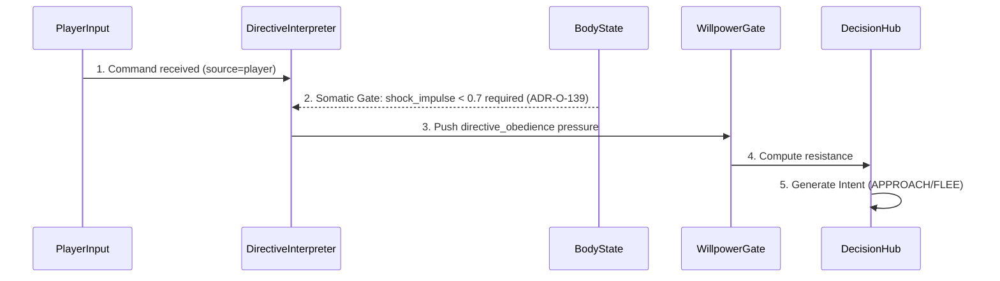

### Fast Path Emotional Injection Flow (ADR-088)

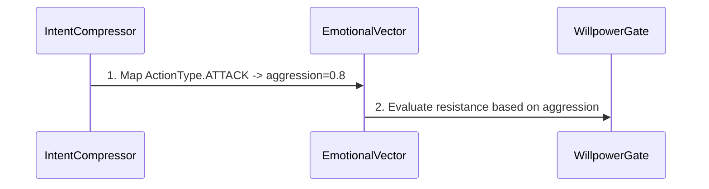

### Affective Pipeline → DecisionHub Utility Flow (ADR-117, §ENIGMA-S72)

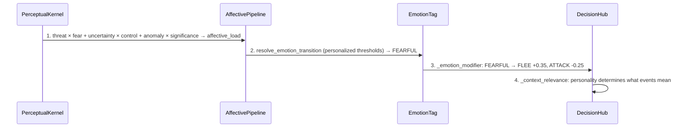

### Personality Math Flow (ADR-O-146)

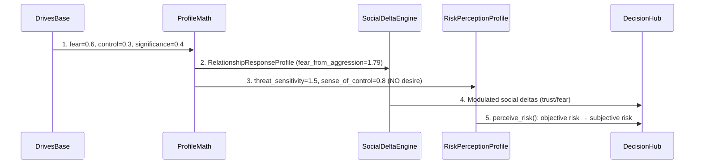

### Viability Pre-Generation Gate Flow (ADR-O-137)

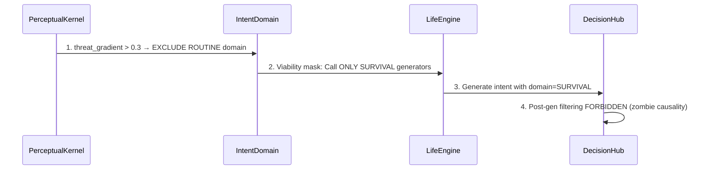

### L2.5 Belief Injection Flow (ADR-O-305)

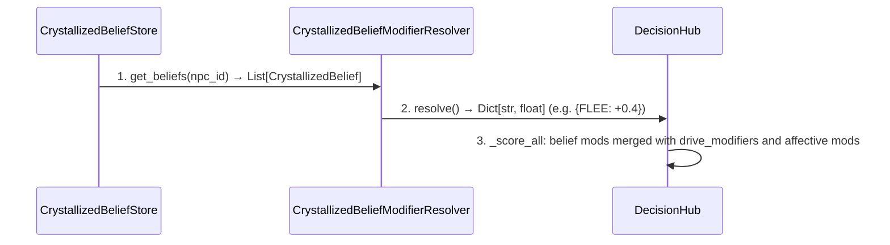

### Will Break & Behavior Mask Flow (S86)

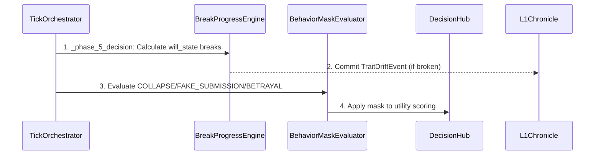

### Calibration Experiment Flow (M0)

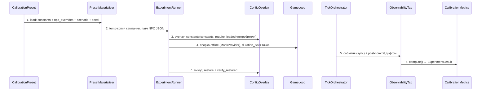

### Economy Tick Flow (Phase 2)

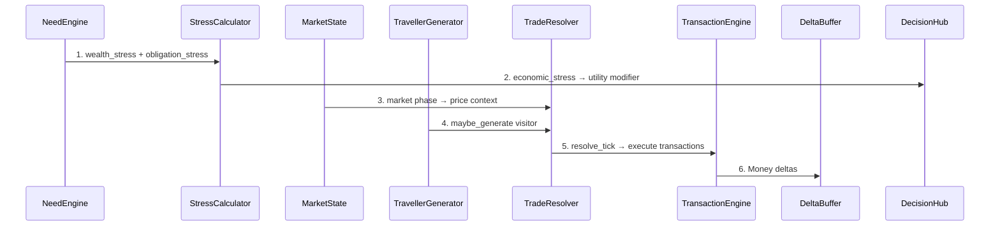

### Memory Application Flow (Phase 3)

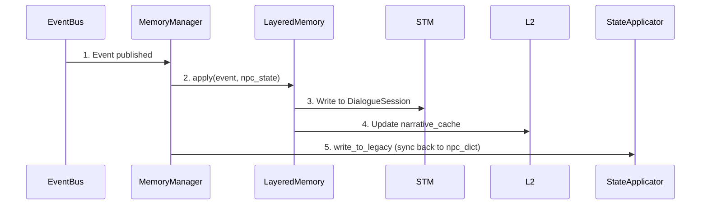

### Memory Promotion Flow

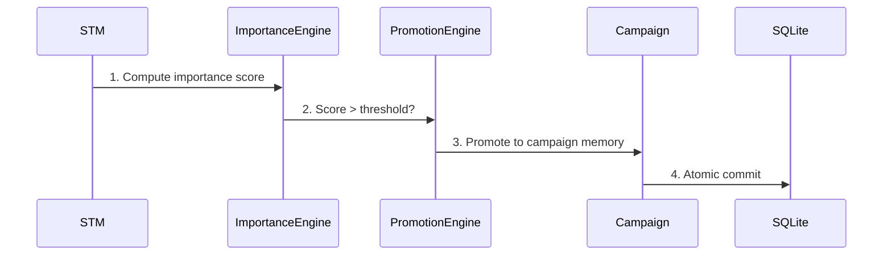

### Affective Resonance Scan (ADR-037)

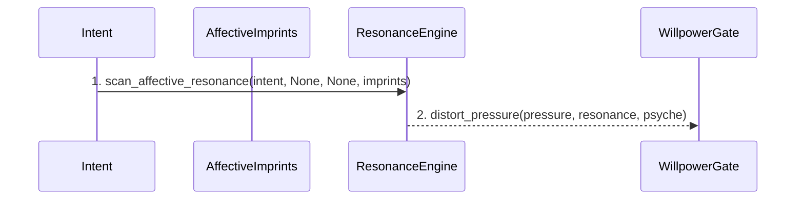

### Memory Promotion & Compression Flow (S86)

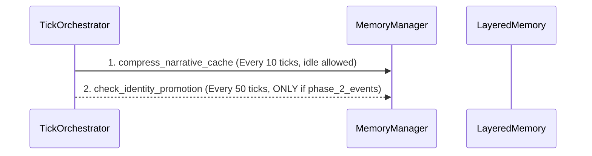

### Combat Impact Cascade

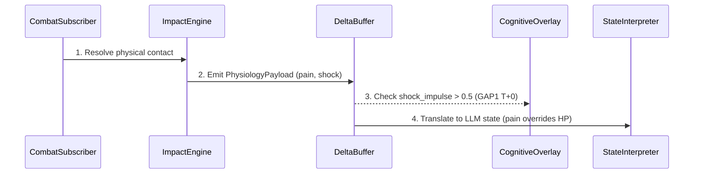

### Affective Pipeline Flow (ADR-117)

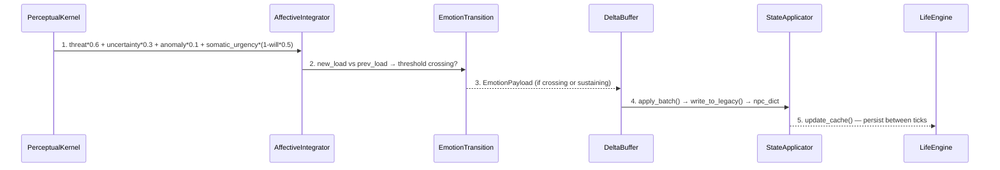

### Injury Chronic Pain Bridge (ADR-141)

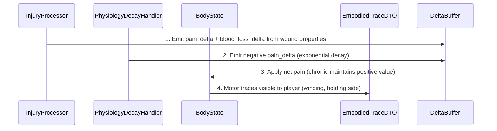

### Somatic Urgency Modulation (ADR-O-143)

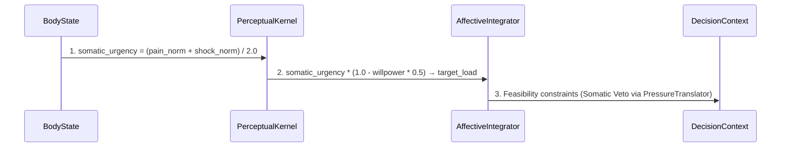

### Pipeline Tick Execution Flow

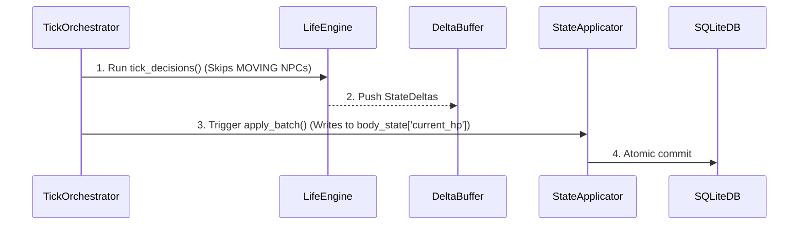

### Causal Kernel Pipeline Flow (ADR-O-201)

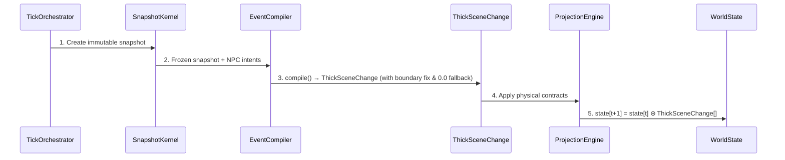

### Traversal Complete Snap & FSM Flow (ADR-130.2, ADR-TRAV-FSM)

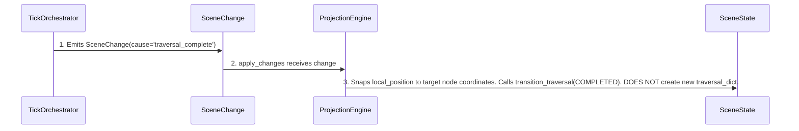

### Identity & Belief Crystallization Flow (ADR-O-305)

```mermaid
sequenceDiagram
participant WorldPressure
participant L1Chronicle
participant SQLiteDB
participant PatternDetector
participant BeliefCrystallizationEngine
participant CrystallizedBeliefStore
participant DecisionHub
WorldPressure->>L1Chronicle: 1. Append TraitDriftEvent (target_id, tick_id, effect_value)
L1Chronicle->>SQLiteDB: 2. Persist to l1_chronicle_events (ADR-O-208.2)
L1Chronicle->>PatternDetector: 3. query_raw() → List[TraitDriftEvent]
PatternDetector->>BeliefCrystallizationEngine: 4. detect() → List[EvidenceOfPersistence] (pure statistics)
BeliefCrystallizationEngine->>CrystallizedBeliefStore: 5. crystallize(drives_base) → CrystallizedBelief (with x6 trauma & decay)
CrystallizedBeliefStore->>DecisionHub: 6. resolve() → drive_modifiers (injects into utility scoring)
```

### Memory Promotion & Behavior Mask Flow (S86)

```mermaid
sequenceDiagram
participant TickOrchestrator
participant MemoryManager
participant BehaviorMaskEvaluator
participant DecisionHub
TickOrchestrator->>MemoryManager: 1. _phase_3_memory: compress_narrative_cache (idle). check_identity_promotion (ONLY if phase_2_events)
TickOrchestrator->>BehaviorMaskEvaluator: 2. _phase_5_decision: Evaluate WillState & relationships for COLLAPSE/FAKE_SUBMISSION/BETRAYAL
BehaviorMaskEvaluator->>DecisionHub: 3. Apply mask to utility scoring
```

### Player Cognition Pipeline

```mermaid
sequenceDiagram
participant SceneState
participant PerceptionLayer
participant SpatialLayer
participant RecognitionLayer
participant AttentionLayer
participant MemoryLayer
participant UncertaintyLayer
participant CognitiveDistortion
participant InterpretationLayer
SceneState->>PerceptionLayer: 1. Raw scene state
PerceptionLayer->>SpatialLayer: 2. Visible/audible entities
SpatialLayer->>RecognitionLayer: 3. Distance + LOS data
RecognitionLayer->>AttentionLayer: 4. Recognition confidence
AttentionLayer->>MemoryLayer: 5. Attended entities
MemoryLayer->>UncertaintyLayer: 6. Memory tier per entity
UncertaintyLayer->>CognitiveDistortion: 7. Uncertainty scores
CognitiveDistortion->>InterpretationLayer: 8. Biased perception
InterpretationLayer->>PerceivedScene: 9. Final: PerceivedScene
```

### Broken Traversal Flow (Node Not Found - BREAK-N)

```mermaid
sequenceDiagram
participant DecisionHub
participant MovementEngine
participant SpatialService
participant SceneStateManager
DecisionHub->>MovementEngine: 1. Intent(FLEE, target=main_hall)
MovementEngine->>SpatialService: 2. get_node('main_hall')
SpatialService-->>MovementEngine: 3. Return None (Node missing in fallback)
MovementEngine-->>SceneStateManager: 4. No Traversal created -> coords=None
```

### Semantic Spatial Binding Flow (ADR-S85.1)

```mermaid
sequenceDiagram
participant LifeEngine
participant SpatialService
participant NodeRef
LifeEngine->>LifeEngine: 1. Get activity (e.g., 'drinking')
LifeEngine->>LifeEngine: 2. Map to NodeRole.BAR via _ACTIVITY_TO_ROLE_MAP
LifeEngine->>SpatialService: 3. resolve_node(role=BAR, origin_zone=current_loc)
SpatialService->>LifeEngine: 4. Return NodeRef (canonical_id, x, y)
```

### Boundary Node Creation Flow (ДОЛГ 6.2, ADR-145)

```mermaid
sequenceDiagram
participant EditorJSON
participant GraphCompiler
participant BoundaryNode
participant SpatialService
EditorJSON->>GraphCompiler: 1. Load nodes + adjacency (east: city_gate, south: market_square)
GraphCompiler->>BoundaryNode: 2. _create_boundary_nodes(): exit_east, exit_south
BoundaryNode->>SpatialService: 3. boundary_map: {exit_east → {neighbor: city_gate, entry_direction: west}}
SpatialService->>SpatialService: 4. is_boundary_node() / get_boundary_info() for MovementEngine
```

### Adjacency Inference Success Flow (ADR-073)

```mermaid
sequenceDiagram
participant EditorJSON
participant GraphCompiler
participant AdjacencyInference
participant SpatialService
EditorJSON->>GraphCompiler: 1. Load rooms (as list) with empty passages
GraphCompiler->>AdjacencyInference: 2. Pass rooms for adjacency check
AdjacencyInference->>GraphCompiler: 3. Return inferred passages (based on bounding box)
GraphCompiler->>SpatialService: 4. Compile connected graph
```

### Semantic Target Resolution Flow (ADR-301)

```mermaid
sequenceDiagram
participant IntentCompressor
participant SemanticIndex
participant CandidateScoring
participant SelectionPolicy
participant SpatialService
IntentCompressor->>SemanticIndex: 1. Target reference string (e.g., 'тень')
SemanticIndex->>SemanticIndex: 2. Classify string (CANONICAL/ROLE_ALIAS/FUZZY)
SemanticIndex->>CandidateScoring: 3. Return List[Candidate]
CandidateScoring->>SelectionPolicy: 4. Score and select (STRICT_MAX/STABLE/DIVERSE)
SelectionPolicy->>SpatialService: 5. get_node(canonical_id)
```

### Traversal Complete Snap & FSM Flow (ADR-130.2, ADR-TRAV-FSM)

```mermaid
sequenceDiagram
participant TickOrchestrator
participant SceneChange
participant SceneStateManager
participant SceneState
TickOrchestrator->>SceneChange: 1. Emits SceneChange(cause='traversal_complete')
SceneChange->>SceneStateManager: 2. apply_changes receives change
SceneStateManager->>SceneState: 3. Snaps local_position. Calls transition_traversal(MOVING->COMPLETED). DOES NOT create new traversal.
```

### NPC Verbalization Flow (Phase 5-7)

```mermaid
sequenceDiagram
participant DecisionHub
participant TopicExtractor
participant VerbalStance
participant StateInterpreter
participant VerbalizationContext
participant DMContractBuilder
participant LlamaServer
participant NPCResponseValidator
DecisionHub->>VerbalStance: 1. DecisionResult → stance_from_decision()
TopicExtractor->>VerbalizationContext: 2. topic (non-empty, Устав §3.2)
StateInterpreter->>VerbalizationContext: 3. body_state → physical_state text
VerbalStance->>VerbalizationContext: 4. urgency + emotion → prompt_line
VerbalizationContext->>DMContractBuilder: 5. Assemble DM contract
DMContractBuilder->>LlamaServer: 6. system_prompt + user_prompt → LLM
LlamaServer->>NPCResponseValidator: 7. Validate + truncate + force_action
```


## 📊 Каузальная Карта (Micro-details)

> Детальная логика работы системы: условия срабатывания, привязка к коду и ADR.

### Потоки данных (Edges)

| Откуда | Куда | Описание | Условие / Логика | Код | ADR/GAP |
|--------|------|----------|------------------|-----|---------|
| WillpowerGate | DecisionHub | provides resistance & identity_rigidity | trauma_markers > 0 -> +0.1 identity_rigidity | `will.py:122-125` | GAP2 FIX |
| BodyState | DirectiveInterpreter | Somatic Gate: shock > 0.7 blocks interpretation (ADR-O-139) | shock_impulse > 0.7 -> return [] | `directive_interpretation_subscriber.py:58` | GAP4 FIX |
| BodyState | DecisionHub | Somatic Veto | pain > 0.8 blocks FLEE; shock > 0.7 blocks ATTACK | `pressure_translator.py:52` | GAP3 FIX |
| SourceID | DirectiveInterpreter | NPC-to-NPC legitimacy | fear_{source_id} > 0.3 | `directive_interpretation_subscriber.py:77-92` | GAP13 FIX |
| DirectiveInterpreter | DeltaBuffer | generates obedience/irritation | legitimacy > 0.3 -> obedience; else -> irritation | `directive_interpretation_subscriber.py:93-97` | ADR-057 |
| IntentEventAdapter | EventDTO | preserves semantic_action & target_id | Always if present in CommunicationIntent | `intent_event_adapter.py:46-47` | GAP8 FIX |
| CFRMSolver | PlayerObserver | parses avatar psyche | - | `local_causal_solver.py:320-324` | GAP7 FIX |
| IntentCompressor | EmotionalVector | injects emotions in Fast Path | ATTACK -> aggression=0.8; THREATEN -> aggression=0.5 | `intent_compressor.py:130` | ADR-088 |
| EmotionalVector | WillpowerGate | provides emotional charge | - | `will.py` | ADR-088 |
| AffectivePipeline | DecisionHub | EmotionTag → _emotion_modifier() → utility deformation | FEARFUL: FLEE +0.35, ATTACK -0.25. ANGRY: ATTACK +0.30. | `decision_hub.py:966-994` | ADR-117 |
| AffectivePipeline | DeltaBuffer | EmotionPayload | - | `tick_orchestrator.py:_run_affective_pipeline` | ADR-117 |
| ReactionSubscriber | AffectivePipeline | sets emotion directly (bypasses accumulator) | Anti-DOUBLE TRUTH bootstrap required | `reaction_subscriber.py:275` | ADR-117 |
| VitalStateEvaluator | AvatarPresentationAssembler | body_state['life_status'] → AvatarStateDTO.life_status | - | `avatar_presentation_assembler.py:30-37` | ADR-137 |
| AvatarPresentationAssembler | AvatarStateDTO | assemble_avatar_presentation → normalized phenomenological projection | - | `avatar_presentation_assembler.py:34-35` | ADR-094 |
| BodyState | PressureTranslator | pain (normalized /100.0) + shock + blood_loss → Somatic Veto constraints | - | `pressure_translator.py:53-64` | ADR-094 |
| PressureTranslator | DecisionContext | DecisionContext with feasibility constraints | - | `pressure_translator.py:57-64` | GAP3 |
| TickOrchestrator | DRFBus | owns self._drf_bus (instance-level) | - | `tick_orchestrator.py` | ADR-134 |
| DRFBus | DRFExecutionContext | drf_ctx = DRFExecutionContext(tick_id, npc_id, bus) — scoped per NPC | - | `tick_orchestrator.py, npc_tick_pipeline.py` | ADR-136 |
| ProfileMath | SocialDeltaEngine | computes RelationshipResponseProfile multipliers | ADR-O-146: fear_from_aggression, trust_from_help etc. Pure function. | `decision/social_deltas.py` | ADR-O-146 |
| ProfileMath | RiskPerceptionProfile | computes threat_sensitivity and sense_of_control | ADR-O-146: desire NOT included (risk ≠ readiness). | `decision/risk_profile.py` | ADR-O-146 |
| SocialDeltaEngine | DecisionHub | process(state, personality, event, intent) → List[StateDeltas] | Replaces inline _compute_deltas. Modulated by RelationshipResponseProfile. | `decision_hub.py` | ADR-O-146 |
| EventBus | SocialMemoryUpdater | EventDTO (COMBAT/DEATH/SOCIAL) | Ingest on event occurrence | `-` | ADR-O-212 |
| SocialMemoryUpdater | VillageMemoryField | ingest(event) / decay() | Updates consensus_risk, witness_count, agent_profiles | `-` | ADR-O-212 |
| VillageMemoryField | InstitutionLayer | consensus_risk, myth_level | Drives target institutional state | `-` | ADR-O-212 |
| InstitutionalInertia | InstitutionLayer | adaptation_rate filter | actual += (target - actual) * α. Prevents instant escalation. | `-` | ADR-O-212 |
| InstitutionLayer | DecisionHub | Decision Bias (effective_risk modifier) | effective_risk = base_risk * 0.6 + consensus_risk * 0.4 | `-` | ADR-O-212 |
| RiskPerceptionProfile | DecisionHub | perceive_risk() replaces _compute_risk() | Two-phase model: objective risk → subjective perception. DecisionHub calls perceive_risk() instead of self._compute_risk(). | `decision_hub.py, decision/risk.py` | ADR-O-146 |
| RelationshipStore | DecisionHub | provides read-only relationship_cache (0-100 scale) | ADR-121: SSOT. Cache is ephemeral per-tick projection. Consumers normalize 0-100 → 0-1. | `decision_hub.py` | ADR-121 |
| PerceptualKernel | IntentDomain | Viability mask projection | ADR-O-137: threat_gradient > 0.3 → EXCLUDE ROUTINE domain. Gate stands BEFORE generators. | `life_engine.py` | ADR-O-137 |
| CrystallizedBeliefStore | CrystallizedBeliefModifierResolver | get_beliefs() → List[CrystallizedBelief] | - | `crystallized_belief_store.py` | ADR-O-305 |
| CrystallizedBeliefModifierResolver | DecisionHub | resolve() → drive_modifiers (Dict[str, float]) | S85.2: L2.5 beliefs deform utility alongside L3 drives and L1.5 social context. | `npc_tick_pipeline.py` | ADR-O-305 |
| TickOrchestrator | BreakProgressEngine | calculates will_state breaks | Before DecisionHub in _phase_5_decision | `-` | ADR-S86.3 |
| BreakProgressEngine | L1Chronicle | commits TraitDriftEvent (target_id, effect_value) | - | `-` | ADR-O-208.1 |
| TickOrchestrator | BehaviorMaskEvaluator | evaluates mask before DecisionHub | Based on WillState and relationship_cache | `-` | ADR-S86.4 |
| BehaviorMaskEvaluator | DecisionHub | applies social mask to utility scoring | - | `-` | - |
| ConfigOverlay | CoreConstants | identity-патч значений + from-import биндингов sys.modules | verify на входе и выходе; вложенность/параллельность = RuntimeError | `calibration/config_overlay.py` | ADR-O-361 |
| CoreConstants | DecisionHub | from-import биндинги констант (27-43) | Патч только модуля констант НЕ действует на потребителей — причина identity-дизайна overlay | `decision_hub.py:27-43` | ADR-O-361 |
| ExperimentRunner | ConfigOverlay | вводит overlay на время прогона (require_loaded) | - | `-` | - |
| PresetMaterializer | CalibrationPreset | load + materialize | - | `-` | - |
| ExperimentRunner | PresetMaterializer | материализует temp-кампанию | - | `-` | - |
| ScenarioPlayer | TickOrchestrator | execute(interventions=[InterventionEvent]) | - | `-` | ADR-TZ08-1 |
| ExperimentRunner | GameLoop | headless-сборка и тики на temp-копии (шаблон DriftLaboratory) | - | `-` | - |
| EventBus | ObservabilityTap | sync-подписка на реальный реестр EventType | - | `-` | Закон 5.3 |
| ObservabilityTap | CalibrationMetrics | события + post-commit диффы сторов | - | `-` | - |
| GameStdout | CausalObserver | reads logs | Regex patterns, pipe/file read | `causal_observer.py` | - |
| GitHistory | CausalObserver | reads git log & TODOs | Every session start | `causal_observer.py` | - |
| DeterministicClock | CausalTrace | provides tick context | - | `-` | - |
| CausalObserver | CausalTrace | writes traces | Passive, try/except isolated | `causal_observer.py` | - |
| CausalObserver | TickHealthChecker | dispatches parsed events | Pattern match from registry | `causal_observer.py:_dispatch` | - |
| PatternRegistry | CausalObserver | provides compiled patterns | COMPILED dict at init | `pattern_registry.py` | - |
| TickHealthChecker | DNAComputer | provides TickHealthReport | After log parsing complete | `dna_metrics.py` | - |
| DNAComputer | CausalTrace | writes DNA snapshot + PFI | After session end | `dna_metrics.py` | - |
| Router | CausalObserver | notify_stream_start/end — LLM execution gate (ADR-147) | On LLM call start/stop. Prevents CDS blindness during streaming. | `dm_router.py` | ADR-147 |
| TickHealthChecker | TickHealthReport | produces health report | Aggregates prebus_failures and affect_decay_fails | `-` | - |
| DNAComputer | DNASnapshot | computes snapshot with PFI | - | `-` | - |
| DNAComputer | DNADelta | computes delta between sessions | - | `-` | - |
| DriftLaboratory | CausalTrace | records drift snapshots | S85.3: Idle stability test logs activity changes and traversals. | `drift_laboratory.py` | ADR-S85.3 |
| BeliefCrystallizationEngine | CausalObserver | logs crystallization & decay events | S85.2: CDS observes belief formation to detect stagnation or hyper-instability. | `belief_crystallization_engine.py` | ADR-O-305 |
| TickOrchestrator | GameStdout | emits [TICK_ORCH] summary | Every tick end: tick, game_time, decisions, verbal, moved. Feeds InvariantHealthChecker. | `tick_orchestrator.py` | ADR-INV-DEF |
| PostDecision | SimulationIntegrityError | raises on INV-DIALOGUE-PIPELINE | If communication_intents empty but verbal decisions > 0. | `phases/post_decision.py` | ADR-INV-DEF |
| TickOrchestrator | SimulationIntegrityError | raises on INV-TIME-FREEZE | If game_time_seconds does not grow. | `tick_orchestrator.py` | ADR-INV-DEF |
| WorldSnapshotBuilder | SimulationIntegrityError | raises on INV-TRAV-DICT or INV-NPC-NAME | If active_traversals is not dict or NPC has no name. | `integration/world_snapshot_builder.py` | ADR-INV-DEF |
| CausalObserver | InvariantHealthChecker | feeds [TICK_ORCH] and [SIM_INTEGRITY] lines | Parsed via new patterns in PatternRegistry. | `causal_observer.py:_dispatch` | ADR-INV-DEF |
| InvariantHealthChecker | InvariantViolation | produces violations | Post-mortem check after 10 ticks or on runtime crash. | `health_checkers/invariant_health.py` | ADR-INV-DEF |
| InvariantHealthChecker | DNAComputer | provides invariant_violations | For DNA metrics aggregation. | `dna_metrics.py` | ADR-INV-DEF |
| IPT | GameLoop | runs idle_tick in isolated world | Layer BEFORE. Executed by LLM before commit. | `backend/tests/IPT.py` | ADR-INV-DEF |
| NeedEngine | StressCalculator | need stress → economic_stress | get_wealth_stress + get_obligation_stress → calculate_economic_stress | `economy/stress_calculator.py` | - |
| StressCalculator | DecisionHub | economic_stress → utility modifier | Phase 5: economic stress deforms utility (buy vs talk vs work). S85.2: Competes with L2.5 Belief Modifiers. | `npc/decision_hub.py` | - |
| TradeResolver | TransactionEngine | resolve_tick → execute_sale/employment | Determine good → find seller → calculate price → execute | `economy/trade_resolver.py` | - |
| MarketState | TradeResolver | market phase → price modifier | CRASH = high prices, BOOM = low prices | `economy/market_state.py` | - |
| PsychoEconomy | NeedEngine | decay_modifier + consumption_frequency | Personality shapes how fast needs decay and how often NPC consumes | `economy/psycho_economy.py` | - |
| ProfileFactory | NeedEngine | EconomicProfile → need calculation | From npc_dict to structured profile | `economy/profile_factory.py` | - |
| EconomyTracker | DecisionHub | ticks_since_talk + daily_income → context | Phase 4-5: economic context for decision | `economy/economy_tracker.py` | - |
| OpportunityEngine | DecisionHub | opportunity result → action option | Phase 5: economic opportunity adds to action space | `economy/opportunity_engine.py` | - |
| TravellerGenerator | TradeResolver | traveller visit → trade opportunity | maybe_generate on tick → new buyer/seller | `economy/traveller.py` | - |
| EconomicModifier | TradeResolver | wealth modifier → price adjustment | calculate(profile) → price modification | `economy/economic_modifier.py` | - |
| TransactionEngine | DeltaBuffer | transaction result → state delta | Money transfer = state mutation via DeltaBuffer | `economy/transaction_engine.py` | - |
| GameScreen | APIRoutes | POST /action (IntentDTO) | On Enter key | `api_client.py` | - |
| APIRoutes | TickOrchestrator | resolve_player_intent() | Validate DTO | `routes.py` | - |
| StateApplicator | APIRoutes | WorldSnapshotDTO + will_conflict | End of action tick | `routes.py` | ADR-068 |
| APIRoutes | GameScreen | JSON Response | ActionQueue poll | `api_client.py` | - |
| GameScreen | APIRoutes | GET /api/world_state (polling) | Idle tick / read-only observation | `api_client.py` | ADR-TZ03-1 |
| GameScreen | APIRoutes | POST /api/game/action/stream (SSE) | Progressive rendering (future) | `api_client.py` | ADR-TZ03-1 |
| GameScreen | TextInput | infect() - motor resistance | will_conflict_data not None | `game_screen.py:808` | ADR-039 |
| GameScreen | PresentationFirewall | sanitize_perceptual_input() | On avatar_state update | `game_screen.py:890` | - |
| PresentationFirewall | PerceptualMomentum | SanitizedPerceptualVectors | S-curve inertia | `game_screen.py:893` | - |
| GameScreen | I18n | t(), activity_ru(), manifest_color() | All user-facing strings | `game_screen.py, scene_renderer.py` | ADR-i18n |
| SceneRenderer | SpriteRegistry | get_entity_sprite(type) | Rendering entities & obstacles | `scene_renderer.py` | ADR-TZ6-2 |
| APIRoutes | GameScreen | manifestations (List[ManifestationDTO]) | WorldSnapshot.player_perception | `world_snapshot_builder.py` | ADR-O-147 |
| TraitDriftEvent | L1Chronicle | appends drift record | World pressure mutates identity | `l1_chronicle.py:append` | - |
| BreakProgressEngine | L1Chronicle | commits TraitDriftEvent (target_id, effect_value) | WillState breaks or deforms | `break_progress_engine.py` | ADR-O-208.1 |
| CrystallizedBeliefStore | DriveResolver | provides L2.5 beliefs for projection | Tick start | `drive_resolver.py:resolve_drives` | ADR-S96.1 |
| DriveResolver | EffectiveDrives | - | - | `-` | ADR-S96.1 |
| CoreOrientation | LifeProject | initializes at spawn | NPC loaded from JSON | `npc_loader.py` | ADR-O-315 |
| BreakProgressEngine | LifeProjectResolver | triggers with identity_crisis=True | stage == deformation | `break_progress_engine.py` | ADR-O-316 |
| LifeProjectResolver | LifeProject | computes new direction | identity_crisis received | `life_project_resolver.py` | ADR-O-316 |
| LifeProject | DecisionHub | provides boosts for proactive intents | WORLD_TICK scoring | `decision_hub.py` | ADR-O-315 |
| EffectiveDrives | CalibrationEngine | pass-through (no scalar mutation) | ADR-O-211 DEPRECATION: Test C noise accumulation | `calibration_engine.py` | - |
| CalibrationEngine | DecisionHub | delivers L3_stable | Projection-native scoring (ADR-O-304) | `tick_orchestrator.py` | - |
| L1Chronicle | PatternDetector | query_raw() → List[TraitDriftEvent] | ADR-O-305A: Группировка по source_id | `pattern_detector.py` | - |
| PatternDetector | EvidenceOfPersistence | detect() → List[EvidenceOfPersistence] | Комбинированная variance (дисперсия + осцилляция). Event_type отсечён. | `pattern_detector.py` | - |
| EvidenceOfPersistence | BeliefCrystallizationEngine | aggregated statistics | Модуляция через drives_base (L0) | `belief_crystallization_engine.py` | - |
| BeliefCrystallizationEngine | CrystallizedBeliefStore | crystallize() → update_beliefs() | ADR-O-305: Формирование CrystallizedBelief | `belief_crystallization_engine.py, crystallized_belief_store.py` | - |
| CrystallizedBeliefStore | CrystallizedBeliefModifierResolver | get_beliefs() → List[CrystallizedBelief] | - | `crystallized_belief_modifier_resolver.py` | - |
| CrystallizedBeliefModifierResolver | DecisionHub | resolve() → drive_modifiers (Dict[str, float]) | S85.2: L2.5 beliefs deform utility alongside L3 drives | `npc_tick_pipeline.py` | - |
| ArchetypeConfig | DriveResolver | provides L0 archetype | Base personality traits and schedule | `npc_loader.py` | - |
| IndividualConfig | DriveResolver | merges individual overrides | Specific schedule/activity_map overrides | `npc_loader.py` | - |
| GameLoop | IntentCompressor | raw text input (async LLM compression) | Phase 1: GameLoop calls await compress() before resolve_player_intent (ADR-159) | `game_loop/__init__.py` | ADR-159 |
| IntentCompressor | LLMCompressorClient | Slow Path: complex intent → LLM | Fast Path failed or ambiguous. 3 retries. | `input/intent_compressor.py:_slow_path_parse` | - |
| IntentCompressor | DecisionHub | IntentSemanticField → pressure source | ATTACK → aggression. THREATEN → aggression. 'сюда'/'мне' → target_ref='player' | `input/intent_compressor.py` | ADR-088 |
| Reality | ManifestationState | manifests | - | `-` | - |
| MemoryManager | LayeredMemory | apply(event, npc_state) | Every event after EventBus (Phase 3) | `memory/memory_manager.py` | Устав §3.1 |
| LayeredMemory | DialogueSession | STM write/read | Per-NPC, 5 реплик | `memory/dialogue_session.py` | - |
| DialogueSession | PromotionEngine | promote on dialogue end | importance > threshold | `memory/promotion_engine.py` | - |
| PromotionEngine | SQLiteMemoryStore | campaign write | Atomic commit | `memory/sqlite_store.py` | - |
| PromotionEngine | YAMLMemoryExport | snapshot for human | On demand or session end | `memory/yaml_export.py` | - |
| ResonanceEngine | WillpowerGate | scan_affective_resonance → distort_pressure | Trauma pattern match amplifies pressure (ADR-037) | `affect.py:scan_affective_resonance` | ADR-037 |
| ImportanceEngine | PromotionEngine | importance score | Determines if memory promotes to campaign | `memory/importance_engine.py` | - |
| EventSemanticTagger | LayeredMemory | semantic tags for retrieval | After event processing | `memory/event_semantic_tagger.py` | - |
| TopicExtractor | DecisionHub | topic for decision | Phase 4: topic must not be empty (Устав §3.2) | `npc/topic_extractor.py` | Устав §3.2 |
| BeliefAggregator | BeliefTransitionEngine | aggregated evidence → belief update | After event processing | `npc/belief_transition_engine.py` | - |
| ContradictionResolver | BeliefTransitionEngine | contradiction detected → belief revision | New event contradicts existing belief | `memory/contradiction_resolver.py` | - |
| RelationshipStore | StateApplicator | relationship_cache updates | Via DeltaBuffer (Устав §4.1.2) | `memory/relationship_store.py` | - |
| TickOrchestrator | MemoryManager | _phase_3_memory: compress_narrative_cache | Every 10 ticks (idle allowed - structural optimization) | `tick_orchestrator.py` | ADR-S86.7 |
| TickOrchestrator | MemoryManager | _phase_3_memory: check_identity_promotion | Every 50 ticks (REQUIRES phase_2_events - prevents phantom drift) | `tick_orchestrator.py` | ADR-S86.7 |
| PerceivedSignal | FactExtractor | reads | - | `-` | - |
| FactExtractor | ObservedFact | produces | - | `-` | - |
| Reality | ManifestationState | manifests | - | `-` | - |
| ManifestationState | ObservationRelation | observed via | - | `-` | - |
| ObservationRelation | PerceivedSignal | filtered by physics | - | `-` | - |
| PerceivedSignal | ObservedFact | extracted | - | `-` | - |
| ObservedFact | Inference | hypothesized | - | `-` | - |
| ObservedFact | Memory | stored | - | `-` | - |
| Inference | Memory | stored | - | `-` | - |
| CombatSubscriber | ImpactEngine | resolves contact | Fuzzy target resolve | `combat_subscriber.py` | ADR-021 |
| ImpactEngine | PhysiologyPayload | computes | Physics composite (DRSL) | `impact_engine.py` | ADR-015 |
| PhysiologyPayload | DeltaBuffer | flushed to | Only PhysiologyPayload | `physiology.py` | ADR-020 |
| DecayHandler | DeltaBuffer | time-driven decay (Phase 0.5) — pain/fatigue/blood_loss/shock_impulse | Leaky integrator exp(-lambda*dt). SHOCK_DECAY_LAMBDA=0.08 (~8%/tick) | `physiology_decay_handler.py` | ADR-022, ADR-109 |
| InjuryProcessor | DeltaBuffer | injury-driven bleeding + chronic pain (Phase 0.5) | blood_loss_delta = structural_damage * zone_rate * type_modifier. pain_delta = structural_damage * zone_modifier * type_modifier (ADR-141). Compensates exponential decay. | `combat/injury_processor.py` | ADR-123, ADR-141 |
| StateApplicator | BodyState | writes damage to body_state['current_hp'] (ADR-HP-UNIFICATION) | Direct write to state.hp is FORBIDDEN. body_state['current_hp'] is canonical. | `npc/state_applicator.py` | ADR-HP-UNIFICATION |
| StateApplicator | VitalStateEvaluator | evaluates body_state after PHYSIOLOGY domain | Writes body_state['life_status']. DEATH LOCK (ADR-127): evaluate_vital_state проверяет life_status==DEAD первой — блокирует реинкарнацию. Decay handler пропускает DEAD NPC. | `npc/state_applicator.py` | ADR-123, ADR-127 |
| VitalStateEvaluator | DecisionHub | DEAD/UNCONSCIOUS → IDLE guard | Blocks decision-making for dead or unconscious NPCs. Sole authority on life/death. | `npc/decision_hub.py` | ADR-123 |
| PhysiologyPayload | StateInterpreter | provides pain & shock | Overrides HP for LLM prompt (GAP5) | `state_interpreter.py:273-291` | GAP5 FIX |
| PhysiologyPayload | BehaviorManifestationService | body_state (pain/blood_loss/shock_impulse) read via all_npcs_raw | Rule X: only physiology, not emotions (ADR-101) | `behavior_manifestation_service.py:42-56, state_applicator.py:474-515` | ADR-101 |
| BehaviorManifestationService | PhenomenologyProjectionService | EmbodiedTraceDTO (instability, micro_pause, action_interruption) | Phase 8.5 → Phase 9 | `phenomenology_projection_service.py:19-61` | ADR-101 |
| PhenomenologyProjectionService | PlayerPerceptionDTO | cue_keys (WINCING, BLEEDING, HOLDING_SIDE, STAGGERED) + atmosphere from motor traces | Phase 9 projection. Atmosphere computed from EmbodiedTraceDTO ratios, NOT from stress_delta | `phenomenology_projection_service.py:24-55` | ADR-101, ADR-112 |
| StateInterpreter | VerbalizationContext | physical_state (pain/shock/blood_loss → words) | interpret() called in npc_tick_pipeline, pain normalized /100.0 | `npc_tick_pipeline.py:208, state_interpreter.py:273` | ADR-094 |
| VitalStateEvaluator | AvatarPresentationAssembler | body_state['life_status'] → AvatarStateDTO.life_status | Assembler reads life_status from body_state. DEAD override zeros all projections. Frontend death overlay triggers on life_status=DEAD. | `avatar_presentation_assembler.py:30-37, snapshot.py:34-56` | ADR-137 |
| AvatarPresentationAssembler | AvatarStateDTO | assemble_avatar_presentation → normalized phenomenological projection | NORMALIZES pain/fatigue /100.0 (ADR-094 MSOC). pain=60 → 0.6 → WOUNDED. Without normalization: pain=60 → CRIPPLED (wrong). | `avatar_presentation_assembler.py:34-35` | ADR-094 |
| PerceptualKernel | PressureTranslator | kernel + body_state → DecisionContext (Somatic Veto) | NORMALIZES pain /100.0 (ADR-094 MSOC). Somatic Veto: pain>0.8 blocks FLEE, shock>0.7 blocks ATTACK. CRITICAL BUG FIXED: without normalization pain=0.8% always blocks FLEE. | `pressure_translator.py:53` | ADR-094, GAP3 |
| PressureTranslator | DecisionContext | DecisionContext with feasibility constraints | Constraints: FLEE blocked if pain>0.8, ATTACK blocked if shock>0.7, physical limited if blood_loss>0.6. After normalization fix: pain=85/100=0.85 blocks FLEE correctly (severe injury). | `pressure_translator.py:57-64` | ADR-094 |
| PerceptualKernel | PressureDerivation | threat_gradient + uncertainty + anomaly + somatic_urgency | Primary perception signals — no psychology. Somatic urgency reflects bodily distress (ADR-O-143). | `pressure_derivation.py:24-33` | ADR-049, ADR-O-143 |
| BodyState | PerceptualKernel | somatic_urgency = (pain_norm + shock_norm) / 2.0 | ADR-O-143: Pain/shock bypass to psyche killed. Goes through PK lens instead. Modulated by willpower in AffectiveIntegrator. | `perceptual_kernel.py, affective_integrator.py` | ADR-O-143 |
| BodyState | PressureDerivation | pain modulates threat; fatigue → sensory overload | Physiology modulates affective pressure | `pressure_derivation.py:24,36` | ADR-049 |
| PressureDerivation | EmotionResolution | AffectivePressureDTO (threat_load, uncertainty_load, aggression_charge) | Pure function: perception+body → pressure vector | `pressure_derivation.py:38-43` | ADR-049 |
| Psyche | EmotionResolution | personality modulates panic threshold | fear_drive lowers threshold; willpower raises it | `emotion_resolution.py:23-27` | ADR-049 |
| EmotionResolution | EmotionTag | threat+personality → fear/panic/rage/confusion | ONLY owner of psychological resolution | `emotion_resolution.py:33-46` | ADR-049 |
| EmotionResolution | NPCState_stress | stress_delta (aggregated load) | Side effect: stress accumulates from all emotion triggers | `emotion_resolution.py:35-46` | ADR-049 |
| PerceptualKernel | AffectiveIntegrator | threat_gradient * 0.6 + uncertainty * 0.3 + anomaly * 0.1 + somatic_urgency * (1.0 - will*0.5) | Every tick (idle + player turn). Somatic urgency modulated by willpower (ADR-O-143). | `affective/affective_integrator.py:28-32` | ADR-049, ADR-117, ADR-O-143 |
| AffectiveIntegrator | EmotionTransition | new_load vs prev_load → threshold crossing? | Phase collapse only on CROSSING. Stably high load = no payload without sustaining logic. | `affective/emotion_transition.py:18-60` | ADR-049, ADR-116 |
| EmotionTransition | DeltaBuffer | EmotionPayload (stress_delta, emotion_tag, affective_load) | Only if threshold crossing OR sustaining (ADR-116) | `tick_orchestrator.py:_run_affective_pipeline` | ADR-117 |
| ReactionSubscriber | DeltaBuffer | EmotionPayload (stress_delta, emotion_tag, affective_load=None) | Direct emotion from shock — bypasses accumulator | `reaction_subscriber.py:275` | ADR-117 |
| NPCStateAdapter | NPCStateAdapter | from_legacy / write_to_legacy round-trip | Every apply_batch call. Loses field = DOUBLE TRUTH. | `npc_state.py:635-800` | ADR-115, ADR-116, ADR-117 |
| TickOrchestrator | BODY_STATE_DISABLED | injects sentinel for NPC without body_state (Normalization Gate) | ADR-O-139: Before use in DirectiveInterpretationSubscriber and PressureTranslator. No body_state = inert matter. | `tick_orchestrator.py` | ADR-O-139 |
| LifeEngine | DeltaBuffer | emits intents & deltas | - | `-` | - |
| TickOrchestrator | DeltaBuffer | aggregates Phase 8 results | - | `-` | - |
| DeltaBuffer | StateApplicator | apply_batch() | - | `-` | - |
| CognitiveOverlay | StateApplicator | injects shock_impulse > 0.5 | - | `-` | - |
| StateApplicator | SQLiteDB | commits state | - | `-` | - |
| StateApplicator | BehaviorManifestationService | reads npc_positions (body_state only) | - | `-` | - |
| BehaviorManifestationService | PhenomenologyProjectionService | EmbodiedTraceDTO | - | `-` | - |
| PhenomenologyProjectionService | WorldSnapshotBuilder | Domain PlayerPerceptionDTO | - | `-` | - |
| WorldSnapshotBuilder | APIRoutes | Canonical PlayerPerceptionDTO | - | `-` | - |
| TickOrchestrator | LlamaServer | query LLM (3 retries) | - | `-` | - |
| GameScreen | APIRoutes | POST /action (IntentDTO) | - | `-` | - |
| DeltaBuffer | NPCStateAdapter | dict → NPCState → _apply_deltas → write_to_legacy → dict | - | `-` | - |
| TickOrchestrator | AffectivePipeline | calls _run_affective_pipeline(ctx) | - | `-` | - |
| StateApplicator | LifeEngine | update_cache(campaign_id, npc_dicts) | - | `-` | - |
| LifeEngine | SqlitePersistenceAdapter | load_npc_runtime — SQLite read-back | - | `-` | - |
| StateApplicator | AvatarPresentationAssembler | player_dict.body_state → AvatarStateDTO | - | `-` | - |
| TickOrchestrator | DRFBus | owns self._drf_bus (instance-level) | - | `-` | - |
| TickOrchestrator | TickState | assembles preloaded data & frozen snapshot | - | `-` | ADR-TZ10-1 |
| TickState | NpcTickPipeline | passes immutable state | - | `-` | ADR-TZ10-1 |
| NpcTickPipeline | TickMutation | returns pure result (deltas, intents, pending_io) | - | `-` | ADR-TZ10-1 |
| TickOrchestrator | TickMutation | commits deferred IO (l1_events, memory_events) & deltas | - | `-` | ADR-TZ10-1 |
| TickOrchestrator | TickContext | creates rng_factory (lambda npc_id: KernelRNG(tick, npc_id)) | - | `-` | ADR-O-301 |
| TickContext | NpcTickPipeline | passes rng_factory | - | `-` | ADR-O-301 |
| NpcTickPipeline | KernelRNG | calls rng_factory(npc_id) to get deterministic RNG | - | `-` | ADR-O-301 |
| KernelRNG | DecisionHub | provides deterministic rng (salt='decision_hub') | - | `-` | ADR-O-301 |
| TickOrchestrator | MemoryManager | _phase_3_memory (compress idle, promote on event) | - | `-` | - |
| TickOrchestrator | BehaviorMaskEvaluator | _phase_5_decision (evaluates mask before DecisionHub) | - | `-` | - |
| TickOrchestrator | BreakProgressEngine | calculates will_state breaks | - | `tick_orchestrator.py:_phase_5_decision` | - |
| BreakProgressEngine | L1Chronicle | commits TraitDriftEvent (target_id, effect_value) | - | `break_progress_engine.py` | ADR-O-208.1 |
| L1Chronicle | SQLiteDB | persists events to l1_chronicle_events | - | `-` | ADR-O-208.2 |
| DeltaBuffer | L1Chronicle | appends TraitDriftEvent from IdentityPayload | - | `-` | - |
| L1Chronicle | DriveResolver | provides weighted history (L1) | - | `-` | - |
| DriveResolver | EffectiveDrives | computes ephemeral projection (L3) | - | `-` | - |
| L1Chronicle | PatternDetector | query_raw() → List[TraitDriftEvent] | - | `-` | ADR-O-305A |
| PatternDetector | EvidenceOfPersistence | detect() → List[EvidenceOfPersistence] | - | `-` | - |
| EvidenceOfPersistence | BeliefCrystallizationEngine | aggregated statistics | - | `-` | - |
| BeliefCrystallizationEngine | CrystallizedBeliefStore | crystallize() → update_beliefs() | - | `-` | ADR-O-305 |
| CrystallizedBeliefStore | CrystallizedBeliefModifierResolver | get_beliefs() → List[CrystallizedBelief] | - | `-` | - |
| CrystallizedBeliefModifierResolver | DecisionHub | resolve() → drive_modifiers (Dict[str, float]) | - | `-` | - |
| SceneStateManager | WorldProjectionBuffer | calls project(state_t, state_t-1) inside commit() | - | `-` | - |
| WorldProjectionBuffer | WorldProjectionEvent | generates derived events | - | `-` | - |
| TimeSkipExecutor | TickOrchestrator | kernel.execute() loop | - | `-` | - |
| GameLoop | TimeSkipExecutor | get_npcs_callback | - | `-` | - |
| PerceptionLayer | SpatialLayer | visible/audible entities → distance + LOS | Only perceived entities get spatial data | `player_cognition/perception_layer.py` | - |
| SpatialLayer | RecognitionLayer | spatial data → recognition confidence | Distance affects recognition confidence | `player_cognition/spatial_layer.py` | - |
| RecognitionLayer | AttentionLayer | recognized entities → attention filter | Known entities get higher attention score | `player_cognition/recognition_layer.py` | - |
| AttentionLayer | MemoryLayer | attended entities → memory update | Only attended entities enter memory | `player_cognition/attention_layer.py` | - |
| MemoryLayer | UncertaintyLayer | memory tier → uncertainty bonus | Known entities = less uncertainty | `player_cognition/memory_layer.py` | - |
| UncertaintyLayer | CognitiveDistortion | uncertain entities → distortion input | High uncertainty + stress = more distortion | `player_cognition/uncertainty_layer.py` | - |
| CognitiveDistortion | InterpretationLayer | biased perception → inference | Distorted inputs produce wrong inferences | `player_cognition/cognitive_distortion.py` | - |
| InterpretationLayer | PerceivedScene | inferences → final scene | All layers contribute to PerceivedScene | `player_cognition/interpretation_layer.py` | - |
| PlayerCognitionPipeline | WorldSnapshotBuilder | PerceivedScene → snapshot enrichment | Pipeline output feeds into WorldSnapshotDTO | `player_cognition/pipeline.py` | - |
| EventBus | ReactionRules | EventDTO → micro events classification | Every published event. _is_threat_event check. | `reaction/reaction_rules.py` | - |
| ReactionRules | ReactionResolver | List[MicroEvent] → resolve | Filtered by type, distance, visibility | `reaction/reaction_resolver.py` | - |
| ReactionResolver | DeltaBuffer | immediate reaction → EmotionPayload | Bypasses affective accumulator. Sets emotion directly (ADR-117). | `reaction/reaction_resolver.py` | ADR-117 |
| RelationshipEvents | RelationshipEventSemantics | события сферы через EventBus | - | `-` | - |
| RelationshipEventSemantics | RelationshipStateStore | дельты через delta_buffer и StateApplicator | - | `-` | - |
| RelationshipDynamics | RelationshipStateStore | медленный контур дня, писатель StateApplicator | - | `-` | - |
| RelationshipStateStore | RelationshipModifierResolver | read-only проекция состояния | - | `-` | - |
| RelationshipModifierResolver | DecisionHub | apply_modifiers — Modifier Contract v1 | - | `-` | - |
| NeedSystem | NeedProviderRelationship | срочность дефицита | - | `-` | - |
| NeedProviderRelationship | DecisionHub | общий контур мотивации | - | `-` | - |
| RelationshipStateStore | RelationshipUtility | ленивое вычисление по требованию | - | `-` | - |
| Attachment | RelationshipUtility | компонент внутри RU — Т1 | - | `-` | - |
| RelationshipUtility | ScenarioEvaluations | вход ContinueValue | - | `-` | - |
| AlternativeValue | ScenarioEvaluations | вход ExitValue | - | `-` | - |
| Investment | ScenarioEvaluations | только LossInvest в ExitCost — СВ4 | - | `-` | - |
| ScenarioEvaluations | DecisionHub | сравнение — intent выбирает DecisionHub | - | `-` | - |
| BeliefPredicates | RelationshipModifierResolver | модификаторы из confidence предикатов | - | `-` | - |
| RelationshipStateStore | IdealizationReadout | read-only диагностика — mutation-нуль | - | `-` | - |
| DriveVector | SteeringResolver | resolve(drive, body, affordance) | - | `-` | - |
| SteeringResolver | KinematicProfile | produces velocity | - | `-` | - |
| KinematicProfile | MotionIntegrator | integrate(position, velocity) | - | `-` | - |
| MotionIntegrator | KinematicProfile | updates position & exertion | - | `-` | - |
| SpatialService | WorldTopologyProvider | get_zone_id(x, y) & geometry | S91: Возвращает zone_id для кэширования деформаций и базовую геометрию. | `-` | - |
| WorldTopologyProvider | AffordanceVector | query_affordance_field(region, pos) | S91: Мержит базовую геометрию, Hard Overrides и Soft Traces. | `-` | - |
| TickOrchestrator | DynamicAffordanceField | owns instance (S91) | Персистентный стигмергический слой. Переживает тики. | `-` | - |
| DynamicAffordanceField | WorldTopologyProvider | injected via constructor | S91: Провайдер мержит деформации и следы с базовой геометрией. | `-` | - |
| TickOrchestrator | DynamicAffordanceField | purge_hard_overrides(current_tick) | S91: Очистка истекших структурных деформаций в Фазе 0.5. | `-` | - |
| TickOrchestrator | DynamicAffordanceField | step_decay() | - | `-` | - |
| Phase1Input | MovementRequest | resolve_actor_reference() -> builds MovementRequest | ADR-O-314: Слой Интерпретации извлекает актора из текста и собирает контракт. | `-` | - |
| MovementRequest | TickOrchestrator | consumes movement_request from IntentResolution | ADR-O-314: TickOrchestrator читает готовый контракт вместо парсинга текста. | `-` | - |
| TickOrchestrator | LocalSteeringGoal | creates LocalSteeringGoal(actor_id) | ADR-O-314: Fast Path для микро-перемещений на основе готового контракта. | `-` | - |
| LocalSteeringGoal | MovementEngine | process_intents([LocalSteeringGoal]) | ADR-O-314: MovementEngine обрабатывает цель по actor_id. | `-` | - |
| DynamicAffordanceField | DeformationRecord | stores & queries (Hard Layer) | S91: Хранит DeformationRecord по ключу (region, zone_id, deformation_type). | `-` | - |
| DynamicAffordanceField | TracePayload | accumulates (Soft Layer) | S91: Накапливает TracePayload.magnitude по ключу (region, zone_id, trace_type). | `-` | - |
| TickOrchestrator | DynamicAffordanceField | apply_trace(TracePayload) | S91: Эмит стигмергических следов (movement_density, safety_confidence). | `-` | - |
| EditorJSON | GraphCompiler | load_editor_json | Parses rooms array & polygons | `graph_compiler.py` | - |
| BuiltinFallback | GraphCompiler | fallback graph | BREAK-2: JSON NOT FOUND -> Builtin | `graph_compiler.py` | - |
| SpatialRuntime | SpatialService | resolve_distance + extract_scene (ADR-102) | Требует campaign_id в scene_state. Fallback на euclidean_distance если SpatialService=None | `spatial_runtime.py:98` | - |
| SceneStateManager | SpatialRuntime | enriches scene_state with campaign_id (ADR-102) | Инжект campaign_id для SpatialService.build_for_location() | `scene_state_manager.py:272` | - |
| GraphCompiler | AdjacencyInference | triggers if passages empty | If no explicit passages provided | `-` | ADR-073 |
| AdjacencyInference | GraphCompiler | returns inferred passages | Based on polygon bounding box intersection | `-` | ADR-073 |
| GraphCompiler | SpatialService | compiles graph + boundary_map + rooms_geometry | S90: Возвращает 5 элементов (nodes, edges, alias_map, boundary_map, rooms_geometry) | `spatial_service.py` | - |
| SpatialService | WorldTopologyProvider | get_zone_id(x, y) & is_point_in_bounds(x, y) | S91: Возвращает zone_id для кэширования деформаций и bool для базовой проверки. | `-` | - |
| TickOrchestrator | DynamicAffordanceField | owns instance (S91) | Персистентный стигмергический слой. Переживает тики. | `-` | - |
| DynamicAffordanceField | WorldTopologyProvider | injected via constructor | S91: Провайдер мержит деформации с базовой геометрией. | `-` | - |
| WorldTopologyProvider | DynamicAffordanceField | apply_deformation(region, zone_id, record) | S91: Делегирует применение деформации в State-object. | `-` | - |
| TickOrchestrator | DynamicAffordanceField | purge_expired(current_tick) | S91: Очистка истекших деформаций в Фазе 0.5 (Temporalization Layer). | `-` | - |
| DynamicAffordanceField | DeformationRecord | stores & queries | S91: Хранит DeformationRecord по ключу (region, zone_id, deformation_type). | `-` | - |
| LifeEngine | DriveVector | generates with MotionPrimitive | S90: LifeEngine добавляет 4-й элемент (primitive) в drive_vector list на основе affective_load. | `-` | - |
| DriveVector | CollisionAvoidance | apply(drive, pos, topology) | S90: Проверка геометрии впереди. Возвращает скорректированный DriveVector. | `-` | - |
| SpatialService | SpatialQueryService | provides read-only spatial API | O(1) queries for positions, LOS, distances | `-` | ADR-048 |
| SpatialQueryService | MovementEngine | reads graph & positions | O(1) spatial index | `spatial_query_service.py` | ADR-048 |
| SpatialService | MovementEngine | get_node(target_id) | Direct access for node resolution | `spatial_service.py` | - |
| LifeEngine | SpatialService | resolve_node(role=NodeRole) (S85.1) | Activity -> _ACTIVITY_TO_ROLE_MAP -> resolve_node(role, origin_zone) | `life_engine.py` | ADR-S85.1 |
| SemanticIndex | SpatialService | resolves semantic targets to canonical IDs | Returns List[Candidate] with scoring | `-` | ADR-301 |
| DecisionHub | MacroMovementGoal | produces domain-typed movement goal | Goal contains IntentDomain for viability mask | `-` | ADR-O-137 |
| MovementEngine | SceneChange | produces | Only if get_node() != None | `movement_engine.py` | ADR-052 |
| SceneChange | SceneStateManager | applied by | - | `-` | - |
| SceneStateManager | TraversalDict | enriches, interpolates & transitions | Uses transition_traversal() for FSM (PENDING->MOVING->COMPLETED). ADR-130.2: On traversal_complete snaps position, does NOT create new traversal. | `scene_state_manager.py:1145,1585` | ADR-TRAV-FSM, ADR-130.2 |
| EventCompiler | BoundaryNode | resolves boundary transitions at compile time | Uses frozen snapshot, NOT live SpatialService. ADR-O-201 | `event_compiler.py` | - |
| PersistencePort | SqlitePersistenceAdapter | primary implementation | Default. Atomic commit. Runtime truth (Устав §4.2.1). | `state/sqlite_persistence_adapter.py` | - |
| PersistencePort | JsonPersistenceAdapter | fallback implementation | Legacy. No transactions = data corruption risk (Устав §4.2.3). | `state/json_persistence_adapter.py` | - |
| StateApplicator | PersistencePort | atomic_commit(campaign_id, scene_state, npc_dicts) | End of tick. All or nothing (Устав §4.2.1). Stage 0: Сериализация через to_persistence_dict (write_to_legacy переименован). | `npc/state_applicator.py` | - |
| ContextBuilder | TickOrchestrator | build_context → TickContext | Every tick start | `state/context_builder.py` | - |
| TemporalEngine | TickOrchestrator | temporal context + tick counter | Every tick start. campaign_id scoped. | `temporal/temporal_engine.py` | - |
| TemporalEngine | DecayHandler | mark_decay_executed → skip double decay | Prevents decay running twice per tick | `temporal/temporal_engine.py` | - |
| GameTimeConstants | TickOrchestrator | GAME_TICK_INTERVAL_SECONDS, ETKE_IK_SUBSTEP_DT | Time semantics isolation (ADR-O-302). ETKE_IK_DT удалён как мёртвый код. | `core/constants.py` | - |
| GameTimeConstants | LifeEngine | GAME_TICK_INTERVAL_SECONDS (REAL_TIME_BRIDGE), AFFECT_DECAY_BASE_RATE | Reconcile state & affective decay | `core/constants.py` | - |
| StateInterpreter | VerbalizationContext | physical_state (pain/shock/blood_loss → words) | interpret() called in npc_tick_pipeline. Pain normalized /100.0 | `npc_tick_pipeline.py:208, state_interpreter.py:273` | ADR-094 |
| VerbalizationContext | DMContractBuilder | context → contract assembly | Phase 6: build DM prompt from NPC context | `verbalization/dm_contract_builder.py` | - |
| DMContractBuilder | DMContract | build() → contract | Builder pattern: add_player_action, add_scene, add_player_state... | `verbalization/dm_contract_builder.py` | - |
| DMContract | LlamaServer | system_prompt + user_prompt → LLM | Via agent_runner | `game_loop/agent_runner.py` | - |
| LlamaServer | ResponseValidator | raw LLM response → validate | Check language, repeats, length, dialog, forced actions | `verbalization/response_validator.py` | - |
| LlamaServer | NPCResponseValidator | raw NPC response → validate | Extended validation: muted mode, fallback text | `verbalization/npc_response_validator.py` | - |
| SceneContinuity | DMContractBuilder | continuity prompt block | Flags, facts, tension, emotional_vector → context for LLM | `verbalization/scene_continuity.py:to_prompt_block` | - |
| SceneOutcomeBuilder | VerbalizationContext | scene outcome → context enrichment | NpcOutcome + PlayerOutcome + latent signals → DM frame | `verbalization/scene_outcome_builder.py` | - |
| DecisionHub | VerbalStance | decision → verbal stance | stance_from_decision() maps urgency + emotion to prompt_line | `verbalization/verbal_stance.py:stance_from_decision` | - |
| VerbalStance | VerbalizationContext | stance → prompt_line in context | Urgency + emotional nuance shape LLM output | `verbalization/verbal_stance.py:to_prompt_line` | - |
| PromptLoader | DMContractBuilder | load system prompts | Template files for DM/NPC contracts | `verbalization/prompt_loader.py` | - |
| MemoryManager | VerbalizationContext | memory entries → context | STM + L2 provide conversation history and beliefs | `memory/memory_manager.py` | - |
| WorldObjectStore | WorldObject | typed operations: spawn / establish / release / relocate | Мутация protected-полей ТОЛЬКО через операции; переходы в domain-слое валидируются конструктором (safe by construction). | `-` | - |
| WorldObjectStore | SceneState | scene_state['world_objects'] subtree (lazy on write only) | SSOT — subtree scene_state; стор ничего не держит; на диск — только atomic_commit_all (Foundation Freeze); загрузка — load_scene_at. | `-` | - |
| WorldObjectStore | AffordanceResolver | read-only composition (query_objects_at -> resolve) | W2 НЕ расширяет WorldTopologyProvider (ADR-O-371 taboo); объекты — только через стор/снапшот-поле; resolver pure, без IO/LLM/мутаций | `-` | - |

### Архитектурные запреты (Constraints)

| Источник | Цель | Правило | Код/Документ |
|----------|------|---------|--------------|
| DecisionHub | Raw_Delta | FORBIDDEN: Use T+0 pressure (Only T-1) | `ADR-050` |
| DirectiveInterpreter | MovementIntent | FORBIDDEN: Direct movement generation | `ADR-043` |
| IntentCompressor | EmotionalVector | FORBIDDEN: Return default 0.0 vector for ATTACK (ADR-088) | `ADR-088` |
| StateInterpreter | EmotionTag | FORBIDDEN: Derive psychological state from stress (ADR-104) | `state_interpreter.py:46-50` |
| AffectivePipeline | DecisionHub | REQUIRED: Affective pipeline must run in player turn (ADR-117) | `tick_orchestrator.py:1282` |
| ReactionSubscriber | AffectivePipeline | REQUIRED: Anti-DOUBLE TRUTH bootstrap when emotion != NEUTRAL but affective_load < threshold (ADR-117) | `tick_orchestrator.py:_run_affective_pipeline` |
| NPCStateAdapter | EmotionTag | FORBIDDEN: from_legacy/write_to_legacy without emotion and emotion_delta (ADR-116) | `npc_loader.py:496, npc_state.py:760-804` |
| DecisionHub | relationship_cache | REQUIRED: relationship_cache = nested {target_id: {trust: 0-100, fear: 0-100}}. SSOT = RelationshipStore. NOT persisted in NPCState (ADR-121). Consumers normalize 0-100 → 0-1. | `decision_hub.py:789, decision_hub.py:935` |
| DecisionHub | APPROACH_score | REQUIRED: PHYSICS_OF_POWER boost directly to scores[APPROACH], not via _context_relevance (ADR-036 FIX) | `decision_hub.py:293-303` |
| LifeEngine | update_routine | REQUIRED: Movement Lock — check active_traversals before mutating routine (ADR-130) | `life_engine.py:1227-1233` |
| LifeEngine | _arousal_gate | REQUIRED: Arousal Gate — missing wake edge (ADR-O-142A). Behavior transition gate, NOT consciousness. | `life_engine.py:_arousal_gate()` |
| DecisionHub | _context_relevance | REQUIRED: Payload target_id fallback (ADR-130) | `decision_hub.py:1039-1049` |
| Engine | Emotion | FORBIDDEN: Engine generates meaning or assigns emotion (§ENIGMA-S72) | `tick_orchestrator.py, affective_integrator.py, decision_hub.py` |
| DecisionHub | EmotionTag | REQUIRED: _emotion_modifier must receive drives_base (§ENIGMA-S72) | `decision_hub.py:1056-1084` |
| LegacyStateDeltaAdapter | stress_delta | FORBIDDEN: Convert uncertainty_delta to stress_delta (§ENIGMA-004) | `legacy_delta_adapter.py:60-65` |
| AvatarPresentationAssembler | pain_fatigue | REQUIRED: Normalize pain/fatigue /100.0 before threshold comparison (ADR-094 MSOC) | `avatar_presentation_assembler.py:34-35` |
| PressureTranslator | pain | REQUIRED: Normalize pain /100.0 before Somatic Veto thresholds (ADR-094 MSOC) | `pressure_translator.py:53` |
| AvatarStateDTO | life_status | REQUIRED: AvatarStateDTO MUST contain life_status field (ADR-137) | `snapshot.py:34-56` |
| GameLoop | WorldSnapshotDTO | REQUIRED: Death Guard MUST include npc_positions in world_snapshot (ADR-137) | `game_loop/__init__.py:653-690` |
| TickOrchestrator | DRFBus | FORBIDDEN: DRFBus via default_factory in _TickContext — split-brain (ADR-134) | `tick_orchestrator.py` |
| Any | DRFBus | FORBIDDEN: Monkey-patch function for bus injection (ADR-134) | `tick_orchestrator.py` |
| Any | VillageMemoryField | REQUIRED: VillageMemoryField is the ONLY social truth (ADR-O-212) | `-` |
| InstitutionLayer | InstitutionalInertia | REQUIRED: Institutional Inertia prevents instant escalation (ADR-O-212) | `-` |
| InstitutionalInertia | InstitutionalInertia | REQUIRED: resistance_to_change > 0.0 (ADR-O-212) | `-` |
| VillageMemoryField | VillageMemoryField | REQUIRED: myth_level requires multi-location + witnesses + contradiction (ADR-O-212) | `-` |
| TickOrchestrator | DRFExecutionContext | REQUIRED: Pass drf_ctx to pipeline (ADR-136) | `tick_orchestrator.py, npc_tick_pipeline.py` |
| TickOrchestrator | MovementIntent | REQUIRED: DRF scoring overlay in BOTH idle and player paths (ADR-135) | `tick_orchestrator.py` |
| Any | priority_scale | FORBIDDEN: Clamp override max(priority, N) at 0.0-1.0 scale (ADR-135) | `tick_orchestrator.py` |
| ProfileMath | RelationshipProfile | FORBIDDEN: Import _drive_multiplier from relationship_profile. Only from profile_math (ADR-O-146) | `-` |
| RiskPerceptionProfile | Desire | FORBIDDEN: desire in RiskPerceptionProfile (ADR-O-146) | `-` |
| ProfileMath | DriveMultiplier | REQUIRED: drive_multiplier(0.25) MUST return exactly 1.0 (ADR-O-146) | `-` |
| DecisionHub | SocialDeltaEngine | REQUIRED: _compute_deltas delegated to SocialDeltaEngine.process() (ADR-O-146) | `-` |
| DecisionHub | RiskPerceptionProfile | REQUIRED: _compute_risk delegated to perceive_risk() (ADR-O-146) | `-` |
| LifeEngine | IntentDomain | REQUIRED: Viability Pre-Generation Gate (ADR-O-137). Threat excludes ROUTINE BEFORE intent generation. | `-` |
| MacroMovementGoal | IntentDomain | REQUIRED: MovementIntent MUST have domain field (ADR-O-137) | `-` |
| TickOrchestrator | IntentParametersDTO | DEPRECATED: target_id field (ADR-125) | `-` |
| LifeEngine | NeedIntent | REQUIRED: Need-driven priority (0.8) MUST override schedule priority (0.6) when need >= threshold (ADR-149) | `life_engine.py:_simulate_major` |
| LifeEngine | routine_current | REQUIRED: routine['current'] MUST update when need-driven wins (ADR-149 BUG SC FIX) | `life_engine.py:_simulate_major` |
| LifeEngine | ScheduleIntent | REQUIRED: Skip schedule generation when need-driven intent already in candidates (ADR-149) | `life_engine.py:_simulate_major` |
| LifeEngine | NeedIntent | REQUIRED: Need-driven MUST resolve target via SpatialService.resolve_node() when activity_map entry missing (ADR-150) | `life_engine.py:_check_need_driven_movement` |
| LifeEngine | _NEED_ROLE_MAP | REQUIRED: Every _NEED_TO_ACTIVITY entry MUST have corresponding _NEED_ROLE_MAP entry (ADR-150) | `life_engine.py` |
| LifeEngine | MovingNPC | FORBIDDEN: LifeEngine generating intents for NPC in status MOVING (ADR-154) | `-` |
| CrystallizedBeliefModifierResolver | DecisionHub | REQUIRED: L2.5 beliefs MUST be injected as drive_modifiers, not bypassing scoring (ADR-O-305) | `-` |
| BreakProgressEngine | TraitDriftEvent | FORBIDDEN: Using legacy fields (npc_id, tick, trait, delta). MUST use (target_id, tick_id, effect_value) (ADR-O-208.1) | `-` |
| BehaviorMaskEvaluator | BehaviorMask | REQUIRED: Mask must be quasi-stable (hysteresis). Prevent social role flickering (ADR-S86.4) | `-` |
| Any | CalibrationLab | FORBIDDEN: ядро (TickOrchestrator, DecisionHub, stores) импортирует app.services.calibration — обратные зависимости | `-` |
| ConfigOverlay | CoreConstants | REQUIRED: verify на входе и verify_restored на выходе; вложенный overlay = RuntimeError | `-` |
| ConfigOverlay | CoreConstants | FORBIDDEN: параллельные overlay в одном процессе (изоляция процессами, M3+) | `-` |
| ExperimentRunner | NPCState | FORBIDDEN: мутация NPCState/психики в обход StateApplicator. Вмешательства — только InterventionEvent → TickOrchestrator | `-` |
| ExperimentRunner | game_time | REQUIRED: метрическое время = детерминированная проекция тиков (tick / ticks_per_real_minute); wall-clock — только метаданные эксперимента (§15.2) | `-` |
| ObservabilityTap | EventBus | REQUIRED: полный try/except вокруг обработчика; никакого I/O в обработчике; отказ наблюдателя не роняет каузальный поток | `-` |
| ExperimentRunner | LlmProvider | REQUIRED: offline — MockProvider (environment != production, B4-FIX); реальный LLM в прогонах калибровки запрещён (детерминизм) | `-` |
| CalibrationPreset | npc_overrides | FORBIDDEN: фейковая реализация [PLAN]-параметров; валидатор помечает их как no-op | `-` |
| CausalObserver | Runtime_State | FORBIDDEN: Feedback loop into simulation | `Устав §11.1` |
| CDS | Pipeline | FORBIDDEN: Interrupt causal flow on crash | `Устав §11.2` |
| TickOrchestrator | CausalObserver | REQUIRED: Log pre-bus failures as [PIPELINE][CRITICAL], [PHASE8_CRASH], [AFFECT_DECAY] (Invariant 3, ADR-120) | `tick_orchestrator.py` |
| TickHealthChecker | DNAComputer | REQUIRED: Report prebus_failures and affect_decay_fails in DNASnapshot — PFI metric (Invariant 3, ADR-120) | `dna_metrics.py` |
| Router | CausalObserver | REQUIRED: Notify stream start/end for observability (ADR-147) | `dm_router.py` |
| DriftLaboratory | SceneState | REQUIRED: Read spatial positions from scene_state[npc_positions] (SSOT), not LifeEngine cache (ADR-S85.3) | `drift_laboratory.py` |
| Any | PrintProbe | REQUIRED: Print probes MUST NOT be deleted without replacement (ADR-151) | `tick_orchestrator.py, life_engine.py, movement_engine.py, belief_crystallization_engine.py` |
| Any | EmptyBlock | FORBIDDEN: Empty code block after probe removal — causes IndentationError (ADR-151) | `tick_orchestrator.py` |
| Any | SimulationIntegrityError | FORBIDDEN: Catching SimulationIntegrityError in try/except. Let the pipeline crash. | `app/errors.py` |
| LLM_Architect | IPT | REQUIRED: Run `python backend/tests/IPT.py` before closing a step. | `backend/tests/IPT.py` |
| LLM_Architect | LAST_SESSION | REQUIRED: Read 🔴 RED INVARIANTS section before starting new work. | `reports/LAST_SESSION.md` |
| TransactionEngine | NPCState | FORBIDDEN: Direct mutation of NPC money | `-` |
| NeedEngine | DecisionHub | REQUIRED: Critical needs MUST influence decision | `-` |
| Frontend | BackendInternals | FORBIDDEN: Import backend.app (Устав §1.1) | `Устав §1.1` |
| APIRoutes | NPCState | FORBIDDEN: Pass internal state to UI | `Устав §6.1` |
| GameScreen | SpatialObstacles | FORBIDDEN: Boolean collision check (must use Push-out Resolution) | `game_screen.py:188-247` |
| SceneRenderer | SpatialObstacles | FORBIDDEN: Treat obstacle x,y as center (must use as top-left corner) | `scene_renderer.py:263-270` |
| GameScreen | Emotion | FORBIDDEN: Show emotions (fearful, anxious) — only observable manifestations (tense, rigid) | `game_screen.py` |
| GameScreen | PerceptionData | FORBIDDEN: Compute manifest in GameScreen — only read from perception data | `game_screen.py` |
| GameScreen | Manifestations | FORBIDDEN: Mix cues and manifestations — separate channels | `phenomenology_projection_service.py, game_screen.py` |
| GameScreen | GameState | FORBIDDEN: Mutate game_time_seconds (+=) in frontend. Backend is sole time authority. | `game_screen.py` |
| GameScreen | AvatarState | FORBIDDEN: Override avatar_state fields in frontend. Backend is sole avatar authority. | `game_screen.py` |
| GameScreen | DialogJournal | FORBIDDEN: Append to dialog_journal locally in frontend. Read from backend. | `game_screen.py` |
| GameScreen | NPCNamesConfig | FORBIDDEN: Use contextlib.suppress(Exception) on system boundaries. Use try/except with logger. | `game_screen.py` |
| GameLoopBridge | SpatialOracle | FORBIDDEN: Silent pass (except Exception: pass) in Spatial Oracle. Log errors. | `game_loop_bridge.py` |
| WorldSnapshotBuilder | NPCPositionDTO | REQUIRED: Return npc_positions as Dict[str, NPCPositionDTO], not List. | `world_snapshot_builder.py` |
| PeripheralCueDTO | Frontend | REQUIRED: Use cue_key field (renamed from cue_type). | `snapshot.py` |
| _MinimalFrontendRegistry | SpatialOracle | REQUIRED: Implement find_chunks method. | `spatial_compilation_orchestrator.py` |
| Any | L1Chronicle | FORBIDDEN: Deletion from L1Chronicle (Append-only history) | `ADR-O-208` |
| Any | EffectiveDrives | FORBIDDEN: Caching EffectiveDrives (L3-P1 is strictly ephemeral) | `ADR-O-208` |
| StateApplicator | OntologyViolationError | REQUIRED: Raise OntologyViolationError and kill tick on NaN, sum!=1.0, or bounds violation | `ADR-O-207` |
| CalibrationEngine | EffectiveDrives | DEPRECATED for scalar mutation (Test C noise accumulation). Pass-through mode ONLY | `ADR-O-211 DEPRECATION` |
| CalibrationEngine | DrivesRuntime | FORBIDDEN: Applying ctx.drives_updates to state.drives_runtime. CalibrationEngine MUST be pass-through (ADR-O-211) | `ADR-O-211 (S86)` |
| BreakProgressEngine | TraitDriftEvent | FORBIDDEN: Using legacy fields (npc_id, tick, trait, delta). MUST use (target_id, tick_id, effect_value) (ADR-O-208.1) | `ADR-O-208.1` |
| DecisionHub | EffectiveDrives | REQUIRED: Projection-native scoring. L0 (drives_base) prohibited in scoring | `ADR-O-304` |
| BeliefCrystallizationEngine | DecisionHub | REQUIRED: Beliefs modify policy via source-specific vectors, NOT abstract scalar fear | `ADR-O-305` |
| PatternDetector | L1Chronicle | REQUIRED: Group by source. Do not accumulate noise from uncorrelated events | `ADR-O-305` |
| ArchetypeConfig | SpatialService | FORBIDDEN: Storing activity_map with concrete coordinates inside archetypes (ADR-S85.2) | `config/npc/archetypes/*.json` |
| IndividualConfig | SpatialService | REQUIRED: Cross-location activity_map MUST be defined in individual config (ADR-S85.2) | `config/npc/individuals/*.json` |
| PatternDetector | EventType | FORBIDDEN: Using event_type in mathematical formulas (ADR-O-305A) | `-` |
| PatternDetector | Psychology | FORBIDDEN: PatternDetector reading emotions, drives, or beliefs (ADR-O-306) | `-` |
| BeliefCrystallizationEngine | L1Chronicle | FORBIDDEN: BeliefCrystallizationEngine reading L1Chronicle directly. MUST use EvidenceOfPersistence (ADR-O-305) | `-` |
| BeliefCrystallizationEngine | CrystallizedBelief | REQUIRED: Asymmetric Trauma (x6 multiplier) and Belief Decay Model (ADR-O-307 / ADR-O-305.1) | `-` |
| DriveResolver | L1Chronicle | FORBIDDEN: DriveResolver reading L1Chronicle directly. Must consume CrystallizedBelief (L2.5) from CrystallizedBeliefStore (ADR-S96.1) | `-` |
| DriveResolver | EffectiveDrives | FORBIDDEN: L3=L0 fallback (pass statement). L3 MUST be deformed by L2.5 beliefs if they exist (ADR-S96.1) | `-` |
| Any | CoreOrientation | FORBIDDEN: Mutation of CoreOrientation (L0) in runtime (§16.1) | `-` |
| DecisionHub | CoreOrientation | FORBIDDEN: Reading personality.core_orientation for boosts. MUST use state.life_direction (L2.7) | `-` |
| BreakProgressEngine | LifeProject | FORBIDDEN: Direct mutation of life_direction inside BreakProgressEngine. MUST use LifeProjectResolver | `-` |
| IntentCompressor | EmotionalVector | FORBIDDEN: Return default 0.0 vector for ATTACK (ADR-088) | `ADR-088` |
| ManifestationState | ObserverPosition | FORBIDDEN: ManifestationState не должен зависеть от позиции наблюдателя | `-` |
| ManifestationState | PerceptualKernel | FORBIDDEN: ManifestationState не должен зависеть от психики наблюдателя | `-` |
| Any | MemoryManager | FORBIDDEN: Write to memory bypassing MemoryManager (Устав §4.1.2) | `Устав §4.1.2` |
| DialogueSession | WorkingMemory | REQUIRED: WorkingMemory is per-NPC (Устав §4.1.1) | `Устав §4.1.1` |
| PromotionEngine | LayeredMemory | FORBIDDEN: Promotion as method of LayeredMemory (Устав §4.1.3) | `Устав §4.1.3` |
| YAMLMemoryExport | RuntimeTruth | FORBIDDEN: YAML as runtime truth (Устав §4.2.2) | `Устав §4.2.2` |
| DecisionHub | TopicExtractor | REQUIRED: Topic must not be empty (Устав §3.2) | `npc/topic_extractor.py` |
| MemoryManager | IdentityPromotion | FORBIDDEN: check_identity_promotion in idle ticks without phase_2_events. Prevents phantom identity drift (ADR-S86.7) | `tick_orchestrator.py` |
| ObservedFact | InferenceEngine | REQUIRED: Составные выводы (hand_on_weapon) должны вычисляться в InferenceEngine, а не в FactExtractor | `-` |
| Reality | PresentationAssembler | FORBIDDEN: Потребители не могут читать Reality напрямую | `-` |
| ManifestationState | ObserverPosition | FORBIDDEN: ManifestationState не зависит от наблюдателя | `-` |
| ObservationRelation | EntityMetadata | FORBIDDEN: ObservationRelation не содержит NPC id, Faction, Mood, Memory | `-` |
| ObservedFact | CompositeConclusions | FORBIDDEN: ObservedFact должен быть строго атомарным | `-` |
| Inference | Reality | FORBIDDEN: Inference не может изменять Reality | `-` |
| CombatSubscriber | Emotion | FORBIDDEN: Domain Leakage (ADR-021) | `ADR-021` |
| StateInterpreter | HP_Ratio | FORBIDDEN: Ignore pain/shock | `state_interpreter.py:273` |
| StateInterpreter | Pain_Scale | FORBIDDEN: Read pain without /100.0 normalization | `state_interpreter.py:273, state_applicator.py:491` |
| BehaviorManifestationService | Emotion | FORBIDDEN: Read psyche (fear/stress) instead of body_state (Rule X, ADR-101, ADR-112) | `behavior_manifestation_service.py` |
| NPCStateAdapter | BodyState | FORBIDDEN: from_legacy/write_to_legacy without body_state (ADR-100) | `npc_state.py:631-673` |
| NPCStateAdapter | PerceptualKernel | FORBIDDEN: from_legacy/write_to_legacy without perceptual_kernel (ADR-115). relationship_cache and affective_load MUST NOT be serialized (ADR-121/122). | `npc_state.py:680-695, _pk_from_dict()` |
| NPCStateAdapter | EmotionTag | FORBIDDEN: from_legacy/write_to_legacy without emotion and emotion_delta (ADR-116) | `npc_state.py:_emotion_from_str(), write_to_legacy(), from_legacy()` |
| StateApplicator | asdict | FORBIDDEN: Local-scope asdict import (ADR-099) | `state_applicator.py:1-24` |
| DecayHandler | ShockImmortality | FORBIDDEN: shock_impulse without decay (ADR-109) | `physiology_decay_handler.py` |
| StateApplicator | ShockDeltaBlock | FORBIDDEN: shock_impulse > 0.0 check instead of != 0.0 (ADR-109) | `state_applicator.py:516-518` |
| NPCStateSnapshot | ShockBlindness | FORBIDDEN: NPCStateSnapshot without shock_impulse field (ADR-109, ADR-110) | `idle_tick.py, combat_subscriber.py` |
| PhenomenologyProjectionService | StressDelta | FORBIDDEN: Read stress_delta for atmosphere calculation (ADR-112) | `phenomenology_projection_service.py` |
| TickOrchestrator | AffectiveIntegrator | FORBIDDEN: Read psyche from npc_raw.psyche.drives_base (ADR-116) | `tick_orchestrator.py:1834` |
| TickOrchestrator | EmotionPayload | REQUIRED: Sustaining emotion when affective_load > threshold but emotion=NEUTRAL (ADR-116) | `tick_orchestrator.py:1864-1877` |
| NPCStateAdapter | NPCStateAdapter | REQUIRED: from_legacy reads npc_id from both 'npc_id' and 'id' keys (ADR-117) | `npc_state.py:769` |
| NPCStateAdapter | NPCStateAdapter | REQUIRED: write_to_legacy writes npc_id to both 'npc_id' and 'id' keys (ADR-117) | `npc_state.py:645-660` |
| _aggregate_deltas | EmotionPayload | REQUIRED: Merge preserves affective_load field (ADR-117) | `tick_orchestrator.py:1534-1541` |
| LifeEngine | LifeEngine | REQUIRED: update_cache() after apply_batch (ADR-117) | `life_engine.py:779-786` |
| GameLoop | LifeEngine | REQUIRED: _load_npcs_with_runtime reads LifeEngine cache before file (ADR-117) | `game_loop/__init__.py:212-213` |
| SqlitePersistenceAdapter | JSON | REQUIRED: json.dumps with default handler for set (ADR-117) | `sqlite_persistence_adapter.py:76` |
| TickOrchestrator | AffectivePipeline | REQUIRED: Anti-DOUBLE TRUTH bootstrap when emotion != NEUTRAL but affective_load < threshold (ADR-117) | `tick_orchestrator.py:_run_affective_pipeline, _phase_9_integration` |
| TickOrchestrator | CFRM_P2 | FORBIDDEN: threat_level < 0.1 gate kills entire affective pipeline (ADR-117) | `tick_orchestrator.py:1821` |
| Any | HP_Death | FORBIDDEN: hp <= 0 as source of death (ADR-123) | `domain/vital_state.py` |
| Any | Shock_Death | FORBIDDEN: shock_impulse as source of death (ADR-123) | `domain/vital_state.py` |
| Any | Phantom_Ontology | FORBIDDEN: brain_integrity/heart_function/respiration without causal source (ADR-123) | `domain/vital_state.py` |
| StateApplicator | Dead_In_Statuses | FORBIDDEN: Writing 'dead' to body_state.statuses (ADR-123) | `npc/state_applicator.py` |
| InjuryProcessor | String_Flags | FORBIDDEN: Reading 'bleeding' from critical_effects as logic source (ADR-123) | `combat/injury_processor.py` |
| PlayerAvatarService | BodyState | REQUIRED: body_state/affective_load/perceptual_kernel serialization in _state_to_dict/_state_from_dict (ADR-128) | `player_avatar_service.py:_state_to_dict, _state_from_dict` |
| PlayerAvatarService | EmotionTag | FORBIDDEN: Reading wounds/conditions as physiology source instead of body_state (ADR-128) | `player_avatar_service.py` |
| AvatarPresentationAssembler | pain_fatigue | REQUIRED: Normalize pain/fatigue /100.0 before threshold comparison (Rule 63, ADR-094 MSOC) | `avatar_presentation_assembler.py:34-35` |
| PressureTranslator | pain | REQUIRED: Normalize pain /100.0 before Somatic Veto thresholds (Rule 64, ADR-094 MSOC) | `pressure_translator.py:53` |
| Any | pain_fatigue_raw | CONTRACT: body_state['pain'] and body_state['fatigue'] stored in 0-100. blood_loss and shock_impulse stored in 0-1. Consumers with 0-1 thresholds MUST normalize /100.0 (ADR-094 MSOC) | `Multiple files` |
| AvatarStateDTO | life_status | REQUIRED: AvatarStateDTO MUST contain life_status field (Rule 81, ADR-137) | `snapshot.py:34-56, avatar_presentation_assembler.py:37-47` |
| Any | BodyState | REQUIRED: Inject BODY_STATE_DISABLED for NPC without body_state (ADR-O-139 NPIC) | `tick_orchestrator.py` |
| DirectiveInterpretationSubscriber | BodyState | FORBIDDEN: Shock > 0.7 check AFTER semantic parsing (ADR-O-139) | `directive_interpretation_subscriber.py` |
| PerceptualKernel | Psyche | FORBIDDEN: Somatic Bypass (Injecting pain/shock directly into psyche dict) (ADR-O-143) | `affective_integrator.py` |
| InjuryProcessor | PainDelta | REQUIRED: InjuryProcessor MUST generate pain_delta alongside blood_loss_delta (ADR-141) | `injury_processor.py` |
| TickOrchestrator | NPCState | FORBIDDEN: Using NPCState.from_legacy. MUST use NPCStateAdapter.from_legacy (ADR-S85.1.1) | `-` |
| StateApplicator | HP | FORBIDDEN: Direct write to state.hp. MUST write to body_state['current_hp'] (ADR-HP-UNIFICATION) | `npc/state_applicator.py, npc_state.py` |
| LifeEngine | NPC_Position | FORBIDDEN: Direct mutation (ADR-051) | `-` |
| Any | State | FORBIDDEN: Bypass DeltaBuffer | `-` |
| TickOrchestrator | Time | FORBIDDEN: TICK_CATCHUP loops (ADR-047) | `-` |
| TickOrchestrator | TickContext | FORBIDDEN: Emergency SpatialService build when cache exists (ADR-065) | `-` |
| TickOrchestrator | TickContext | FORBIDDEN: Use location_id as campaign_id (ADR-089) | `-` |
| DMAgent | FakeNarrative | FORBIDDEN: Fake narrative fallback on LLM failure (ADR-113) | `-` |
| NPCStateAdapter | NPCState | REQUIRED: Round-trip integrity (ADR-117) | `-` |
| LifeEngine | LifeEngine | REQUIRED: update_cache() called after every apply_batch (ADR-117) | `-` |
| LifeEngine | SqlitePersistenceAdapter | REQUIRED: SQLite read-back on cache miss (ADR-128) | `-` |
| GameLoop | PlayerAction | REQUIRED: Action Eligibility Gate (ADR-131) | `-` |
| Any | DecisionHub | FORBIDDEN: DecisionHub() without rng. All kernel randomness MUST go through KernelRNG (ADR-O-301) | `-` |
| Any | KernelLayer | FORBIDDEN: Use of global random.* in kernel layer. Must use KernelRNG(tick, npc_id, salt) (ADR-O-301) | `-` |
| AvatarPresentationAssembler | pain_fatigue | REQUIRED: Normalize pain/fatigue /100.0 (ADR-094 MSOC) | `-` |
| PressureTranslator | pain | REQUIRED: Normalize pain /100.0 (ADR-094 MSOC) | `-` |
| AvatarStateDTO | life_status | REQUIRED: AvatarStateDTO MUST contain life_status field (ADR-137) | `-` |
| TickOrchestrator | DRFBus | FORBIDDEN: DRFBus via default_factory in _TickContext (ADR-134) | `-` |
| AffectivePipeline | affective_load | REQUIRED: Asymmetric Attractor (Hysteresis). NO leaky integrator (ADR-138) | `-` |
| ProjectionEngine | SpatialService | FORBIDDEN: SpatialService query inside apply_changes (Rule 117, ADR-O-201) | `-` |
| ProjectionEngine | RNG | FORBIDDEN: RNG inside apply_changes (Rule 118, ADR-O-201) | `-` |
| ProjectionEngine | Pathfinding | FORBIDDEN: Pathfinding inside apply_changes (Rule 119, ADR-O-201) | `-` |
| ProjectionEngine | TraversalDict | FORBIDDEN: Traversal creation inside apply_changes (Rule 120, ADR-O-201) | `-` |
| Any | L1Chronicle | FORBIDDEN: Deletion from L1Chronicle (Append-only history) (ADR-O-208) | `-` |
| Any | EffectiveDrives | FORBIDDEN: Caching EffectiveDrives (L3-P1 is strictly ephemeral) (ADR-O-208) | `-` |
| StateApplicator | OntologyViolationError | REQUIRED: Raise OntologyViolationError and kill tick on NaN, sum!=1.0, or bounds violation (ADR-O-207) | `-` |
| LifeEngine | MovingNPC | FORBIDDEN: LifeEngine generating intents for NPC in status MOVING (ADR-154) | `-` |
| ProjectionEngine | ActiveTraversal | FORBIDDEN: apply_changes overwriting active traversal with status MOVING (ADR-130.1) | `-` |
| ProjectionEngine | TraversalComplete | FORBIDDEN: Creating new traversal_dict for cause=traversal_complete. MUST snap local_position (ADR-130.2, ADR-TRAV-FSM) | `-` |
| ProjectionEngine | TraversalStatus | FORBIDDEN: Direct mutation of traversal status. MUST use transition_traversal() FSM (ADR-TRAV-FSM) | `-` |
| EventCompiler | NullCoordinate | FORBIDDEN: Using None for SpatialResolution.target_xy. MUST use (0.0, 0.0) fallback (ADR-O-201.3) | `-` |
| EquivalenceValidator | CrossLocationTopology | FORBIDDEN: validate_topology for cross-location transitions. Nodes are physically different (ADR-O-201.2) | `-` |
| TickOrchestrator | NPCState | FORBIDDEN: Using NPCState.from_legacy. MUST use NPCStateAdapter.from_legacy (ADR-S85.1.1) | `-` |
| BreakProgressEngine | TraitDriftEvent | FORBIDDEN: Using legacy fields (npc_id, tick, trait, delta). MUST use (target_id, tick_id, effect_value) (ADR-O-208.1) | `-` |
| StateApplicator | HP | FORBIDDEN: Direct write to state.hp. MUST write to body_state['current_hp'] (ADR-HP-UNIFICATION) | `-` |
| CalibrationEngine | DrivesRuntime | FORBIDDEN: Applying ctx.drives_updates to state.drives_runtime. CalibrationEngine MUST be pass-through (ADR-O-211) | `-` |
| MemoryManager | IdentityPromotion | FORBIDDEN: check_identity_promotion in idle ticks without phase_2_events. Prevents phantom identity drift (ADR-S86.7) | `-` |
| PatternDetector | EventType | FORBIDDEN: Using event_type in mathematical formulas (ADR-O-305A) | `-` |
| PatternDetector | Psychology | FORBIDDEN: PatternDetector reading emotions, drives, or beliefs (ADR-O-306) | `-` |
| BeliefCrystallizationEngine | L1Chronicle | FORBIDDEN: BeliefCrystallizationEngine reading L1Chronicle directly. MUST use EvidenceOfPersistence (ADR-O-305) | `-` |
| BeliefCrystallizationEngine | CrystallizedBelief | REQUIRED: Asymmetric Trauma (x6 multiplier) and Belief Decay Model (ADR-O-307 / ADR-O-305.1) | `-` |
| TickOrchestrator | WorldProjectionBuffer | FORBIDDEN: Direct call. Projection MUST be called inside SceneStateManager.commit() (ADR-O-309) | `-` |
| WorldProjectionBuffer | State | FORBIDDEN: Mutation of world state. Pure function only (ADR-O-309) | `-` |
| WorldProjectionBuffer | Cache | FORBIDDEN: Internal state/cache. Stateless projection only (ADR-O-309) | `-` |
| SceneStateManager | State_t_minus_1 | REQUIRED: Deep immutable snapshot (copy.deepcopy) of state_t to prevent temporal cross-contamination (ADR-O-309) | `-` |
| CognitiveDistortion | ObjectiveReality | REQUIRED: Player MUST NOT see objective reality directly | `-` |
| RecognitionLayer | NPCName | REQUIRED: Unknown NPC MUST have generic description | `-` |
| ReactionResolver | AffectivePipeline | REQUIRED: Anti-DOUBLE TRUTH bootstrap (ADR-117) | `tick_orchestrator.py:_run_affective_pipeline` |
| ReactionResolver | DecisionHub | FORBIDDEN: Reactions must NOT bypass DecisionHub for movement | `-` |
| DecisionHub | RelationshipUtility | FORBIDDEN обратная причинность — решение не меняет RU — №26 | `-` |
| ScenarioEvaluations | RelationshipUtility | FORBIDDEN сценарный слой не переписывает RU — №26 | `-` |
| DecisionHub | AlternativeValue | FORBIDDEN обратные пути запрещены — матрица знаний 9.10.7 | `-` |
| Frustration | PartnerDesire | FORBIDDEN прямого входа нет — только через аффект — ПД5 и Фр4 | `-` |
| Satiation | NeedSystem | FORBIDDEN сатурация не меняет давление и Satisfaction — №21 | `-` |
| AlternativeValue | RelationshipUtility | FORBIDDEN альтернатива не читает RU текущей связи — аксиома 23 | `-` |
| RelationshipDynamics | Infatuation | TOMBSTONE воскрешение под любым именем запрещено — №35.1 | `-` |
| RelationshipDynamics | Bond | TOMBSTONE Bond удалён окончательно — РУ3 | `-` |
| ObservedRelationshipState | SharedHistory | FORBIDDEN derived-сводка не пишется в парные факты — №16 | `-` |
| MovementEngine | SceneState | FORBIDDEN: Direct mutation (ADR-066) | `ADR-066` |
| GraphCompiler | SpatialService | FORBIDDEN: Добавлять orphan rooms в навигационный граф при наличии nodes (жёсткая двухслойная топология ADR-121) | `S91.1` |
| MovementEngine | SceneChange | FORBIDDEN: Генерировать кросс-локационный SceneChange напрямую, минуя boundary node (ДОЛГ 6.2) | `S91.1` |
| SceneStateManager | SpatialService | FORBIDDEN: Mutate graph | `ADR-008` |
| Enrichment | LOD0_Position | FORBIDDEN: Overwrite pipeline position (ADR-072) | `ADR-072` |
| GraphCompiler | EditorJSON | FORBIDDEN: Require manual passages if polygons are adjacent (ADR-073) | `ADR-073` |
| SpatialService | TickContext | FORBIDDEN: Use location_id as campaign_id (ADR-089) | `tick_orchestrator.py` |
| TickOrchestrator | SpatialService | FORBIDDEN: Emergency build_for_location when self._spatial_service already resolved (ADR-065) | `tick_orchestrator.py:225-232` |
| GraphCompiler | EditorJSON | FORBIDDEN: Use room x,y as node coordinates (must use centroid x+w/2, y+h/2) | `graph_compiler.py:108-115` |
| GameScreen | WorldSnapshotDTO | FORBIDDEN: Overwrite local_position for NPC in MOVING status (ADR-096) | `game_screen.py:794-799` |
| GraphCompiler | LegacyName | REQUIRED: Role-based legacy aliases in alias_map (ADR-114) | `-` |
| WorldTopologyProvider | AffordanceVector | REQUIRED: Non-uniform field. MUST query is_point_in_bounds. (S90 Audit) | `-` |
| CollisionAvoidance | DriveVector | REQUIRED: MUST execute before SteeringResolver. Modifies direction/intensity based on geometry. (S90 Audit) | `-` |
| LifeEngine | DriveVector | REQUIRED: drive_vector list MUST contain 4 elements [dx, dy, intensity, primitive_str]. (S90 Audit) | `-` |
| Frontend | WorldSnapshotDTO | REQUIRED: MotionRenderRouter. MUST check velocity first (ETKE-IK), then path_waypoints (FSM). (S90 Audit) | `-` |
| EventCompiler | SpatialService | FORBIDDEN: Node lookup in snapshot.spatial_service for cross-location SceneChange (S88 БАГ S) | `event_compiler.py:168-173` |
| EventCompiler | SceneChange | REQUIRED: boundary_snap fallback uses change.value and change.target_local_xy when node=None (S88 БАГ S) | `event_compiler.py:231-234` |
| TickOrchestrator | SpatialService | REQUIRED: SpatialService per-location scope — get_node() cannot resolve cross-location nodes (S88) | `spatial_service.py:117-129` |
| DataManager | EditorJSON | REQUIRED: Map editor nodes added via DataManager.add_node() — NOT manual JSON editing (S88 БАГ N) | `data_manager.py:847-858, graph_compiler.py:134-153` |
| SpatialQueryService | SpatialRuntime | FORBIDDEN: Wrong argument order in is_line_of_sight_clear call (ADR-129) | `spatial_query_service.py:68` |
| SceneStateManager | SpatialRuntime | FORBIDDEN: CEI-2 uses is_movement_blocked instead of is_blocked_by_wall (ADR-129) | `scene_state_manager.py:1276` |
| SpatialRuntime | SceneState | REQUIRED: normalize_scene_state() on every consumer function (ADR-129) | `spatial_runtime.py` |
| SceneStateManager | SceneState | REQUIRED: isinstance(scene, dict) guard in get_scene_state and get_scene_state_uncached (ADR-129) | `scene_state_manager.py:255,319` |
| TickOrchestrator | MovementEngine | REQUIRED: DRF scoring overlay applied to movement intents in BOTH idle and player paths (ADR-135) | `tick_orchestrator.py` |
| MovementEngine | priority_scale | FORBIDDEN: Clamp override max(priority, N) at 0.0-1.0 scale (ADR-135) | `tick_orchestrator.py` |
| BoundaryNode | SpatialService | FORBIDDEN: Boundary node as movement goal or dwelling (Rule 108, ADR-145) | `graph_compiler.py` |
| GraphCompiler | BoundaryNode | REQUIRED: Create boundary nodes from adjacency (ADR-145) | `graph_compiler.py` |
| EventCompiler | BoundaryResolution | REQUIRED: Boundary resolution in EventCompiler, NOT in apply_changes (ADR-O-201) | `event_compiler.py (NEW)` |
| ProjectionEngine | SpatialService | FORBIDDEN: SpatialService.build_for_location() inside Projection Engine (ADR-O-201) | `scene_state_manager.py:1230` |
| SemanticIndex | Any | FORBIDDEN: SemanticIndex returns single canonical_id (Must return List[Candidate]) | `-` |
| MacroMovementGoal | IntentDomain | REQUIRED: MovementIntent MUST have domain field (ADR-O-137) | `-` |
| LifeEngine | SceneStateManager | REQUIRED: Movement Lock — update_routine MUST check scene_state.active_traversals before mutating routine (ADR-130) | `-` |
| LifeEngine | _resolve_position | FORBIDDEN: Fallback to string nodes like 'common_area' (S85.1) | `life_engine.py:1633` |
| SpatialQueryService | SceneState | FORBIDDEN: Read distances or positions directly from scene_state (ADR-048, ADR-TZ04-1) | `-` |
| Any | SpatialService | FORBIDDEN: Direct SpatialService.build_for_location() call. MUST use SpatialFactory.build_for_campaign() (ADR-TZ04-4) | `-` |
| LifeEngine | MovingNPC | FORBIDDEN: LifeEngine generating intents for NPC in status MOVING (ADR-154) | `-` |
| SceneStateManager | ActiveTraversal | FORBIDDEN: apply_changes overwriting active traversal with status MOVING (ADR-130.1) | `-` |
| SceneStateManager | TraversalComplete | FORBIDDEN: Creating new traversal_dict for cause=traversal_complete. MUST snap local_position (ADR-130.2, ADR-TRAV-FSM) | `-` |
| SceneStateManager | TraversalStatus | FORBIDDEN: Direct mutation of traversal status (status = ...). MUST use transition_traversal() FSM (ADR-TRAV-FSM) | `-` |
| WorldSnapshotBuilder | current_waypoint_idx | REQUIRED: Must propagate current_waypoint_idx from runtime dict to frontend projection (ADR-TRAV-FSM) | `-` |
| EventCompiler | BoundaryFlag | REQUIRED: EventCompiler MUST set is_boundary=True when target_loc is present (ADR-O-201.1) | `-` |
| EventCompiler | NullCoordinate | FORBIDDEN: Using None for SpatialResolution.target_xy. MUST use (0.0, 0.0) fallback (ADR-O-201.3) | `-` |
| EventCompiler | TraversalContract | FORBIDDEN: Creating TraversalContract with status=COMPLETED. EventCompiler MUST return traversal=None for cause=traversal_complete and boundary snap. SSM owns lifecycle (ADR-O-201.4, ADR-TRAV-FSM). | `-` |
| EquivalenceValidator | CrossLocationTopology | FORBIDDEN: validate_topology for cross-location transitions. Nodes are physically different (ADR-O-201.2) | `-` |
| JsonPersistenceAdapter | RuntimeTruth | FORBIDDEN: JSON as runtime truth (Устав §4.2.2) | `Устав §4.2.2` |
| SqlitePersistenceAdapter | JSON | REQUIRED: json.dumps with default handler for set (ADR-117) | `sqlite_persistence_adapter.py:76` |
| NPCLoader | NPCState | FORBIDDEN: Использование whitelist `_RUNTIME_TOP_LEVEL_KEYS` (ADR-FOUNDATION-FREEZE) | `npc/npc_loader.py:_apply_runtime_overlay` |
| StateApplicator | NPCState | REQUIRED: apply(..., cause: Cause) must populate causal_ledger (ADR-CAUSAL-SPINE) | `npc/state_applicator.py:apply` |
| TickOrchestrator | WorldSnapshot | REQUIRED: TickOrchestrator creates frozen WorldSnapshot per tick (ADR-CAUSAL-SPINE) | `tick_orchestrator.py:_run_core_phases` |
| StateApplicator | RelationshipStore | REQUIRED: update_relationships is the sole write-path to RelationshipStore (ADR-SSOT-ECONOMIC) | `npc/state_applicator.py:update_relationships` |
| ProjectionEngine | Simulation | REQUIRED: apply_changes = pure projection operator, NOT simulator (ADR-O-201, ADR-TZ04-2) | `scene_state_manager.py:1153-1446` |
| NpcOrchestration | SceneState | FORBIDDEN: Direct mutation of scene_state['npc_positions'][nid]['activity']. MUST use SceneChange(NPC_METADATA) (ADR-TZ04-5) | `-` |
| DMPhase | SceneState | FORBIDDEN: Direct mutation of scene_state['line_of_sight']. MUST use SceneChange(SCENE_METADATA) (ADR-TZ04-5) | `-` |
| ProjectionEngine | WorldKnowledge | FORBIDDEN: apply_changes queries world state beyond target entity (ADR-O-201) | `scene_state_manager.py:apply_change` |
| StateApplicator | HP | FORBIDDEN: Direct write to state.hp. MUST write to body_state['current_hp'] (ADR-HP-UNIFICATION) | `npc/state_applicator.py, npc_state.py` |
| TickOrchestrator | Time | FORBIDDEN: TICK_CATCHUP loops (ADR-047) | `ADR-047` |
| SimulationLayer | WallClock | FORBIDDEN: datetime.now() or time.time() in simulation layer (§15.1, ADR-O-302) | `ADR-O-302` |
| Any | Time | FORBIDDEN: Deriving ticks from real time (§14.1) | `ADR-O-302` |
| MotionPipeline | Time | FORBIDDEN: Magic numbers for dt/delta_time | `ADR-O-302` |
| StateInterpreter | EmotionTag | FORBIDDEN: Derive psychological state from stress (ADR-104) | `state_interpreter.py:46-50` |
| StateInterpreter | HP_Ratio | FORBIDDEN: Ignore pain/shock | `state_interpreter.py:273` |
| StateInterpreter | Pain_Scale | FORBIDDEN: Read pain without /100.0 normalization | `state_interpreter.py:273, state_applicator.py:491` |
| NPCResponseValidator | MutedNPC | REQUIRED: Muted NPC must return appropriate fallback | `verbalization/npc_response_validator.py:validate_muted` |
| TopicExtractor | VerbalizationContext | REQUIRED: Topic must not be empty (Устав §3.2) | `npc/topic_extractor.py` |
| DMAgent | DMContractBuilder | REQUIRED: When npc_movement_summary is empty, inject explicit prohibition against describing NPC movement (Invariant 2, ADR-119) | `agents/dm_agent.py` |
| VerbalizationContext | DMAgent | REQUIRED: is_moving field must be set from DecisionHub intent (APPROACH/FLEE/RETREAT/FOLLOW/PATROL) + can_move (Invariant 2, ADR-119) | `npc_tick_pipeline.py` |
| AffordanceResolver | WorldObject | FORBIDDEN: stored affordances на WorldObject; LLM/IO/мутации в resolver и предикатах; расширение реестра предикатов или WorldActionType без мини-ADR; скрытые гейты вне precondition-кортежей | `-` |
| Any | world_objects | FORBIDDEN: прямая dict-хирургия scene_state['world_objects'] вне WorldObjectStore (ADR-O-371; ловится INV-WORLD-OBJECT-TOPOLOGY как DOUBLE TRUTH) | `-` |
| Any | WorldObject | FORBIDDEN: presentation-поля (sprite/mesh/texture/animation/model) в WorldObject или его сериализации (W0-инвариант, ТЗ §17/§19.3) | `-` |
| WorldObjectStore | WorldObject | REQUIRED: мутация ТОЛЬКО через типизированные операции; generic update(**changes) запрещён; auto-release запрещён (явная цепочка release -> establish) | `-` |
| WorldObject | CarrierMode | REQUIRED: carrier exclusivity — ровно один из holder/container_id/attachment; SUPPORTED_BY/OCCUPIED_BY совместимы только с FREE; USED_BY — независимая ось | `-` |
| WorldTopologyProvider | WorldObjectStore | FORBIDDEN: расширение WorldTopologyProvider объектными запросами (ETKE-IK поле не знает scene_state; канонический объектный API — WorldObjectStore; композиция — W2) | `-` |
