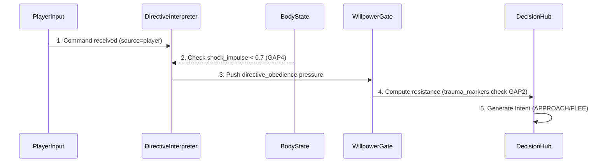
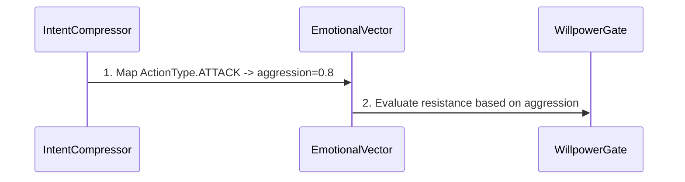
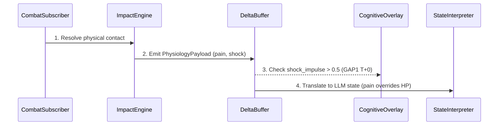
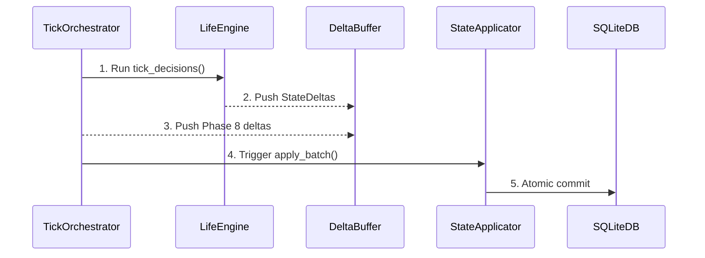
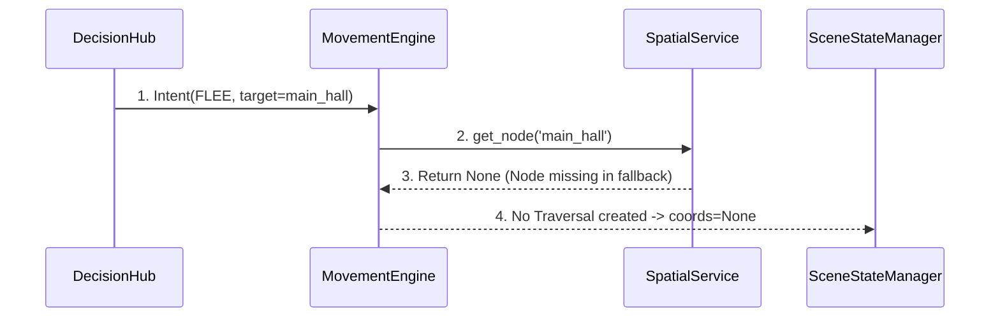
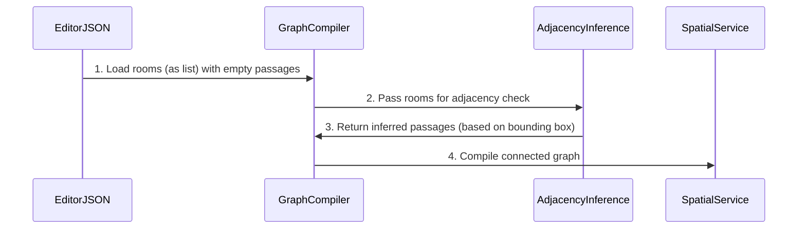

# ARCHITECTURE FLOW (Auto-generated)

> Внимание: Этот файл сгенерирован автоматически из `architecture/*.yaml`.
> Не редактируйте его вручную. Изменяйте YAML файлы и запускайте `python build_graph.py`.

## 🔗 Топология системы (Flowchart)

```mermaid
flowchart TD

    %% === БАЗОВЫЕ СТИЛИ ===
    classDef ui fill:#e0f7fa,stroke:#006064,stroke-width:2px;
    classDef application fill:#e8f5e9,stroke:#1b5e20,stroke-width:2px;
    classDef domain fill:#fff3e0,stroke:#e65100,stroke-width:2px;
    classDef infrastructure fill:#ffebee,stroke:#b71c1c,stroke-width:2px;
    classDef forbidden fill:#f66,stroke:#333,stroke-width:2px,stroke-dasharray: 5 5;

    subgraph UI[UI Layer]
    direction TB
        GameScreen("Pygame GameScreen"):::ui
        TextInput("TextInput (Resistance Medium)"):::ui
        PresentationFirewall("Presentation Firewall"):::ui
        PerceptualMomentum("Perceptual Momentum (S-curve)"):::ui
    end

    subgraph APPLICATION[Application Layer]
    direction TB
        WillpowerGate("WillpowerGate (Cumulative Strain)"):::application
        DecisionHub("Decision Hub v2 (Utility Deformation)"):::application
        IntentEventAdapter("Intent Event Adapter"):::application
        IntentCompressor("Intent Compressor (Fast Path)"):::application
        CausalObserver("Causal Observer (CDS)"):::application
        CombatSubscriber("Combat Subscriber"):::application
        StateInterpreter("State Interpreter (LLM Bridge)"):::application
        UrgencyLevel["Urgency Level (Duplicates EmotionTag — ADR-104)"]:::application
        TickOrchestrator("Tick Orchestrator"):::application
        LifeEngine("Life Engine (De-godified)"):::application
        StateApplicator("State Applicator"):::application
        CognitiveOverlay("Cognitive Overlay (T+0)"):::application
        TickContext["Tick Context"]:::application
        BehaviorManifestationService("Behavior Manifestation Service"):::application
        PhenomenologyProjectionService("Phenomenology Projection Service"):::application
        WorldSnapshotBuilder("World Snapshot Builder"):::application
        DMAgent("DM Agent (Narrative)"):::application
        PipelineContext["Pipeline Context"]:::application
        MovementEngine("Movement Engine"):::application
        SceneStateManager("Scene State Manager"):::application
    end

    subgraph DOMAIN[Domain Layer]
    direction TB
        DirectiveInterpreter("Directive Interpretation Subscriber"):::domain
        CFRMSolver("Local Causal Solver (CFRM P2)"):::domain
        BodyState["Body State (Physiology)"]:::domain
        SourceID["Source ID (Social Authority)"]:::domain
        EventDTO["Event DTO (NPC_SPOKE)"]:::domain
        EmotionalVector["Emotional Vector (Aggression/Fear)"]:::domain
        DeterministicClock("Deterministic Clock"):::domain
        CausalTrace("Causal Trace"):::domain
        ImpactEngine("Impact Engine (Pure Function)"):::domain
        PhysiologyPayload["PhysiologyPayload (pain, blood_loss, shock_impulse)"]:::domain
        DecayHandler("Leaky Integrator (Decay)"):::domain
        PerceptualKernel["Perceptual Kernel (threat/uncertainty/anomaly)"]:::domain
        PressureDerivation("Pressure Derivation (Primary Signals)"):::domain
        EmotionResolution("Emotion Resolution (Pressure → Emotion)"):::domain
        AffectiveIntegrator("Affective Integrator (Time Integral)"):::domain
        EmotionTag["Emotion Tag (fearful/angry/panic)"]:::domain
        Psyche["Psyche (fear_drive, willpower — personality traits)"]:::domain
        DeltaBuffer(("Delta Buffer (Event Bus)")):::domain
        EmbodiedTraceDTO["Embodied Trace DTO"]:::domain
        PlayerPerceptionDTO["Player Perception DTO"]:::domain
        SpatialService("Spatial Query Service v1.2"):::domain
        TraversalState("Traversal State (LOD1)"):::domain
        SceneChange["SceneChange (Projection)"]:::domain
        AdjacencyInference("Adjacency Inference"):::domain
        SpatialRuntime("Spatial Runtime (LOS, Sound, Scene Extraction)"):::domain
        LocationGraph["LocationGraph (DEPRECATED — ADR-102)"]:::domain
    end

    subgraph INFRASTRUCTURE[Infrastructure Layer]
    direction TB
        GameStdout(("Game Process stdout/logs")):::infrastructure
        GitHistory[("Git Log & File System")]:::infrastructure
        APIRoutes[["FastAPI Routes"]]:::infrastructure
        SQLiteDB[("Runtime SQLite")]:::infrastructure
        LlamaServer[["LLM API (llama-server :8080)"]]:::infrastructure
        GraphCompiler("Graph Compiler (v2 - List format + Adjacency)"):::infrastructure
        EditorJSON[("Map Editor JSON (rooms as list)")]:::infrastructure
        BuiltinFallback["Builtin Fallback Graph"]:::infrastructure
    end

    %% === КАСТОМНЫЕ СТИЛИ УЗЛОВ ===
    style DecisionHub fill:#e8f5e9,stroke:#1b5e20,stroke-width:4px;
    style TickOrchestrator fill:#e1f5fe,stroke:#0277bd,stroke-width:4px;

    %% === ПОТОКИ ДАННЫХ ===
    WillpowerGate ==>|"provides resistance & identity_rigidity"| DecisionHub
    BodyState -.->|"inhibits obedience"| DirectiveInterpreter
    BodyState -.->|"Somatic Veto"| DecisionHub
    SourceID -->|"NPC-to-NPC legitimacy"| DirectiveInterpreter
    DirectiveInterpreter -->|"generates obedience/irritation"| DeltaBuffer
    IntentEventAdapter -->|"preserves semantic_action & target_id"| EventDTO
    CFRMSolver -->|"parses avatar psyche"| PlayerObserver
    IntentCompressor -->|"injects emotions in Fast Path"| EmotionalVector
    EmotionalVector -->|"provides emotional charge"| WillpowerGate
    GameStdout -->|"reads logs"| CausalObserver
    GitHistory -->|"reads git log & TODOs"| CausalObserver
    DeterministicClock -->|"provides tick context"| CausalTrace
    CausalObserver -->|"writes traces"| CausalTrace
    GameScreen ==>|"POST /action (IntentDTO)"| APIRoutes
    APIRoutes -->|"resolve_player_intent()"| TickOrchestrator
    StateApplicator -->|"WorldSnapshotDTO + will_conflict"| APIRoutes
    APIRoutes -->|"JSON Response"| GameScreen
    GameScreen -.->|"infect() - motor resistance"| TextInput
    GameScreen -->|"sanitize_perceptual_input()"| PresentationFirewall
    PresentationFirewall -->|"SanitizedPerceptualVectors"| PerceptualMomentum
    CombatSubscriber -->|"resolves contact"| ImpactEngine
    ImpactEngine ==>|"computes"| PhysiologyPayload
    PhysiologyPayload -->|"flushed to"| DeltaBuffer
    DecayHandler -->|"time-driven decay (Phase 0.5) — pain/fatigue/blood_loss/shock_impulse"| DeltaBuffer
    PhysiologyPayload -.->|"provides pain & shock"| StateInterpreter
    PhysiologyPayload -->|"body_state (pain/blood_loss/shock_impulse) read via all_npcs_raw"| BehaviorManifestationService
    BehaviorManifestationService -->|"EmbodiedTraceDTO (instability, micro_pause, action_interruption)"| PhenomenologyProjectionService
    PhenomenologyProjectionService -->|"cue_keys (WINCING, BLEEDING, HOLDING_SIDE, STAGGERED)"| PlayerPerceptionDTO
    StateInterpreter -->|"physical_state (pain/shock/blood_loss → words)"| VerbalizationContext
    PerceptualKernel -->|"threat_gradient + uncertainty + anomaly"| PressureDerivation
    BodyState -->|"pain modulates threat; fatigue → sensory overload"| PressureDerivation
    PressureDerivation -->|"AffectivePressureDTO (threat_load, uncertainty_load, aggression_charge)"| EmotionResolution
    Psyche -->|"personality modulates panic threshold"| EmotionResolution
    EmotionResolution -->|"threat+personality → fear/panic/rage/confusion"| EmotionTag
    EmotionResolution -->|"stress_delta (aggregated load)"| NPCState_stress
    NPCState_stress ==>|"CRITICAL: stress → SCARED/PANIC/BROKEN (DUPLICATES EmotionTag)"| UrgencyLevel
    LifeEngine ==>|"emits intents & deltas"| DeltaBuffer
    TickOrchestrator -->|"aggregates Phase 8 results"| DeltaBuffer
    DeltaBuffer ==>|"apply_batch()"| StateApplicator
    CognitiveOverlay -.->|"injects shock_impulse > 0.5"| StateApplicator
    StateApplicator -->|"commits state"| SQLiteDB
    StateApplicator -->|"reads npc_positions (stress_delta, psyche_state)"| BehaviorManifestationService
    BehaviorManifestationService -->|"EmbodiedTraceDTO"| PhenomenologyProjectionService
    PhenomenologyProjectionService -->|"Domain PlayerPerceptionDTO"| WorldSnapshotBuilder
    WorldSnapshotBuilder -->|"Canonical PlayerPerceptionDTO (peripheral_cues, embodied_traces)"| APIRoutes
    TickOrchestrator -.->|"query LLM"| LlamaServer
    GameScreen ==>|"POST /action (IntentDTO)"| APIRoutes
    TickOrchestrator -->|"creates context"| TickContext
    TickOrchestrator -->|"writes player_perception"| PipelineContext
    PipelineContext -->|"reads embodied_traces (observable symptoms only)"| DMAgent
    EditorJSON -->|"load_editor_json"| GraphCompiler
    BuiltinFallback -->|"fallback graph"| GraphCompiler
    SpatialRuntime -->|"resolve_distance + extract_scene (ADR-102)"| SpatialService
    SceneStateManager -.->|"enriches scene_state with campaign_id (ADR-102)"| SpatialRuntime
    GraphCompiler -->|"triggers if passages empty"| AdjacencyInference
    AdjacencyInference -->|"returns inferred passages"| GraphCompiler
    GraphCompiler -->|"compiles graph"| SpatialService
    SpatialService -->|"reads graph & positions"| MovementEngine
    MovementEngine -.->|"get_node(target_id)"| SpatialService
    MovementEngine -->|"produces"| SceneChange
    SceneChange -->|"applied by"| SceneStateManager
    SceneStateManager -->|"enriches & interpolates"| TraversalState

    %% === АРХИТЕКТУРНЫЕ ЗАПРЕТЫ ===
    DecisionHub -.->|"🚫 FORBIDDEN: Use T+0 pressure (Only T-1)"| Raw_Delta:::forbidden
    DirectiveInterpreter -.->|"🚫 FORBIDDEN: Direct movement generation"| MovementIntent:::forbidden
    IntentCompressor -.->|"🚫 FORBIDDEN: Return default 0.0 vector for ATTACK (ADR-088)"| EmotionalVector:::forbidden
    StateInterpreter -.->|"🚫 FORBIDDEN: Derive psychological state from stress (ADR-104)"| EmotionTag:::forbidden
    CausalObserver -.->|"🚫 FORBIDDEN: Feedback loop into simulation"| Runtime_State:::forbidden
    CDS -.->|"🚫 FORBIDDEN: Interrupt causal flow on crash"| Pipeline:::forbidden
    Frontend -.->|"🚫 FORBIDDEN: Import backend.app (Устав §1.1)"| BackendInternals:::forbidden
    APIRoutes -.->|"🚫 FORBIDDEN: Pass internal state to UI"| NPCState:::forbidden
    GameScreen -.->|"🚫 FORBIDDEN: Boolean collision check (must use Push-out Resolution)"| SpatialObstacles:::forbidden
    SceneRenderer -.->|"🚫 FORBIDDEN: Treat obstacle x,y as center (must use as top-left corner)"| SpatialObstacles:::forbidden
    CombatSubscriber -.->|"🚫 FORBIDDEN: Domain Leakage (ADR-021)"| Emotion:::forbidden
    StateInterpreter -.->|"🚫 FORBIDDEN: Ignore pain/shock"| HP_Ratio:::forbidden
    StateInterpreter -.->|"🚫 FORBIDDEN: Read pain without /100.0 normalization"| Pain_Scale:::forbidden
    BehaviorManifestationService -.->|"🚫 FORBIDDEN: Read psyche (fear/stress) instead of body_state (Rule X, ADR-101)"| Emotion:::forbidden
    NPCStateAdapter -.->|"🚫 FORBIDDEN: from_legacy/write_to_legacy without body_state (ADR-100)"| BodyState:::forbidden
    StateApplicator -.->|"🚫 FORBIDDEN: Local-scope asdict import (ADR-099)"| asdict:::forbidden
    UrgencyLevel -.->|"🚫 FORBIDDEN: Duplicate psychological resolution (ADR-104)"| EmotionTag:::forbidden
    StateInterpreter -.->|"🚫 FORBIDDEN: Compute psychology from stress (ADR-104)"| EmotionTag:::forbidden
    DecayHandler -.->|"🚫 FORBIDDEN: shock_impulse without decay (ADR-109)"| ShockImmortality:::forbidden
    StateApplicator -.->|"🚫 FORBIDDEN: shock_impulse > 0.0 check instead of != 0.0 (ADR-109)"| ShockDeltaBlock:::forbidden
    NPCStateSnapshot -.->|"🚫 FORBIDDEN: NPCStateSnapshot without shock_impulse field (ADR-109, ADR-110)"| ShockBlindness:::forbidden
    LifeEngine -.->|"🚫 FORBIDDEN: Direct mutation (ADR-051)"| NPC_Position:::forbidden
    Any -.->|"🚫 FORBIDDEN: Bypass DeltaBuffer"| State:::forbidden
    TickOrchestrator -.->|"🚫 FORBIDDEN: TICK_CATCHUP loops (ADR-047)"| Time:::forbidden
    TickOrchestrator -.->|"🚫 FORBIDDEN: Emergency SpatialService build when cache exists (ADR-065)"| TickContext:::forbidden
    TickOrchestrator -.->|"🚫 FORBIDDEN: Use location_id as campaign_id (ADR-089)"| TickContext:::forbidden
    MovementEngine -.->|"🚫 FORBIDDEN: Direct mutation (ADR-066)"| SceneState:::forbidden
    SceneStateManager -.->|"🚫 FORBIDDEN: Mutate graph"| SpatialService:::forbidden
    Enrichment -.->|"🚫 FORBIDDEN: Overwrite pipeline position (ADR-072)"| LOD0_Position:::forbidden
    GraphCompiler -.->|"🚫 FORBIDDEN: Require manual passages if polygons are adjacent (ADR-073)"| EditorJSON:::forbidden
    SpatialService -.->|"🚫 FORBIDDEN: Use location_id as campaign_id (ADR-089)"| TickContext:::forbidden
    TickOrchestrator -.->|"🚫 FORBIDDEN: Emergency build_for_location when self._spatial_service already resolved (ADR-065)"| SpatialService:::forbidden
    GraphCompiler -.->|"🚫 FORBIDDEN: Use room x,y as node coordinates (must use centroid x+w/2, y+h/2)"| EditorJSON:::forbidden
    GameScreen -.->|"🚫 FORBIDDEN: Overwrite local_position for NPC in MOVING status (ADR-096)"| WorldSnapshotDTO:::forbidden
```

## ⏱ Временные Диаграммы (Sequence Diagrams)

### Player Command Execution Flow

### Fast Path Emotional Injection Flow (ADR-088)

### Combat Impact Cascade

### Pipeline Tick Execution Flow

### Broken Traversal Flow (Node Not Found - BREAK-N)

### Adjacency Inference Success Flow (ADR-073)

## 📊 Каузальная Карта (Micro-details)

> Детальная логика работы системы: условия срабатывания, привязка к коду и ADR.

### Потоки данных (Edges)

| Откуда | Куда | Описание | Условие / Логика | Код | ADR/GAP |
|--------|------|----------|------------------|-----|---------|
| WillpowerGate | DecisionHub | provides resistance & identity_rigidity | trauma_markers > 0 -> +0.1 identity_rigidity | `will.py:122-125` | GAP2 FIX |
| BodyState | DirectiveInterpreter | inhibits obedience | shock_impulse > 0.7 -> return [] | `directive_interpretation_subscriber.py:58` | GAP4 FIX |
| BodyState | DecisionHub | Somatic Veto | pain > 0.8 blocks FLEE; shock > 0.7 blocks ATTACK | `pressure_translator.py:52` | GAP3 FIX |
| SourceID | DirectiveInterpreter | NPC-to-NPC legitimacy | fear_{source_id} > 0.3 | `directive_interpretation_subscriber.py:77-92` | GAP13 FIX |
| DirectiveInterpreter | DeltaBuffer | generates obedience/irritation | legitimacy > 0.3 -> obedience; else -> irritation | `directive_interpretation_subscriber.py:93-97` | ADR-057 |
| IntentEventAdapter | EventDTO | preserves semantic_action & target_id | Always if present in CommunicationIntent | `intent_event_adapter.py:46-47` | GAP8 FIX |
| CFRMSolver | PlayerObserver | parses avatar psyche | Player is observer candidate | `local_causal_solver.py:320-324` | GAP7 FIX |
| IntentCompressor | EmotionalVector | injects emotions in Fast Path | ATTACK -> aggression=0.8; THREATEN -> aggression=0.5 | `intent_compressor.py:130` | ADR-088 |
| EmotionalVector | WillpowerGate | provides emotional charge | Determines resistance level | `will.py` | ADR-088 |
| GameStdout | CausalObserver | reads logs | Regex patterns, pipe/file read | `causal_observer.py` | - |
| GitHistory | CausalObserver | reads git log & TODOs | Every session start | `causal_observer.py` | - |
| DeterministicClock | CausalTrace | provides tick context | - | `-` | - |
| CausalObserver | CausalTrace | writes traces | Passive, try/except isolated | `causal_observer.py` | - |
| GameScreen | APIRoutes | POST /action (IntentDTO) | On Enter key | `api_client.py` | - |
| APIRoutes | TickOrchestrator | resolve_player_intent() | Validate DTO | `routes.py` | - |
| StateApplicator | APIRoutes | WorldSnapshotDTO + will_conflict | End of action tick | `routes.py` | ADR-068 |
| APIRoutes | GameScreen | JSON Response | ActionQueue poll | `api_client.py` | - |
| GameScreen | TextInput | infect() - motor resistance | will_conflict_data not None | `game_screen.py:808` | ADR-039 |
| GameScreen | PresentationFirewall | sanitize_perceptual_input() | On avatar_state update | `game_screen.py:890` | - |
| PresentationFirewall | PerceptualMomentum | SanitizedPerceptualVectors | S-curve inertia | `game_screen.py:893` | - |
| CombatSubscriber | ImpactEngine | resolves contact | Fuzzy target resolve | `combat_subscriber.py` | ADR-021 |
| ImpactEngine | PhysiologyPayload | computes | Physics composite (DRSL) | `impact_engine.py` | ADR-015 |
| PhysiologyPayload | DeltaBuffer | flushed to | Only PhysiologyPayload | `physiology.py` | ADR-020 |
| DecayHandler | DeltaBuffer | time-driven decay (Phase 0.5) — pain/fatigue/blood_loss/shock_impulse | Leaky integrator exp(-lambda*dt). SHOCK_DECAY_LAMBDA=0.08 (~8%/tick) | `physiology_decay_handler.py` | ADR-022, ADR-109 |
| PhysiologyPayload | StateInterpreter | provides pain & shock | Overrides HP for LLM prompt (GAP5) | `state_interpreter.py:273-291` | GAP5 FIX |
| PhysiologyPayload | BehaviorManifestationService | body_state (pain/blood_loss/shock_impulse) read via all_npcs_raw | Rule X: only physiology, not emotions (ADR-101) | `behavior_manifestation_service.py:42-56, state_applicator.py:474-515` | ADR-101 |
| BehaviorManifestationService | PhenomenologyProjectionService | EmbodiedTraceDTO (instability, micro_pause, action_interruption) | Phase 8.5 → Phase 9 | `phenomenology_projection_service.py:19-61` | ADR-101 |
| PhenomenologyProjectionService | PlayerPerceptionDTO | cue_keys (WINCING, BLEEDING, HOLDING_SIDE, STAGGERED) | Phase 9 projection | `phenomenology_projection_service.py:24-38` | ADR-101 |
| StateInterpreter | VerbalizationContext | physical_state (pain/shock/blood_loss → words) | interpret() called in npc_tick_pipeline, pain normalized /100.0 | `npc_tick_pipeline.py:208, state_interpreter.py:273` | ADR-094 |
| PerceptualKernel | PressureDerivation | threat_gradient + uncertainty + anomaly | Primary perception signals — no psychology | `pressure_derivation.py:24-33` | ADR-049 |
| BodyState | PressureDerivation | pain modulates threat; fatigue → sensory overload | Physiology modulates affective pressure | `pressure_derivation.py:24,36` | ADR-049 |
| PressureDerivation | EmotionResolution | AffectivePressureDTO (threat_load, uncertainty_load, aggression_charge) | Pure function: perception+body → pressure vector | `pressure_derivation.py:38-43` | ADR-049 |
| Psyche | EmotionResolution | personality modulates panic threshold | fear_drive lowers threshold; willpower raises it | `emotion_resolution.py:23-27` | ADR-049 |
| EmotionResolution | EmotionTag | threat+personality → fear/panic/rage/confusion | ONLY owner of psychological resolution | `emotion_resolution.py:33-46` | ADR-049 |
| EmotionResolution | NPCState_stress | stress_delta (aggregated load) | Side effect: stress accumulates from all emotion triggers | `emotion_resolution.py:35-46` | ADR-049 |
| NPCState_stress | UrgencyLevel | CRITICAL: stress → SCARED/PANIC/BROKEN (DUPLICATES EmotionTag) | Same concept, different owner. Causes Double Truth when personality differs. | `state_interpreter.py:46-50` | ADR-104 |
| LifeEngine | DeltaBuffer | emits intents & deltas | tick_decisions() produces StateDeltas | `life_engine.py` | ADR-051 |
| TickOrchestrator | DeltaBuffer | aggregates Phase 8 results | Always on tick | `tick_orchestrator.py` | ADR-066 |
| DeltaBuffer | StateApplicator | apply_batch() | Aggregated at end of tick | `state_applicator.py` | ADR-001 |
| CognitiveOverlay | StateApplicator | injects shock_impulse > 0.5 | shock_impulse > 0.5 (T+0 injection) | `tick_orchestrator.py:634` | GAP1 FIX |
| StateApplicator | SQLiteDB | commits state | Atomic commit | `state_applicator.py` | - |
| StateApplicator | BehaviorManifestationService | reads npc_positions (stress_delta, psyche_state) | Phase 8.5 | `behavior_manifestation_service.py` | The Fool v2 |
| BehaviorManifestationService | PhenomenologyProjectionService | EmbodiedTraceDTO | Phase 9 | `phenomenology_projection_service.py` | The Fool v2 |
| PhenomenologyProjectionService | WorldSnapshotBuilder | Domain PlayerPerceptionDTO | Phase 9 | `world_snapshot_builder.py` | The Fool v2 |
| WorldSnapshotBuilder | APIRoutes | Canonical PlayerPerceptionDTO (peripheral_cues, embodied_traces) | API Response | `routes.py` | The Fool v2 |
| TickOrchestrator | LlamaServer | query LLM | Action tick | `game_loop_bridge.py` | - |
| GameScreen | APIRoutes | POST /action (IntentDTO) | On Enter key. 'сюда'/'мне' -> target_ref='player' (GAP11 FIX) | `intent_compressor.py:93-98` | - |
| TickOrchestrator | TickContext | creates context | Must use authentic campaign_id | `tick_orchestrator.py` | ADR-089 |
| TickOrchestrator | PipelineContext | writes player_perception | Phase 9: embodied_traces from PhenomenologyProjection | `tick_orchestrator.py:712` | ADR-093 |
| PipelineContext | DMAgent | reads embodied_traces (observable symptoms only) | The Fool: DM sees traces, not internal states | `dm_agent.py:309-324` | ADR-093 |
| EditorJSON | GraphCompiler | load_editor_json | Parses rooms array & polygons | `graph_compiler.py` | - |
| BuiltinFallback | GraphCompiler | fallback graph | BREAK-2: JSON NOT FOUND -> Builtin | `graph_compiler.py` | - |
| SpatialRuntime | SpatialService | resolve_distance + extract_scene (ADR-102) | Требует campaign_id в scene_state. Fallback на euclidean_distance если SpatialService=None | `spatial_runtime.py:98` | - |
| SceneStateManager | SpatialRuntime | enriches scene_state with campaign_id (ADR-102) | Инжект campaign_id для SpatialService.build_for_location() | `scene_state_manager.py:272` | - |
| GraphCompiler | AdjacencyInference | triggers if passages empty | If no explicit passages provided | `-` | ADR-073 |
| AdjacencyInference | GraphCompiler | returns inferred passages | Based on polygon bounding box intersection | `-` | ADR-073 |
| GraphCompiler | SpatialService | compiles graph | Strict match or valid inferred | `spatial_service.py` | - |
| SpatialService | MovementEngine | reads graph & positions | O(1) spatial index | `spatial_service.py` | ADR-048 |
| MovementEngine | SpatialService | get_node(target_id) | BREAK-N: Node 'main_hall' missing in fallback -> returns None | `spatial_service.py` | BREAK-N |
| MovementEngine | SceneChange | produces | Only if get_node() != None | `movement_engine.py` | ADR-052 |
| SceneChange | SceneStateManager | applied by | - | `-` | - |
| SceneStateManager | TraversalState | enriches & interpolates | in_transit flag, interpolation by progress | `scene_state_manager.py:1145,1585` | GAP12 FIX |

### Архитектурные запреты (Constraints)

| Источник | Цель | Правило | Код/Документ |
|----------|------|---------|--------------|
| DecisionHub | Raw_Delta | FORBIDDEN: Use T+0 pressure (Only T-1) | `ADR-050` |
| DirectiveInterpreter | MovementIntent | FORBIDDEN: Direct movement generation | `ADR-043` |
| IntentCompressor | EmotionalVector | FORBIDDEN: Return default 0.0 vector for ATTACK (ADR-088) | `ADR-088` |
| StateInterpreter | EmotionTag | FORBIDDEN: Derive psychological state from stress (ADR-104) | `state_interpreter.py:46-50` |
| CausalObserver | Runtime_State | FORBIDDEN: Feedback loop into simulation | `Устав §11.1` |
| CDS | Pipeline | FORBIDDEN: Interrupt causal flow on crash | `Устав §11.2` |
| Frontend | BackendInternals | FORBIDDEN: Import backend.app (Устав §1.1) | `Устав §1.1` |
| APIRoutes | NPCState | FORBIDDEN: Pass internal state to UI | `Устав §6.1` |
| GameScreen | SpatialObstacles | FORBIDDEN: Boolean collision check (must use Push-out Resolution) | `game_screen.py:188-247` |
| SceneRenderer | SpatialObstacles | FORBIDDEN: Treat obstacle x,y as center (must use as top-left corner) | `scene_renderer.py:263-270` |
| CombatSubscriber | Emotion | FORBIDDEN: Domain Leakage (ADR-021) | `ADR-021` |
| StateInterpreter | HP_Ratio | FORBIDDEN: Ignore pain/shock | `state_interpreter.py:273` |
| StateInterpreter | Pain_Scale | FORBIDDEN: Read pain without /100.0 normalization | `state_interpreter.py:273, state_applicator.py:491` |
| BehaviorManifestationService | Emotion | FORBIDDEN: Read psyche (fear/stress) instead of body_state (Rule X, ADR-101) | `behavior_manifestation_service.py` |
| NPCStateAdapter | BodyState | FORBIDDEN: from_legacy/write_to_legacy without body_state (ADR-100) | `npc_state.py:631-673` |
| StateApplicator | asdict | FORBIDDEN: Local-scope asdict import (ADR-099) | `state_applicator.py:1-24` |
| UrgencyLevel | EmotionTag | FORBIDDEN: Duplicate psychological resolution (ADR-104) | `state_interpreter.py:46-50, emotion_resolution.py:33-46` |
| StateInterpreter | EmotionTag | FORBIDDEN: Compute psychology from stress (ADR-104) | `state_interpreter.py:46-50` |
| DecayHandler | ShockImmortality | FORBIDDEN: shock_impulse without decay (ADR-109) | `physiology_decay_handler.py` |
| StateApplicator | ShockDeltaBlock | FORBIDDEN: shock_impulse > 0.0 check instead of != 0.0 (ADR-109) | `state_applicator.py:516-518` |
| NPCStateSnapshot | ShockBlindness | FORBIDDEN: NPCStateSnapshot without shock_impulse field (ADR-109, ADR-110) | `idle_tick.py, combat_subscriber.py` |
| LifeEngine | NPC_Position | FORBIDDEN: Direct mutation (ADR-051) | `ADR-051` |
| Any | State | FORBIDDEN: Bypass DeltaBuffer | `ADR-001` |
| TickOrchestrator | Time | FORBIDDEN: TICK_CATCHUP loops (ADR-047) | `-` |
| TickOrchestrator | TickContext | FORBIDDEN: Emergency SpatialService build when cache exists (ADR-065) | `ADR-047` |
| TickOrchestrator | TickContext | FORBIDDEN: Use location_id as campaign_id (ADR-089) | `tick_orchestrator.py` |
| MovementEngine | SceneState | FORBIDDEN: Direct mutation (ADR-066) | `ADR-066` |
| SceneStateManager | SpatialService | FORBIDDEN: Mutate graph | `ADR-008` |
| Enrichment | LOD0_Position | FORBIDDEN: Overwrite pipeline position (ADR-072) | `ADR-072` |
| GraphCompiler | EditorJSON | FORBIDDEN: Require manual passages if polygons are adjacent (ADR-073) | `ADR-073` |
| SpatialService | TickContext | FORBIDDEN: Use location_id as campaign_id (ADR-089) | `tick_orchestrator.py` |
| TickOrchestrator | SpatialService | FORBIDDEN: Emergency build_for_location when self._spatial_service already resolved (ADR-065) | `tick_orchestrator.py:225-232` |
| GraphCompiler | EditorJSON | FORBIDDEN: Use room x,y as node coordinates (must use centroid x+w/2, y+h/2) | `graph_compiler.py:108-115` |
| GameScreen | WorldSnapshotDTO | FORBIDDEN: Overwrite local_position for NPC in MOVING status (ADR-096) | `game_screen.py:794-799` |
