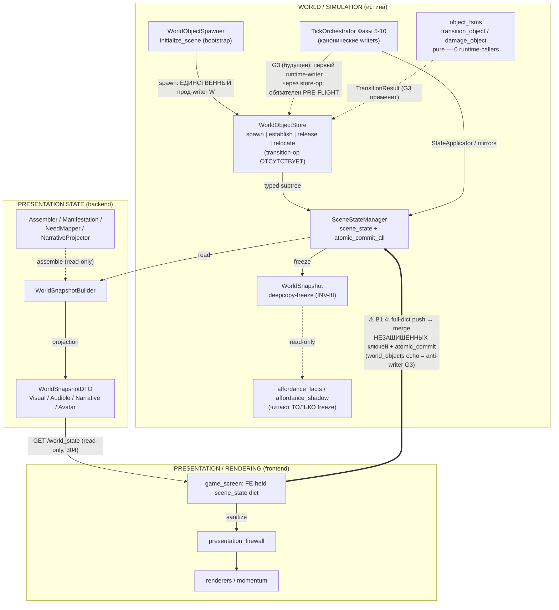

# AUDIT_W_TRACK_COUPLINGS — аудит сцеплений simulation ↔ presentation (ТЗ Часть II §18)

path: docs/AUDIT_W_TRACK_COUPLINGS.md
Назначение: Обязательный deliverable Stage 2.5 (ТЗ §18.3, DoD п.25) — карта фактических
    пересечений слоёв WORLD/EMBODIED ↔ PRESENTATION/RENDERING + входной ограничитель G3.
Зависимости: только чтение кода (PowerShell-археология §A); ни один .py не изменён;
    рантайм-прогоны симуляции не выполнялись; APS/deps_compressed.json не регенерировался.
Основные сущности: ownership/coupling-граф (§1), реестр находок (§2), сводка §18.2 (§3),
    входной ограничитель G3 (§4), релеи (§5), команды воспроизведения (§A).

> **Статус:** deliverable закрыт в W-сессии (номер фиксируется в MUTATIONS при записи, anti-race).
> **Scope (вердикт Мастера Г7):** весь `backend/app` + presentation bridges; классификация по
> (слой-хозяин × направление ребра), не по слову «W».
> **Дисциплина:** каждая строка помечена FACT / INTERPRETATION / RECOMMENDATION.
> Аудит отвечает «где связь существует», не утверждает «как обязаны переписать».
> Migration plans — РЕКОМЕНДАЦИИ, в этой сессии НЕ исполнялись.

---

## §0. Метод и границы

- Статическая археология: 15 breadth-зондов (A1) + 19 точечных верификаций (A2) + 17 глубоких
  чтений (A3) + 5 доборов состава (A4). Полный список команд — §A.
- «Пустой» зонд = находка-верификация (отсутствие нарушения фиксируется как FACT).
- Ограничение выборки: листинг sync-ключей FE (A4-2r) снят с крышкой 25 строк — состав
  payload B1.4 в runtime не верифицирован print-зондом (см. строку B1.4-c, INTERPRETATION).
- Часы/состояние репозитория на момент аудита: HEAD = 0ba3c336 (S239-финал), ветка
  V.0.5.3.9.6_Память_3; чужой WIP GC-00 не затронут.

---

## §1. Ownership / Coupling граф



**Легенда G3:** `==>` — риск-ребро (DOUBLE-TRUTH-risk / anti-writer); сплошные — легальные
write-пути; пунктир — read-only / будущие. Категории рёбер — §2.

---

## §2. Реестр находок (File:line | Паттерн | Категория | F/I/R | Migration plan)

### 2.1. W-граница (ядро §4)

| # | Файл:строка | Паттерн | Категория | F/I/R | Migration plan |
|---|---|---|---|---|---|
| W1 | svc/world/world_object_store.py:57–148 | typed-ops (spawn:241 / establish:276,285,290 / relocate:338); OntologyViolationError на повреждённую структуру (:71–91); запрет dict-хирургии (:148) | Acceptable adapter (SSOT-guard) | FACT | сохранить |
| W2 | svc/world/world_object_spawner.py:8–11 | presentation-поля editor-JSON (sprite/color/name/show_name) отбрасываются by design — «две проекции, не DOUBLE TRUTH» | Acceptable adapter | FACT | — |
| W3 | svc/scene_state_manager.py:1099–1122 | bootstrap: пустой корень world_objects (:1102) + spawn ТОЛЬКО новых сцен (сейв выигрывает); единственный путь записи — store.spawn | Acceptable adapter | FACT | — |
| W4 | models/world_snapshot.py:107–125 | читатели W: только deepcopy-freeze WorldSnapshot.world_objects → project_world_objects → facts/shadow; живую сцену не читает никто | Acceptable adapter (INV-III) | FACT | — |
| W5 | dom/object_fsms.py:292–316 | transition_object / damage_object (TransitionResult) — **0 runtime-callers** (G1 unconsumed; role_transition.py — чужой TransitionResult, false positive зонда) | — (субстрат) | FACT | G3 = первый потребитель |
| W6 | store typed-ops relations | establish/release_relation/relocate — **0 app-callers** (все хиты = сам стор/спавнер) | — (субстрат) | FACT | G3 = первый runtime-writer |

### 2.2. B1.4-канал: frontend → backend scene_state (главный риск-узел)

| # | Файл:строка | Паттерн | Категория | F/I/R | Migration plan |
|---|---|---|---|---|---|
| B1 | api/routes.py:1243–1268 | POST /game/{campaign}/scene_state: merge-семантика (:1258–1264) вливает НЕзащищённые ключи в канонический scene_state + save_scene_state → atomic_commit_all (:551–558). Канал = санкционированный ввод позиции игрока (легенда B1.4-FIX/NEW-8/TIME-FREEZE) | Legacy coupling (player-input канал) | FACT | — (см. B3/B4) |
| B2 | api/routes.py:1254–1257 | protected-лист из 7 ключей; **НЕ входят: world_objects, relationship_state, npc_positions, active_commitments/history/ordinals** | Architectural violation (risk) | FACT | до G3-ON: расширить protected ИЛИ сузить payload (B3) |
| B3 | fe/game_screen.py:1283 (+ api_client.py:287/601/802, game_loop_bridge.py:277–281) | пуш ПОЛНОГО FE-held dict перед idle_tick (3 транспорта: HTTP/Direct/Retry) | — (состав канала) | FACT | сузить payload до player-position-only, либо обёртка InterventionEvent |
| B4 | fe/game_screen.py:581 + 1077–1549 | FE scene_state: origin = session-данные; синхронизируются projection-ключи (tick/gts/traversals/avatar_state/visual_dto/…; npc_positions синхронизируется по :1091); **world_objects / relationship_state в sync-списке отсутствуют → stale-эхо в payload → перезапись канонических поддеревьев + персистенция**. Anti-writer для G3 (откат transitions между тиками) | **DOUBLE TRUTH risk** (по протоколу Часть IV: инцидент не задокументирован → MULTIPLE REPRESENTATIONS с risk-классом) | INTERPRETATION (статический путь доказан; листинг снят с крышкой 25; runtime-состав не зондирован) | 1 print-зонд ключей пуша → сузить payload/расширить protected; ФИКС ДО G3-ON — обязательное условие |
| B5 | svc/scene_state_manager.py:537–541 | при tick-locked push ЗАМЕНЯЕТ tick-scoped кэш локации целиком (окно гонки «push во время тика») | Race risk | INTERPRETATION | сериализация пушей вне тика / очередь |

### 2.3. Presentation-мосты (backend)

| # | Файл:строка | Паттерн | Категория | F/I/R | Migration plan |
|---|---|---|---|---|---|
| P1 | api/world_routes.py:18–60 | GET /world_state → WorldSnapshotDTO через builder; read-only; 304-семантика | Acceptable adapter | FACT | — |
| P2 | svc/integration/world_snapshot_builder.py:31–420 | scene_state → DTO; read-only | Acceptable adapter | FACT | — |
| P3 | svc/perception/presentation_assembler.py:26–107 | ObservedFact → Visual/Audible DTO | Acceptable adapter | FACT | — |
| P4 | svc/perception/behavior_manifestation_service.py:46–149 | wounds → EmbodiedTraceDTO (§17.5 единый мост) | Acceptable adapter | FACT | — |
| P5 | svc/economy/need_presentation_mapper.py:15–57 | Need → NeedStatusDTO (ребро ECONOMY→PRESENTATION, read-only) | Acceptable adapter | FACT | — |
| P6 | svc/perception/narrative_projector.py:24–32; svc/integration/legacy_dialogue_adapter.py:11–17 | perception → narrative DTO | Acceptable adapter | FACT | — |
| P7 | fe/presentation_firewall.py:15–41 (+ scene_renderer:49, perceptual_momentum:4,14) | sanitize_perceptual_input на входе FE | Acceptable adapter | FACT | — |

### 2.4. Frontend

| # | Файл:строка | Паттерн | Категория | F/I/R | Migration plan |
|---|---|---|---|---|---|
| F1 | fe/game_screen.py:1795–1800 | `player_stress=10.0, player_hp=100` — хардкод в PerceptionConfig; AvatarStateDTO скаляров не несёт (dom/snapshot.py:39–65 — только life_status) | Legacy coupling | FACT | канал аватар-скаляров (роадмап Фаза 1.9 AV-01; AvatarStatusBuilder) |
| F2 | fe/game_types.py:117–118 | `_raw_data` — сырое scene_state в FE («для отладки, не для UI») | Presentation coupling (minor) | FACT | аудит потребителей → удаление |
| F3 | fe/character_select.py:376–401 | frontend пишет characters.json НАПРЯМУЮ в saves-каталог (creation-flow, мимо API) | Architectural violation (filesystem-граница) | FACT | API-endpoint создания персонажа |
| F4 | fe/map_editor/editor_core.py:1623–1641; data/npc_data.py:82–106; ui/dialogs.py:96–121 | psyche/drives авторинг в конфиг-JSON | Acceptable (authoring; механика/контент №35) | FACT | — |
| F5 | fe/game_screen.py:2172 | player_beliefs из world_snapshot (эпистемический UI-канал, S199) | Acceptable adapter | FACT | — |

### 2.5. Верификационные строки (пустые зонды = FACT отсутствия)

| # | Зонд §18.1 | Результат | Вердикт |
|---|---|---|---|
| V1 | identity-поля (sprite_id/model_id/animation_clip/clip_id/sprite_frame/texture_id/mesh_id) в domain+models | **0** | W8-Anim-1 соблюдён |
| V2 | frame_id/current_frame/frame_index в backend/app | **0** | «sprite frame как состояние» отсутствует |
| V3 | реальные импорты frontend из backend/app | **0** (routes.py:1247 — докстринг; докстринги-упоминания pygame = 6 строк, словарная граница, минор) | изоляция держит |
| V4 | visual/pose-поля в персистенции NPCState | **0** (только narrative_cache; SSOT-writer guard npc_state.py:634) | W0-инвариант в персистенции держит |

---

## §3. Сводка по категориям §18.2

| Категория | Кол-во | Ключевые представители |
|---|---|---|
| Simulation coupling | 0 | — |
| Presentation coupling | 1 minor | F2 (_raw_data) |
| Legacy coupling | 2 | B1 (канал), F1 (player_stress хардкод) |
| Acceptable adapter | 12 | W1–W4, P1–P7, F4, F5 |
| Architectural violation | 2 + 2 risk | F3 (characters.json); B2+B4 (risk-class, anti-writer G3); B5 (race, risk) |

**Вердикт по ТЗ-инварианту Части II:** «Renderer не источник истины» — на уровне
domain/models/персистенции подтверждён эмпирически (V1–V4). Единственное системное
исключение — B1.4-канал: не renderer-чтение, а **projection→world writeback** с
персистенцией — класс, отсутствующий в исходной таблице §18.1 паттернов.

---

## §4. Входной ограничитель G3 (Execution)

### 4.1. Где G3 МОЖЕТ писать (легальные write-пути)

| Поверхность | Статус | Примечание |
|---|---|---|
| `WorldObjectStore.spawn` | живой (1 прод-caller: спавнер, bootstrap-only) | не трогать |
| `establish_relation / release_relation / relocate` | **0 callers** | G3 может стать первым runtime-writer |
| FSM-transition | **typed-op в сторе ОТСУТСТВУЕТ** | ⚠ G3 потребуется новая операция применения TransitionResult к scene_state через стор — расширение контракта = мини-ADR (прецедент закрытых реестров); прямое присваивание state-поля объекта в обход стора = запрет (W1) |
| Persistence | только atomic_commit_all (SSM:551–558) | без нового кода |
| L1Chronicle / MutationRecord | существующий single-writer-путь | новый writer в L1 запрещён |

### 4.2. Где G3 может ТОЛЬКО читать

Frozen `WorldSnapshot.world_objects` (deepcopy, world_snapshot.py:107) →
`project_world_objects` → resolver/facts — единственный существующий паттерн чтения
(INV-III-совместимый). Чтение живой scene_state вне снапшота — по прецеденту G2 не делать.

### 4.3. Анти-writer'ы G3 (запретные зоны, ДО включения executor'а)

1. **B1.4-эхо world_objects** (B4): FE-пуш полного dict перезаписывает канонический subtree
   между/во время тиков → откат transitions. **Обязательное условие до G3-ON:** protected
   list += world_objects (и relationship_state/commitments — см. §5) ИЛИ сужение payload.
   Перед фиксом — один runtime print-зонд фактического состава пуша.
2. **Dict-хирургия scene_state["world_objects"]** вне стора — онтологический запрет уже в
   коде (store:148); enforcement Г4 (`_ALLOWED_WRITERS` caller-guard) вводится с первым
   легальным writer'ом G3.
3. Писатели проекций в scene_state (projection-writeback через B1) — зона §5-релеев.

### 4.4. Порядок (рекомендация)

```
B1.4-runtime-зонд → B1.4-фикс/защита → G3 PRE-FLIGHT (Г1–Г4 хэндоффа S239,
git-археология Фаз 6–7 — зона параллельных серий) → executor через store-op
(мини-ADR) → Г4 caller-guard с первым writer'ом
```

---

## §5. Релеи (НЕ чинить в этой сессии — чужие зоны)

| # | Релей | Адресат |
|---|---|---|
| R1 | B1.4 не защищает `active_commitments/commitment_history/commitment_ordinals` → обход single-writer CommitmentRegistry (ADR-O-363) | серия «Память_3» |
| R2 | B1.4 не защищает `relationship_state` → bypass RelationshipWriteGate (ADR-O-369/370/371-серия) | RE-01-серия |
| R3 | npc_positions: FE держит собственную позицию игрока (мембранный дизайн, :1146 «не перезаписываем из world_snapshot») + эхо NPC-записей в пуше — влияние на SpatialEventDetector old/new | movement-зона |
| R4 | avatar_state write-back (:1167→пуш) — projection backflow в scene_state | AV-трек (Фаза 1.9) |
| R5 | player_stress/player_hp хардкод (F1) — корень: отсутствие канала аватар-скаляров | Фаза 1.9 |
| R6 | Эпистемические поддеревья scene_state (S193 упоминал проброс) — вне protected-листа; в этой сессии не зонировались | зона «Памяти» |

---

## §A. Команды воспроизведения

Breadth (A1): рендер-библиотеки/identity-поля/sprite-словарь/presentation-DTO/backend→frontend
импорты/frontend-чтения/frontend-«мутации»/W-граница/event-мосты/NPCState-персистенция/
frame-паттерны/мосты/API/renderer-словарь — 15 зондов (см. историю сессии; клоны Runnable
в git-истории W-трека).

Точечные резолвы: routes.py:1242–1278 (B1.4-тело); scene_state_manager.py:530–560
(save-семантика), 1094–1132 (bootstrap+spawn); world_object_spawner.py:0–60;
object_fsms.py (callers: 0); world_routes.py:0–60; game_screen.py:734–757 (_do_idle_tick),
1228–1284 (пуш), 1785–1805 (хардкод), A4-2r (FE-мутации scene_state).

Рекомендованные целевые доборы (не исполнены):
`Select-String -Path "frontend/game_screen.py" -Pattern 'scene_state\["world_objects"\]|scene_state\["relationship_state"\]'`
runtime print-зонд ключей payload в `save_scene_state` (FE, один прогон). → **исполнен S241** (см. §6).

---

## §6. Runtime-верификация B1.4 (S241) — аддендум

> Метод: харнесс `backend/tests/sandbox/b1_4_push_probe.py` (GC-00-паттерн: production-path
> ONLY, temp-saves изоляция — урок H5, два изолированных rail). Реконструкция FE-held dict:
> origin = `session_state().scene_state` (SSOT) → 3× `idle_tick` + FE-sync (семейства A/B
> листинга A4-2r) → player-move → пуш. Checkpoint = `get_scene_state` (unlocked = диск,
> deepcopy) до/после; Δ = anti-writer-критерий §4.3. Доказательная база:
> `reports/b1_4_probe_report.json`. Зонды `[DIAG_B14_*]` — временные, сняты после прогона.

| # | Находка | Класс | F/I/R |
|---|---|---|---|
| RT1 | B4 runtime-подтверждён: origin несёт wo/rel/ac/hist — эхо неизбежно по построению (FE их никогда не перечитывает) | DOUBLE TRUTH (эхо) | FACT |
| RT2 | Direct-rail: полная замена сцены FE-диктом; вытерты active_commitments (3, вкл. player), commitment_history (5), commitment_ordinals (7 — риск переиспользования, ADR-O-363) + backend-only ключи (_version, epistemic_records, player_recognition, pending_tasks, last_save_real_time); protected-лист на пути ОТСУТСТВУЕТ (TIME-FREEZE bypass, находка №1 аудита подтверждена runtime) | anti-writer полного спектра | FACT |
| RT3 | HTTP-rail: критические Δ=0 = латентность, НЕ безопасность (writers=0: RE M1a dormant, G3 не реализован; origin-реестры пусты → update({}) = no-op); механизм эха доказан на npc_positions | risk (латентный) | FACT |
| RT4 | F-эхо: per-NPC записи npc_positions замещаются FE-копиями DTO-формы; множества изменённых полей идентичны на обоих rail → damage-класс определяется составом payload, транспорт — только blast-radius | presentation→world writeback | FACT |
| RT5 | HTTP merge персистит projection-ключи в канонический scene_state (avatar_state, player_perception, player_body_topology, embodied_status, visual_dto, audible_dto) | projection-pollution | FACT |
| RT6 | INV-NPC-NAME маскирован: name восстанавливается re-enrichment при load (SSM:380–382) — запись теряется в персистенции, эффект скрыт | masked | FACT |
| RT7 | else-ветка routes.py:1267 не покрыта (недостижима в харнесс-мире) — класс статический | risk | — |

**Усиление §4.3 (anti-writer условия G3):**
1. Сужение payload БЕЗ конвергенции Direct-транспорта = деградация (Direct заменит сцену
   мини-диктом). Любая опция защиты обязана закрывать ОБА rail.
2. Санкционированный контракт канала (B1.4-FIX: player position) работает на обоих rail —
   живая функция; всё прочее в payload — за пределами заявленного контракта.
3. Релеи: R1 runtime-доказан (RT2); R2 латентен (RT3); R3 жив (RT4).

**Развилка Р2 (фикс — отдельной сессией, решение Мастера):** приёмник-whitelist
(только `npc_positions.player`) + конвергенция Direct-моста — рекомендация; матрица
опций А/Б/В — в отчёте сессии S241.