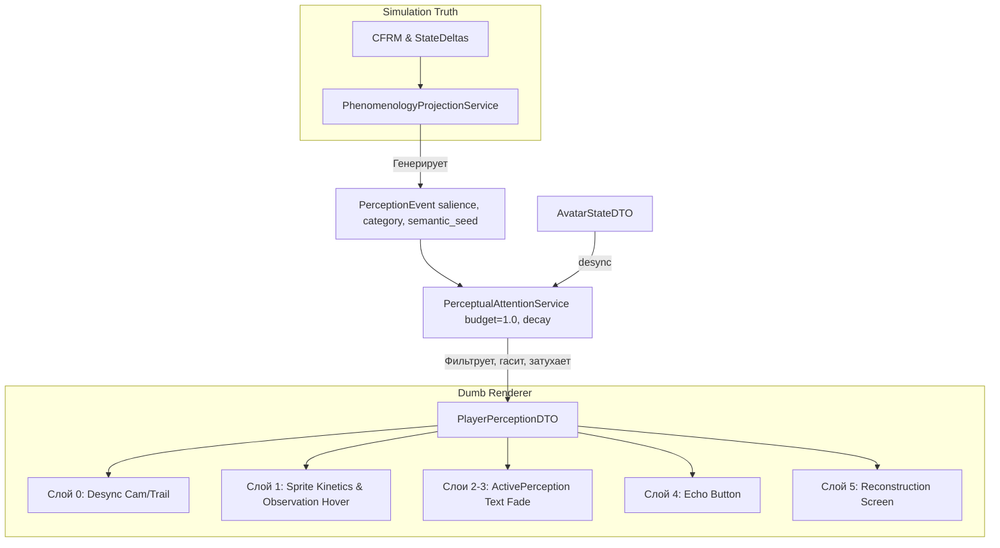

# ТЗ: EMBODIED UI PERCEPTION — СИММЕТРИЧНАЯ ОНТОЛОГИЯ ВОСПРИЯТИЯ

**Проект:** ENIGMA Engine  
**Онтология:** Игрок и NPC подчиняются одной онтологии восприятия, но используют разные линзы. 
`Мир → Восприятие → NPC` | `Мир → Восприятие → Игрок`. 
UI не вычисляет реальность, UI является `PlayerProjectionPolicy`. Он получает на вход только значимости и смыслы, отбрасывая сырую математику.
**Цель:** Реализовать симметричный пайплайн восприятия от CFRM до экрана, управляемый `attention_budget` и временной инерцией.

---

## 1. АРХИТЕКТУРНЫЙ КОНТРАКТ: СИММЕТРИЯ И ДИАФРАГМА

**Закон Симметрии:** Запрещено передавать Игроку информацию, которую NPC не мог бы получить через `PerceptualKernel`. Если NPC видит "дрожь", а не "страх +0.2", то и Игрок должен видеть "дрожь", а не "страх".

**Новый Пайплайн (Единый для NPC и Игрока):**
```text
Simulation Truth (CFRM, Deltas)
    → PhenomenologyProjectionService (Генерация PerceptionEvent)
        → PerceptualAttentionService (Диафрагма: бюджет, кулдауны, затухание)
            → PlayerPerceptionDTO (Транспорт для "тупого" фронтенда)
```

---

## 2. ГЕНЕРАЦИЯ СМЫСЛОВ: PerceptionEvent

Бэкенд (через `PhenomenologyProjectionService`) переводит каузальные возмущения и дельты в семантические события. Сервис внимания больше не знает слов "fear" или "trust". Он знает только "salience" (значимость).

```python
@dataclass(frozen=True)
class PerceptionEvent:
    """Единица смысла, попадающая в поле внимания."""
    salience: float               # 0.0-1.0 Важность события (вычисляется из magnitude дельт)
    category: Literal[
        "ATMOSPHERE",             # Фоновое давление
        "PERIPHERAL",             # Кинетика/движение
        "CENTRAL",                # Фокус внимания (звук, фраза)
        "RUMOR",                  # Слух
        "RECONSTRUCTION"          # Пост-фактум
    ]
    semantic_seed: str            # Наблюдение: "замер", "крик", "запах_крови"
    source_cluster: str
    expiration_tick: int          # Когда событие теряет актуальность
```

---

## 3. СЛОИ ВНИМАНИЯ И МАППИНГ НА РЕНДЕР

### Слой 0: Подсознательное восприятие (Телесный Резонанс)
*Чувство, а не чтение. "Что-то не так".*

*   **Источник:** `AvatarStateDTO` (Слой Воли).
*   **Рендер (Перевод `perceptual_latency` в `perceptual_desync`):** 
    *   **ЗАПРЕТ:** Искусственная задержка ввода (лаг) — запрещена. Игра не должна "ломаться".
    *   **ДЕСКРИНК:** Вместо лага — инерция камеры, смазывание движения (motion trail), легкое отставание взгляда аватара от курсора, приглушение звуков. Управление остается честным, но мир начинает "плыть".

### Слой 1: Периферическое восприятие (Наблюдение, не диагноз)
*Мимолетные сигналы. Никакой телепатии.*

*   **Источник:** `PerceptionEvent(category=PERIPHERAL)`.
*   **Рендер:** Изменение позы/поведения спрайта NPC + наблюдательный текст при наведении (hover).
    *   **ЗАПРЕТ:** Слова "Оцепенел", "Боится", "Злится" — это диагнозы внутренних состояний.
    *   **ПРАВИЛО:** Только внешние наблюдения.
        *   Вместо "Оцепенел от страха" → `"Замер на месте"`
        *   Вместо "Избегает вас" → `"Отвел взгляд"`
        *   Вместо "Торопливо уходит" → `"Быстро шагает к выходу"`
        *   Вместо "Нервничает" → `"Нервно переминается"`

### Слой 2: Атмосфера места (Фоновая Температура)
*Тихий индикатор давления.*

*   **Источник:** `PerceptionEvent(category=ATMOSPHERE)`.
*   **Рендер:** Маленький блок справа сверху.
    *   `semantic_seed = "tension"` → *"Напряжение висит в воздухе"*
    *   `semantic_seed = "calm"` → *"Обстановка спокойная"*

### Слой 3: Феноменологические сигналы (Центральное Внимание)
*Слово, которое пробивает фокус.*

*   **Источник:** `PerceptionEvent(category=CENTRAL)`.
*   **Рендер:** Текст по центру экрана (fade-in/out).
    *   `semantic_seed = "silence"` → *"Разговоры резко смолкли."*
    *   `semantic_seed = "stare"` → *"Несколько взглядов устремились на вас."*

### Слой 4: Эхо мира (Добровольное Внимание)
*Искаженные слухи.*

*   **Источник:** `PerceptionEvent(category=RUMOR)`.
*   **Рендер:** Иконка 🕯️ со счетчиком. Читается по клику (текст формируется из `semantic_seed` + стадия мутации).

### Слой 5: Каузальная Реконструкция (Постфактум)
*Отчет о произошедшем без игрока.*

*   **Источник:** `PerceptionEvent(category=RECONSTRUCTION)`.
*   **Рендер:** Список при смене локации (запрос событий по `expiration_tick`).

---

## 4. МЕХАНИКА ВНИМАНИЯ: БЮДЖЕТ И ИНЕРЦИЯ

### Конкуренция внимания (Attention Budget)
Игрок не может воспринять всё одновременно. Если происходит 5 событий, низкоприоритетные гасятся.

*   **Бюджет по умолчанию:** `1.0`
*   **Стоимость категорий:**
    *   `CENTRAL`: `0.6`
    *   `ATMOSPHERE`: `0.2`
    *   `PERIPHERAL`: `0.2`
    *   `RECONSTRUCTION`: `0.8` (показывается отдельно, не конкурирует в моменте)

**Пример работы `PerceptualAttentionService`:**
1. Происходит драка (`CENTRAL`, salience=0.8, cost=0.6). Бюджет: 1.0 - 0.6 = 0.4.
2. Крик (`CENTRAL`, salience=0.7, cost=0.6). Не проходит! Бюджет исчерпан. Событие глотается.
3. Служанка замерла (`PERIPHERAL`, salience=0.5, cost=0.2). Проходит! Бюджет: 0.4 - 0.2 = 0.2.
4. Другой NPC отвернулся (`PERIPHERAL`, salience=0.3, cost=0.2). Не проходит, слишком мелко на фоне драки.

### Временная инерция (Active Perception)
Восприятие не исчезает за один кадр. Оно затухает.

```python
@dataclass
class ActivePerception:
    """Активное восприятие игрока с инерцией затухания."""
    text: str
    intensity: float           # Текущая яркость (1.0 = только что замечено)
    decay_rate: float          # Скорость затухания (например, -0.05 за тик)
    created_tick: int
```

Если `PerceptionEvent` пробил бюджет, он становится `ActivePerception`. На следующий тик его `intensity` падает. Фронтенд рендерит текст с прозрачностью, пропорциональной `intensity`. Когда `intensity < 0.1`, восприятие стирается.

---

## 5. ЕДИНЫЙ КОНТРАКТ: PlayerPerceptionDTO

Фронтенд получает этот объект и ничего не вычисляет.

```python
@dataclass
class PlayerPerceptionDTO:
    """Линза восприятия игрока. Тупой рендер."""

    # Слой 0: Подсознание
    avatar_desync: Optional[AvatarDesyncDTO] = None # Инерция камеры, шлейфы
    
    # Слой 1-3: Активные восприятия (отсортированы по приоритету)
    active_perceptions: List[ActivePerception] = field(default_factory=list)
    
    # Слой 1: Периферия (кто сейчас выделяется в толпе)
    peripheral_cues: List[PeripheralCueDTO] = field(default_factory=list)
    
    # Слой 4: Эхо
    echo_count: int = 0
    
    # Слой 5: Реконструкция
    reconstruction_events: List[ReconstructionEventDTO] = field(default_factory=list)

@dataclass
class AvatarDesyncDTO:
    """Визуальное искажение без поломки управления."""
    camera_inertia: float = 0.0     # Смещение/запаздывание камеры
    motion_trail: float = 0.0        # Шлейф при движении
    auditory_muffle: float = 0.0     # Глушение звуков

@dataclass
class PeripheralCueDTO:
    npc_id: str
    cue_type: str # "FREEZE", "HURRY", "AVOID_GAZE"
    hover_text: str # СТРОГО наблюдение: "Замер", "Отвел взгляд"
```

---

## 6. ИНТЕГРАЦИЯ В АРХИТЕКТУРУ (БЛОК-СХЕМА)



---

## 7. ЗАПРЕТЫ (HARD CONSTRAINTS)

1.  **Запрет на Повторное Вычисление:** `PerceptualAttentionService` не имеет доступа к `StateDeltas.fear_delta` или `social_stats`. Он читает только `PerceptionEvent.salience`.
2.  **Запрет на Лаг (Input Delay):** `perceptual_latency` запрещено использовать для задержки ввода. Только визуальный/звуковой `desync` (шлейфы, инерция камеры).
3.  **Запрет на Телепатию:** Тексты для Игрока формируются только из внешних наблюдений (`semantic_seed`). Вместо "Боится" → "Дрожит". Вместо "Злится" → "Сжимает кулаки".
4.  **Запрет на Визуальную Инфляцию:** Строгий `attention_budget = 1.0`. Если бюджет исчерпан, мелкие события подавляются крупными.

---

## 8. КРИТЕРИИ ПРИЕМКИ (ПЕСОЧНИЦА)

1.  **Тест "Бюджет Приоритетов":** Происходит драка (центральное событие, cost 0.6) и кто-то роняет кружку (периферия, cost 0.2). В `PlayerPerceptionDTO` пробивается только драка. Кружка проглатывается диафрагмой внимания.
2.  **Тест "Инерция Восприятия":** Игрок слышит громкий звук (Центральный текст: "Раздался грохот"). На следующем тике звук не повторяется, но `ActivePerception.intensity` падает с 1.0 до 0.8. Текст плавно затухает 3-4 тика, а не исчезает мгновенно.
3.  **Тест "Дескринк, а не Лаг":** Аватар получает травму (`motor_disruption = 0.5`). Фронтенд применяет `camera_inertia` (камера чуть отстает от курсора), но клики и нажатия клавиш обрабатываются мгновенно, без задержки.
4.  **Тест "Наблюдение":** Игрок наводит курсор на NPC с высоким страхом. Всплывает текст *"Замер на месте"*, а НЕ *"Напуган"*.

---

## 9. СОСТОЯНИЕ РЕАЛИЗАЦИИ (Спринт 58)

**Статус:** Слои 0 и 1 частично реализованы. Каузальная труба движения восстановлена.

**Ключевые достижения S58:**
1. **Слой 0 (Честное управление):** Восстановлен посредством ADR-097 (Push-out Resolution). Игрок больше не застревает между объектами (Corner Trap). Физика коллизий использует выталкивание по вектору проникновения вместо булевой блокировки.
2. **Слой 1 (Визуальное наблюдение):** Исправлен ADR-098 (AABB Coordinate Contract). Визуальное представление препятствий (тени/полигоны) теперь совпадает с реальной физикой (хитбоксы).
3. **Каузальная труба движения:** ADR-096 (Frontend Traversal Respect). Устранена телепортация NPC при макро-движении. Если NPC в статусе MOVING, фронтенд интерполирует позицию, а не перепрыгивает.

**Архитектурный долг (обновлено S59):**
1. ~~**Spatial Obstacle Types:**~~ ПОЧИНЕНО ADR-102. `spatial_obstacles` теперь передаёт `type` (bar, table, chair, decoration) на фронтенд. Рендерер маппит типы на спрайты через `sprite_resolver.py`.
2. ~~**Double Truth Spatial Graphs:**~~ ПОЧИНЕНО ADR-102. `spatial_runtime.py` использует `SpatialService.build_for_location()` вместо мёртвого `load_graph()`. В `scene_state` добавлен `campaign_id`.
3. **FLEE Oscillation:** Граф таверны имеет только 2 узла (room_0, room_1). NPC осциллируют между ними при FLEE. Нужно больше комнат в editor JSON или динамические узлы у объектов (bar_area, table_3).
4. **Node Roles:** Комнаты из Map Editor не имеют ролей (все DEFAULT). Нет ENTRANCE/TRANSITION для реального бегства из локации. Нужно назначать роли в editor JSON (имена комнат: "вход", "лестница").
5. **TraversalState from_node:** Обновляется после position change — показывает тот же узел что и target (from=room_0, to=room_0). NPC визуально не двигается.